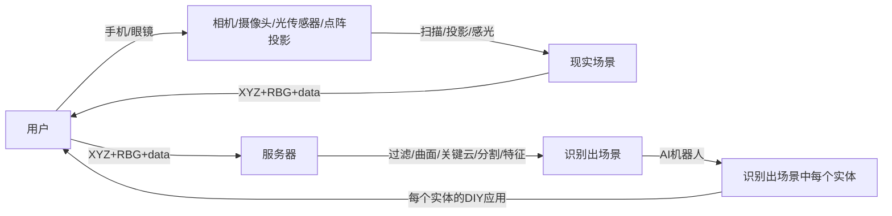

# 概览

## VR

Virtual Reality，虚拟现实，个人觉得翻译成：虚拟一个 3 维现实世界，更准确些。通过穿戴设备，如：眼镜，然后，你眼前即会看见一个较为完整的 3 维世界。现在，市面上大部分都是 VR，商场里那些小孩玩的游戏，基本上都属于这些。

感觉应用场景不太多：游戏、工业模具模拟、旅游业的讲解

国外：
- Oculus Quest 2
- HTC VIVE
- PS VR

>Oculus 被 facebook/mate 收购 

国内：
- 爱奇艺
- 华为
- 小米
- Pico 
## AR

Augmented Reality，增强\(虚拟\)现实，VR 是全虚拟，AR 是对 VR 的一种增强，眼睛看到的并不全是假的，或者说：眼睛看见的东西，主要都是真的，然后，在真实的实体物上再覆盖\(叠加\)一层虚拟的。如：

1. 逛街时，看见的建筑物，AR 会标识出该建筑物的一些描述信息。
2. 钢铁侠里以第一视角看，AR 会帮你标识出打击目的的距离速度等，
3. 骄车上的 hud 抬头显示功能，帮助司机计算前后车距离，当前车速等等。
4. 将键盘投影到手掌上
5. PokemonGo 游戏，手机安装个 APP，用 APP 的扫一扫，任意扫描实现场景，有的精灵就会出现，可以捕捉

如：

- google glass
- microSoft hololens 2
- 苹果 ar 眼镜
- Nreal
- rokid

## MR

Mixed Reality，即混合现实技术. 把现实叠加到虚拟上，好像跟 AR 差不多，不过想想，AR 略简单些，现实就是现实，或者说在现实的场景上再生成一层虚拟画板，帧上即可，现实场景得扫描完成后，再生帧到虚拟中，貌似更复杂一点。

如：主播想把自己放置于某个虚拟场景\(太阳、火星\)中，这个场景现实中肯定不存在的，也无法到达，那么借助 MR 即可。

这里有个难点，终端大多是摄像头，它是二维的，我们要把扫描后的现实场景的二维数据，分析沉浸成 3 维的，再帖到虚拟场景中。

分析看，如果 MR 这东西真的能实现，就有点元宇宙的意思了，以现实中的本人，生成一个虚拟中的人物，在很多不存在的场景\(虚拟\)中玩耍，如果这个时候再加上社交，每个人都生成这么个人物，最后，如果再能加上感官体验的效果，挺可怕的....

## 小结

如果全是虚拟的肯定是 VR，如果只管在现实世界上叠加信息，并不太关心虚拟世界，那么就是 AR，如果既要关心虚拟世界，也要关心现实世界，处于混合状态，来回切换状态，即是 MR.

VR 的应用场景不太多，感觉 AR/MR 才是未来。

AR 未来猜测：

- AR 后端的需求，目前猜测，可能是：一个房间内，两人进行游戏，房间内的实体均会被扫描并生成 3D 实体数据，交由后端互相进行同步。设计一下，并出文档
- AR 同步服务 用户服务 匹配 等，最终会统一整合成一个大的构架，考虑下如何设计 ，最好是：以快速为核心，暂且不考虑大公司的微服务体系
- 可以考虑下基础设施建议，如：大公司的微服务构架体系，先写文档，分享开会 大家一起讨论


AR肯定是未来，人人都明白。但是人人都做不出来理想的产品。单一个场景/物体识别功能就做的不友好，而AR的核心就是得各种识别，这个就很讽刺。
所以，从目前看，还是VR更好，至少他能落地。
# 3d-深度-传感器

传感器可以比喻成：计算机的眼睛(视觉系统)，用来告诉计算机它所'看到'的场景是什么样的：多大/多宽、场景里有有什么物体/人物，人的动作等。最后，将由大脑\(cpu\)来决定，是否要做出'反映'\(处理\)

大体上分为 3 类：

1. 双目：主动投射，一个物体，左眼看到在坐标 1，右眼看见是在坐标 2，如果再加一个该物体坐标 3，得到 1 2 3 坐标，再根据三角法公式，即可计算出位置
> leap Motion， ZED， 大疆;

2. 结构光:主动投射，使用提前设计好的具有特殊结构的图案（比如离散光斑、条纹光、编码结构光等），将图案投影到三维空间物体表面上，使用另外一个相机观察在三维物理表面成像的畸变情况.根据物体造成的光信号的变化来计算物体的位置和深度等信息，进而复原整个三维空间。
> iPhone X

3. TOF:time of Flight ，飞行时间。主动投射，连续光脉冲到目标，然后用传感器接收从物体返回的光，通过探测光脉冲的飞行（往返）时间来得到目标物距离，同时，以产生深度信息。就是通过反射光来收集。
> Kinect\-2，PMD，SoftKinect， 联想 Phab
> 这里还被动式的，没找到具体应用先不写了

3 类都各有优缺，依然是在使用场景上略不同

1. TOF：动态场景，如汽车自动架构，距离较宽广，如 VR/AR
2. 结构光：静态场景，短距离
3. 双目：好像这种方式现在不受待见，说是计算量过大，对光线敏感度高，精度低

载体：

1. 相机\(摄像头\)
2. 雷达/光传感器
3. 点阵投影器

摄像头可识别颜色，雷达不行。但雷达更精准，不受强光影响\(自己发射的激光，不依赖外光\)
所以，结合着看，一个大的载体至少应该有两个东西：光传感器及摄像头，把两个载体的数据收集合成一组数据，即：点云

TOF 相机：整画幅获取
TOF 打印机：逐点顺序扫描

# 点云

point cloud :对 3 维的数据进行数据化
不同的传感器产生的数据略为不同
激光：XYZ、反射强度\(Intensity\)、scan angle\(扫描角\)、回波次数
图像：xyz、rbg
如果两者结合使用：xyz\+Intensity\+rbg
还有其它类型的特征，如：

1. 灰度值
2. 两点的方向/连接性

激光的反射时间：也能测算出与物体的距离
Intensity:这个能大概获取到反射物的材质

## 点云-数据

目前最主流的点云数据\(Point Cloud Data\)格式为 .pcd，遵循点云库\(Point Cloud Library\)标准。

数据文件，包含两部分：

1. 头
   1. version
   2. fields desc
   3. size
      ....
2. 体

```
VERSION 0.7
FIELDS x y z
SIZE 4 4 4
TYPE F F F
COUNT 1 1 1
WIDTH 39432
HEIGHT 1
VIEWPOINT 0 0 0 1 0 0 0
POINTS 39432
DATA ascii
7.0967999 -4.8207002 0.4303
7.0918002 -4.8204002 0.43009999
7.0840001 -4.8213 0.4298
...  ...
```

前 10 行，头是 ASCII 字符集，体可以是 ASCII 也可以是二进制

## 点云数据-基础计算

过滤：拿到点云数据，做建模时，假 RBG 及方向/连接属性都健全的情况下，实际上的模型，好像是带有毛边的，或者说是：大概复现了一个模型的样式，但并不是十分精准的，甚至可能还有些散列点/孤立点，这个时候就需要去做过滤，降噪

曲面

关键点

特征和特征描述

# AR-cloud

AR 是把虚拟的东西帖到现实场景中，肯定不能乱帖，那就得识别出现实场景,扫描\(锚点分析\)与识别\(分析出具体是个什么东西\)还有匹配，然后，往上帖自己想要的东西，重点：

## 扫描

> 终端设备要求：360 度立体的摄影能力。那，用什么终端来扫描，手机和专用设备？
> 如果是手机，那么用户必须得有专业的摄像头，普及有点难
> 如果是专业设备，这个入门门槛就更高了
> 感觉，还是得公司提前找好人，用专业设备，到特定场合扫描这个靠点谱

## 识别

> 好像得用 AI 了，机器学习，没太好办法

1. 匹配，分析出具体的的锚点是什么东西，那这里就有两个问题
   1. 数据源
      > 用户众包采集，优点是：代价小，缺点是：数据的真假验证有点难，另外牵扯隐私
      > 公司专门派出人去采集，优点是：准确，缺点是：代价大，如果实体场景变更有点麻烦，不过如果能结合卫星使用，感觉也可行
   1. 匹配计算
      > 终端肯定不可能计算这些东西，只能交由后端

## 数据源

1. 坐标
2. 锚点

所以这么看下下为，除了 3 维锚点坐标，再加个坐标，感觉有点 3 维\+的意思了
感觉坐标更多是辅助功能，如：计算时可缩小范围，提高计算速度及精准度

## AR-cloud 几个核心功能

1. 收集数据源
2. 对前端传输来的 锚点\+坐标，进行识别与匹配

分析看，如果真是按照上面的标准来看，小公司想实现，有点不现实呢.



## 用具体场景做分析

上面的场景太大了，我们缩小一下场景，拿 pokemongo 当例子，把地域限制成北京

1. 先构建一个地图\(坐标\)，找百度地图拿
2. 然后，在该坐标系中，随机挑几个景点，找百度地图拿
3. 然后，在该景点中，挑几个具体点的位置，再随机放上几个 宠物，并该宠物，随机的换换位置\(区域内\)，更真实一些
4. 用户，拿手机在任意地点，做任意扫描，把扫描后的数据交由前端传给后端
5. 后端，根据 GPS 坐标及锚点，即可确定具体位置，就可以判定是否可以显示

这么看，好像也能实现一些，但好像有些问题：

1. 坐标是非三维的，且不是绝对精准，只能确定个大概位置
2. 锚点的扫描，得有算法
3. 后端，如何用锚点数据，进行分析匹配

如果这 3 条，全都依附百度来给计算，那好像都说得通了....

## AR CLOUD 能做什么

1. 制作出一个长连接，保持基本稳定、安全、传输效率，并支持 TCP WS UDP，动态扩容
2. 接收数据，并能存储、建立索引、快速检索，并考虑数据传输时的压缩
3. 对存储数据进行分类归档，如：用户扫描的点云数据、场景\(地图\)数据、场景中的物体\(模型\)数据、物体\(模型\)数据的 DIY 应用数据
4. 对点云数据的分析与识别，貌似无法实现，得借助 3 方服务
5. 后台，对采集的场景数据进行管理，对 DIY 应用的物体\(模型\)数据进行管理

## 点云存储

pts:好像只在 XYZ，是个简便格式

las\(LiDar\):

C：class\(所属类\)，F：flight\(航线号\)，T：time\(GPS 时间\)，I：intensity\(回波强度\)，R：return\(第几次回波\)，N：number of return\(回波次数\)，A：scan angle\(扫描角\)，RGB：red green blue\(RGB 颜色值\)。

pcd:上面已讲过

xyz 一种文本格式，前面 3 个数字表示点坐标，后面 3 个数字是点的法向量，数字间以空格分隔

## 点云能做什么？

物体分类

部件分割

## 如何从点云数据中提取特征？

## 如何分割？

## 如何补全？

数据采取时的角度不同，远近不同，如何将多角度合成/配准

# PCL

point cloude library

# LiDAR

LIght Detection And Ranging:\(激\)光 探测与测距，也叫激光雷达

> 不使用无线电波，而是无线脉冲

基本原理：

> 激光发射器\-\>光学接收器\-\>芯片\-信息处理\(用光的飞行时间信息，测量场景中物体的距离\)

属于 TOF 测距

再通过旋转角度，即能得到该物体的高度信息

激光属于主动发射光，对基本天气\(黑天、白天\)不受影响\(摄像头是属于被动接收光\)，而特殊\(恶劣\)天气：雨水、下雪、浓雾会对无线脉冲有一定反射

这东西成本略高

目前苹果手机上装载：有效距离大概是 5 米

# 悉见(爻图)科技

1. 场景数据采集
2. 采集后的编辑
3. 前端 SDK，捕捉用户画面的点云数据
4. 识别场景、物体


