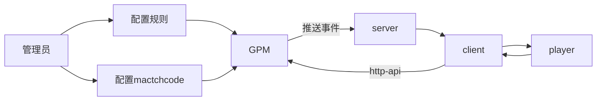
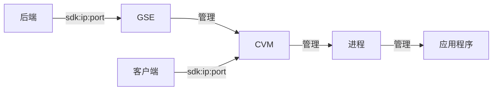

# GPM

## F\(放置\)

放置用于表示为游戏玩家匹配匹配结果请求对战资源的动作。当您创建的匹配需要为匹配结果请求游戏服务器伸缩资源时，游戏玩家匹配将自动为您调用游戏服务器伸缩的游戏服务器会话放置接口，匹配结果将用于在指定的服务器队列中启动一个游戏服务器会话。

## G\(规则\)rule

规则包含规则名称、规则集脚本，由开发者定义和创建，用于描述一个游戏中的匹配算法实现。

## P\(匹配\)matchCode

匹配由开发者在控制台创建。需要配置关联的规则、匹配结果处理方式、匹配超时时间、匹配事件接收地址等信息。创建成功的匹配将被分配一个 MatchCode 作为匹配配置的唯一标识。

## MatchTicket 匹配票据

匹配票据（MatchTicket）包含一个匹配请求的信息，用于追踪每一次匹配请求的状态和结果。每一次通过云 API 发起的匹配请求具有一个唯一的匹配票据，匹配票据通过一个唯一的票据 ID 识别。匹配票据 ID 可以由开发者传入，或由游戏玩家匹配生成。

## S\(事件推送\)

在一个匹配请求的生命周期中，将会产生各种事件，如开始搜索、潜在匹配创建、匹配完成、匹配超时、匹配失败等。游戏玩家匹配将在这些事件发生时，对您配置的接收地址进行推送，方便您追踪匹配请求的状态，以及处理匹配结果。

## GPM 状态

SEARCHING ： 匹配搜索中。此状态的票据，正在被 GPM 执行匹配搜索，GPM 将在匹配池中搜索满足规则约束的其他票据，并在超时时间内撮合出一个完整的匹配。如果在设定的超时时间内没有找到符合条件的其他票据，当前票据的状态将会流转为 TIMEDOUT。

PLACING ：匹配放置中。此状态的票据，已经搜索到完整的匹配，正在被 GPM 将匹配结果放置到游戏服务器 GSE 中，即在 GSE 中启动一个游戏服务器会话。并非所有票据都会经历此状态，只有配置了为匹配“请求 GSE 资源”的 MatchCode，其发起匹配的票据才会经历这个状态。

COMPLETED ：匹配已完成。此状态的票据，已经成功搜索到符合规则条件的完整匹配，并结束在 GPM 的生命周期。

对于不通过 GPM 请求对战服资源的票据，此状态表示当前票据被撮合到一个完整的匹配。

对于需要由 GPM 自动请求 GSE 对战服务资源的票据，此状态表示当前票据已经被撮合到一个完整的匹配，且已成功放置到 GSE 的指定队列上。

CANCELLED ： 匹配已取消。此状态的票据，表示在 SEARCHING 阶段被用户主动请求取消。

TIMEDOUT ： 匹配已超时。此状态的票据，表示在 SEARCHING 阶段未能成功，在设置匹配超时时间 TimeOut 时间内找到符合规则约束的其他票据形成完整的匹配。TimeOut 时间是 MatchCode 的参数，在 创建匹配 时定义。

FAILED ： 匹配已失败。此状态的票据，表示在 SEARCHING、PLACING 阶段因为系统内部错误而失败。

# 交互流程

# 云服务器 CVM

Cloud Virtual Machine

游戏服务器伸缩:Game Server Elastic\-scaling，缩写 GSE

服务器

这套东西挺强大的，但不适合中小型公司
