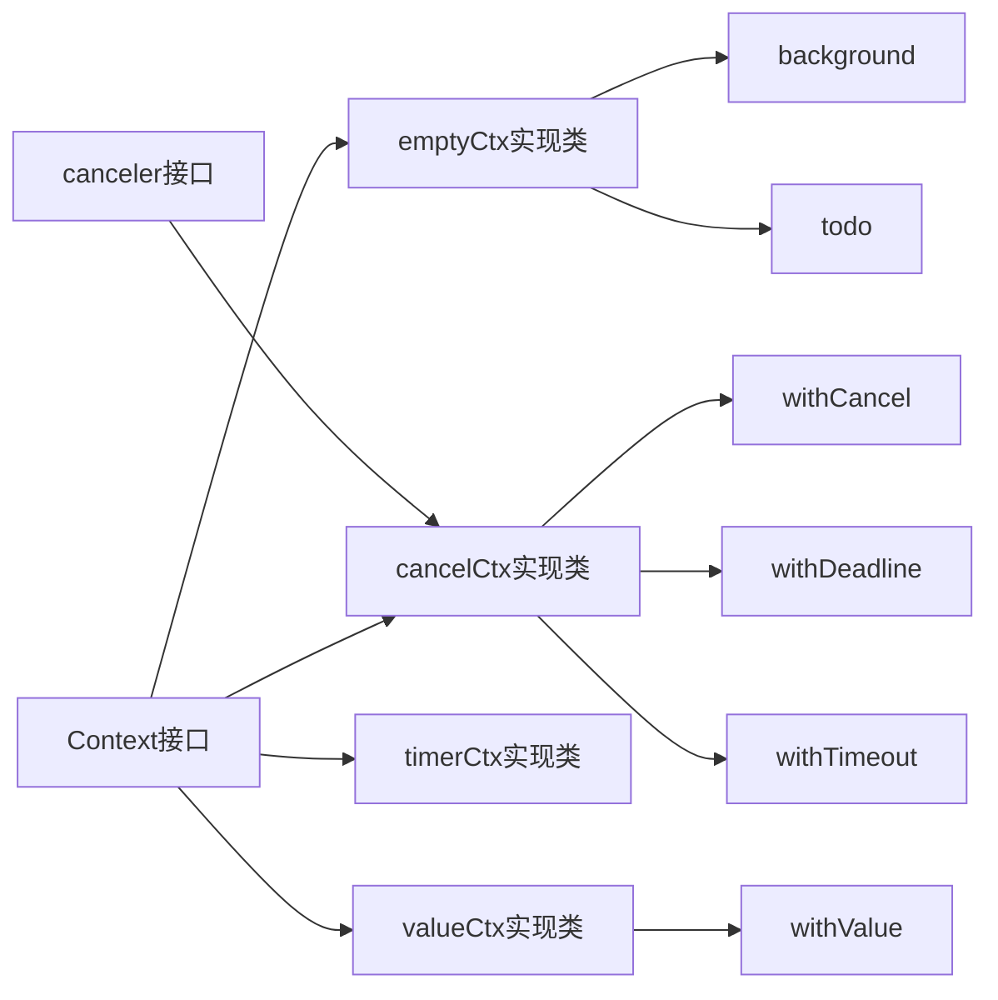
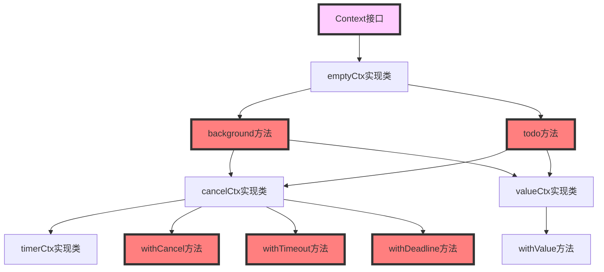
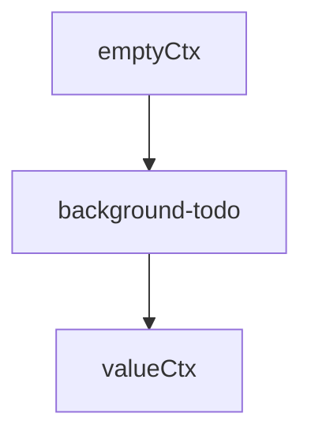

# 概览


context：上下文，感觉翻译成：多个函数之间的数据值更具体些。
比如：A函数要调用B，给它一些数据，但是此时可能B又调用了C，得把A的数据连带着B的数据一并发给C。或者，B在执行过程中去干其它的事情了，此时的数据得暂存到一个地方。

golang Context 更像是一种设计模式，一组接口，而不是具体的一个东西，其结构如下：

一个主接口，一个辅助接口，4个实现类，6个函数

> 网上也有管 context 叫做：context 家族



  

  



## Context 接口

```go
type Context interface {
    Deadline() (deadline time.Time, ok bool)
    Done() <-chan struct{}
    Err() error
    Value(key interface{}) interface{}
}
```

Context 结构体/接口，只是简单定义了4个函数：

1. Deadline:返回绑定当前context的任务被取消的截止时间；如果没有设定期限，将返回ok == false。
2. Done :当绑定当前 context 的任务被取消时，将返回一个关闭的 channel；如果当前 context 不会被取消，将返回nil。
3. Err :
	- 如果 Done 返回的 channel 没有关闭，将返回nil;
	- 如果Done返回的channel已经关闭，将返回非空的值表示任务结束的原因。
	- 如果是context被取消，Err将返回Canceled；
	- 如果是context超时，Err将返回DeadlineExceeded。
1. Value 返回context存储的键值对中当前key对应的值，如果没有对应的key,则返回nil。

## 4个 context 的类 实现了4个接口

1. emptyCtx 空的 Context，只实现了 Context interface 4个方法
2. cancelCtx 继承自 Context 并实现了 canceler interface
3. timerCtx 继承自 cancelCtx，可以用来设置timeout
4. valueCtx 继承自 Context，可以储存一对键值对

## emptyCtx

```go
type emptyCtx int

func (*emptyCtx) Deadline() (deadline time.Time, ok bool) {
    return
}

func (*emptyCtx) Done() <-chan struct{} {
    return nil
}

func (*emptyCtx) Err() error {
    return nil
}

func (*emptyCtx) Value(key interface{}) interface{} {
    return nil
}

func (e *emptyCtx) String() string {
    switch e {
    case background:
        return "context.Background"
    case todo:
        return "context.TODO"
    }
    return "unknown empty Context"
}
```

好像什么也没做，都是空实现，context 接口...

emptyCtx: 没有超时时间，不能取消，也不能存储任何额外信息，所以 emptyCtx 用来作为 context 树的根节点。

```go
var (
    background = new(emptyCtx)
    todo       = new(emptyCtx)
)

func Background() Context {
    return background
}

func TODO() Context {
    return todo
}
```

emptyCtx 并不会直接使用，GO 提供了两个方法：background 和  todo 实例化 emptyCtx 来使用

1. Background：通常被用于主函数、初始化以及测试中，作为一个顶层的 context，也就是说一般我们创建的context都是基于Background；
2. TODO：在不确定使用什么 context 的时候才会使用

> 我是没搞懂有啥本质区别，想起学英语的时候用 todo something 这种东西像是占位符....

接下来，看下context的3个具体实现类~

## valueCtx

```go
type valueCtx struct {
    Context
    key, val interface{}
}

func (c *valueCtx) Value(key interface{}) interface{} {
    if c.key == key {
        return c.val
    }
    return c.Context.Value(key)
}
```

Context 是继承，另外还包含了两个变量：key val

valueCtx-Value方法：覆写了父类的 value 方法


总结下：valueCtx 继承父类 context，同时可以有附带值（K/V），覆写了 value 方法 

## cancelCtx

```go
type cancelCtx struct {
	Context

	mu       sync.Mutex            
	done     chan struct{}         
	children map[canceler]struct{} // set to nil by the first cancel call
	err      error                 // set to non-nil by the first cancel call
}

type canceler interface {
    cancel(removeFromParent bool, err error)
    Done() <-chan struct{}
}
```

Context 是继承，但多了几个成员属性：

1. mu: 悲观锁，防止协程安全
2. done: 一个管道，用来传递关闭信号。它没有数据缓冲，只要调，就会阻塞
3. children: 用于存储当前节点下的所有子节点
4. err：记录错误信息

canceler是接口,看一下，cancelCtx 如何实现这个接口

```go
func (c *cancelCtx) Done() <-chan struct{} {
    c.mu.Lock()
    if c.done == nil {
        c.done = make(chan struct{})
    }
    d := c.done
    c.mu.Unlock()
    return d
}

func (c *cancelCtx) Err() error {
    c.mu.Lock()
    err := c.err
    c.mu.Unlock()
    return err
}

func (c *cancelCtx) cancel(removeFromParent bool, err error) {
    if err == nil {
        panic("context: internal error: missing cancel error")
    }
    c.mu.Lock()
    if c.err != nil {
        c.mu.Unlock()
        return // already canceled
    }
    // 设置取消原因
    c.err = err
    设置一个关闭的channel或者将done channel关闭，用以发送关闭信号
    if c.done == nil {
        c.done = closedchan
    } else {
        close(c.done)
    }
    // 将子节点context依次取消
    for child := range c.children {
        // NOTE: acquiring the child's lock while holding parent's lock.
        child.cancel(false, err)
    }
    c.children = nil
    c.mu.Unlock()

    if removeFromParent {
        // 将当前context节点从父节点上移除
        removeChild(c.Context, c)
    }
}
```

感觉就是操控一个 done 管道，并且此管理没有缓冲 ，也不会写数据，信号是通过关闭一个管道产生的错误来通信

```go
  _,ok  <- done
  if !ok {
	//此conetext 结束
  }
```

剩下的就是：关闭子结点，将当前节点从父节点移出


## WithCancel

上面是： cancelCtx 类， 具体使用，得用 WithCancel 来创建

```go
type CancelFunc func()

func WithCancel(parent Context) (ctx Context, cancel CancelFunc) {
    c := newCancelCtx(parent)
    propagateCancel(parent, &c)
    return &c, func() { c.cancel(true, Canceled) }
}

// newCancelCtx returns an initialized cancelCtx.
func newCancelCtx(parent Context) cancelCtx {
    // 将parent作为父节点context生成一个新的子节点
    return cancelCtx{Context: parent}
}

func propagateCancel(parent Context, child canceler) {
    if parent.Done() == nil {
        // parent.Done()返回 nil 表明父节点以上的路径上没有可取消的context
        return // parent is never canceled
    }
    // 获取最近的类型为cancelCtx的祖先节点
    if p, ok := parentCancelCtx(parent); ok {
        p.mu.Lock()
        if p.err != nil {
            // parent has already been canceled
            child.cancel(false, p.err)
        } else {
            if p.children == nil {
                p.children = make(map[canceler]struct{})
            }
            // 将当前子节点加入最近 cancelCtx 祖先节点的children中
            p.children[child] = struct{}{}
        }
        p.mu.Unlock()
        
    } else {
        go func() {
            select {
            case <-parent.Done():
                child.cancel(false, parent.Err())
            case <-child.Done():
            }
        }()
    }
}

func parentCancelCtx(parent Context) (*cancelCtx, bool) {
    for {
        switch c := parent.(type) {
        case *cancelCtx:
            return c, true
        case *timerCtx:
            return &c.cancelCtx, true
        case *valueCtx:
            parent = c.Context
        default:
            return nil, false
        }
    }
}
```

1. WithCancel  就是 创建一个 CancelCtx  结构体
2. propagateCancel：这个就是核心了，主要就是将新的节点，加到父节点的 map 中。
3. 取消子结点：只能取消 cancelCtx 类型的

总结：实现了将某个节点加到父节点上，父节点一但 cancel，那么所有节点均退出。


实际使用：
```go 
ctx, cancel := context.WithCancel(context.Background())
go func(){
	//阻塞中，直到其它协程 调用了 cancel 函数
	<-ctx.Done()
}()

cancel()// 取消此 ctx ，函数就会不阻塞了
```


## timerCtx

```go
type timerCtx struct {
    cancelCtx
    timer *time.Timer // Under cancelCtx.mu.

    deadline time.Time
}

func (c *timerCtx) Deadline() (deadline time.Time, ok bool) {
    return c.deadline, true
}

func (c *timerCtx) cancel(removeFromParent bool, err error) {
    将内部的cancelCtx取消
    c.cancelCtx.cancel(false, err)
    if removeFromParent {
        // Remove this timerCtx from its parent cancelCtx's children.
        removeChild(c.cancelCtx.Context, c)
    }
    c.mu.Lock()
    if c.timer != nil {
        取消计时器
        c.timer.Stop()
        c.timer = nil
    }
    c.mu.Unlock()
}
```


```go
func WithDeadline(parent Context, d time.Time) (Context, CancelFunc) {  
	// 与 cancelCtx 一样先检查一下 parent Context  
	if parent == nil {  
		panic("cannot create context from nil parent")  
	}  
	  
	// 判断 parent Context 是否支持 Deadline，如果支持的话需要判断 parent Context 的截止时间  
	// 假设 parent Context 的截止时间早于当前设置的截止时间，那就意味着 parent Context 肯定会先  
	// 被 cancel，同样由于 parent Context 的 cancel 会导致当前这个 child Context 也会被 cancel  
	// 所以这时候直接返回一个 cancelCtx 就行了，计时器已经没有必要存在了  
	if cur, ok := parent.Deadline(); ok && cur.Before(d) {  
		// The current deadline is already sooner than the new one.  
		return WithCancel(parent)  
	}  
	  
	// 创建一个 timerCtx  
	c := &timerCtx{  
		cancelCtx: newCancelCtx(parent),  
		deadline: d,  
	}  
	  
	// 与 cancelCtx 一样的传播操作  
	propagateCancel(parent, c)  
	  
	// 判断当前时间已经已经过了截止日期，如果超过了直接 cancel  
	dur := time.Until(d)  
	if dur <= 0 {  
		c.cancel(true, DeadlineExceeded) // deadline has already passed  
		return c, func() { c.cancel(false, Canceled) }  
	}  
	  
	// 所有 check 都没问题的情况下，创建一个定时器，在到时间后自动 cancel  
	c.mu.Lock()  
	defer c.mu.Unlock()  
	if c.err == nil {  
	c.timer = time.AfterFunc(dur, func() {  
		c.cancel(true, DeadlineExceeded)  
		})  
	}  
	return c, func() { c.cancel(true, Canceled) }  
}
```

timerCtx 是基于 cancel 之上，增加了一个 timer 定时器
当 定时器 到时间后，执行 cancelCtx  上的 cancel 方法

timerCtx 依然只是一个类，实际使用需要：WithDeadline
WithDeadline ：也比较简单，基于 timerCtx 这上，根据 定时时间，到时间后就调用  timerCtx 的 cancel

## WithDeadline

父协程可取消的 context

# 总结

1. 有个 context 接口，该接口算是根接口吧。里面有4个方法，使用者可以都实现，也可以只实现部分（不想实现的直接空实现即可），取决于使用方。
2. 具体实现 context 接口的类是emptyCtx，但是不给开发者直接使用
3. 使用 background todo 两个方法来做实例化
4. 虽然实例化了，得到了 emptyCtx，但是只是空实现
5. valueCtx \-》 WithValue
6. cancelCtx \-\> WithCancel timerCtx
7. WithDeadline WithTimeout
8. 通过 golang 自带的valueCtx cancelCtx 来最终爆给用户使用
9. 用户的使用过程中，可以根据需求，自行决定使用哪种类型的context
10. 最主要的是：所有的context最终被组织成一个链表




日常使用 context 不是特别多，最多也就是 cancel 更多一些，且也没有父子关系，基本都是用最简单的方式。主要有有全局变量，还有函数自带的参数也能传递值。