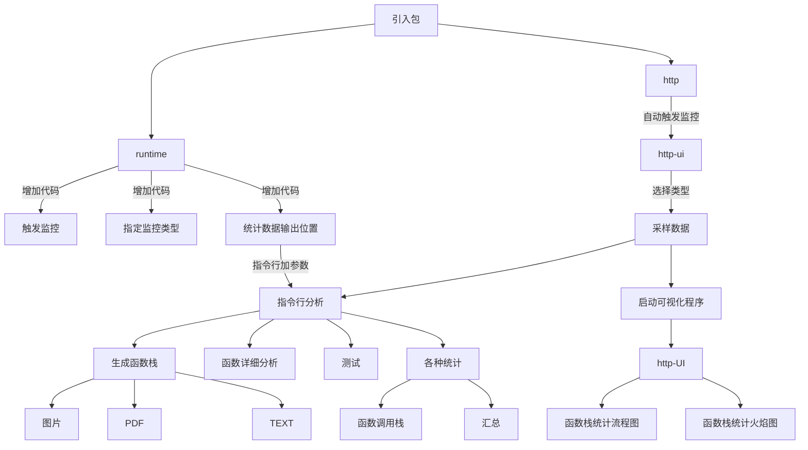

# pprof

## 流程

  



## 引入/使用

包名

1. runtime/pprof
2. import \_ "net/http/pprof

> net/http/pprof 封装了一层 runtime/pprof 包

触发 pprof 监听的3种条件：

1. 如果项目中已经有了 http 守护协程，引入 net/http/pprof 包即可
2. 如果项目中没有 http 守护协程
    1. 引入 net/http/pprof
    2. 那得单独开一个http\(随便开\)
3. 以上两荐均不具备
    1. 引入 runtime/pprof
    2. 代码中加函数，并指定监控的类型，统计数据输出文件位置
    3. 启动时加参数

```go
f, err := os.Create(*cpuprofile)
    if err != nil {
        log.Fatal(err)
    }
    pprof.StartCPUProfile(f)
    defer pprof.StopCPUProfile()
}
```

go run main.go --cpuprofile=ppp.prof


#### 对比

- 第1种最简单，但只能用最原生HTTP监听的写法，如果使用GIN有冲突
- 第2种，略复杂一点点，但相对独立，可定义单独的端口号
- 第3种有点复杂

## demo

> 使用第1种最简单的方式

```go
package main

import (
	"fmt"
	"net/http"
	_ "net/http/pprof"
	"time"
)

func main(){
	go startHttpd()
	for{
		time.Sleep(time.Second * 1)
	}
}

func startHttpd(){
	hostPort := "127.0.0.1:10000"
	http.HandleFunc("/", wwwHandle)
	err := http.ListenAndServe(hostPort, nil)
	if err != nil {
		fmt.Println("ListenAndServe err:",err)
	}
}

func  wwwHandle(w http.ResponseWriter, r *http.Request){

}
```

打开浏览器 ：
>http://127.0.0.1:10000/debug/pprof/


> 代码中因为原本就使用到了 http，所以没其它多余代码

## 采样数据

可彩样数据类型

|Count|Profile     |desc                  |
|-----|------------|----------------------|
|9    |allocs      |所有过去内存分析采样  |
|0    |block       |导致阻塞同步的堆栈跟踪|
|0    |cmdline     |程序启动参数          |
|0    |goroutine   |当前运行的协程        |
|0    |heap        |活动对象的内存分配情况|
|0    |mutex       |导致互斥锁的竞争持有者|
|0    |profile     |CPU                   |
|0    |threadcreate|创建新OS线程的        |
|0    |trace       |对当前程序执行的跟踪  |

full goroutine stack dump

监控程序已经生效，接下来就是采样源数据了:

1. http://127.0.0.1:10000/debug/pprof/
2. go tool pprof http://localhost:6060/debug/pprof/profile?seconds=60
3. 非 http 的 runtime 模式，因为在程序启动时并指定了采样类型及数据输出，所以这种方式先忽略

http的2种方式对比：

1. 用浏览器\<点击\>选项即可，直接打开的方式简单，但是还得有一步进入指令行模式，才能分析
2. 直接进入指令行分析模式，参数中加URL地址，它是：下载彩样数据\+进入分析模式

> 方法2是方法1的URL加到指令行的参数中，在执行的过程中，也是把URL访问后的数据保存到某个位置。缺点就是：你得记住URL地址

采样的结果不同：

1. CPU的采样需要有时间等待\(60秒\)，且最后生成一个可下载的文件，不能直接观看
2. 内存的采样就没有文件可下载了，但可以直接查看

不管哪种方式采样数据，最终生成的数据都是，如：profile.proto\(protocol buffer V3\)

## 分析阶段

进入指令行模式

> go tool pprof profile

ps:可在指令行输出 help 查看这个分析工具的一些参数

列出当前最吃 CPU 性能的前10项

> top 10

1. flat：函数上运行耗时
2. flat%：函数上运行耗时 占 CPU 运行耗时总比例
3. sum%：flat%的累加\(上一列的flat%\+这一列的flat%\)，这列主要是看前10项总共累计占了CPU多少
4. cum：当前函数加上\<调用子函数\>的耗时
5. cum%：同上的 CPU 运行耗时总比例

基本上这个指令列出的数据，大体上就能定位到某个函数上了，如果不够直观也可以生成图片，如下.

查看具体某个函数

> \(pprof\) list syscall.syscall

```
      70ms       70ms (flat, cum) 41.18% of Total
         .          .     59://go:linkname syscall_syscall syscall.syscall
         .          .     60://go:nosplit
         .          .     61://go:cgo_unsafe_args
         .          .     62:func syscall_syscall(fn, a1, a2, a3 uintptr) (r1, r2, err uintptr) {
         .          .     63:	entersyscall()
      70ms       70ms     64:	libcCall(unsafe.Pointer(funcPC(syscall)), unsafe.Pointer(&fn))
         .          .     65:	exitsyscall()
         .          .     66:	return
         .          .     67:}
         .          .     68:func syscall()
         .          .     69:
         
```

神奇不？像不像GDB？只能说，被 PHP 惯坏了....

## 生成图片/PDF/TEXT

要进入指令行模式，先随便打开一个profile:

> go tool pprof http://192.168.31.147:5678/debug/pprof/heap

输入web:

> \(pprof\) web

路径

> /tmp/pprof001.svg

也可以直接生成，不用这么麻烦

go tool pprof \-\-pdf profile

go tool pprof \-\-web profile

go tool pprof \-\-text profile

## 可视化分析

指令的方式，操作起来麻烦，可以直接上UI工具

安装：

这里依赖一个图形插件，先安装了

> brew install graphviz

启动分析工具

> go tool pprof  -http=":8081" profile

访问图形工具页面：

> http://127.0.0.1:8081/ui/

在这个列表里找一些想要分析文件，比如：profile 连接

UI的分类还是挺全的：

1. top
2. graph
3. flame graph
4. peek
5. source

选 graph ，直接 图片流程图

其中：方块最大、包边的线\<比较深/颜色标红\>的是执行时间比较耗时的

可视化\-主要看什么？

1. 调用栈的流程图/统计时间

> 分析看一下，每个函数之间的调用时间，基本上能确定哪个函数非常耗时，我看的时候，大多拉到最下面，因为最下面都是些sys call，基本上这个是最耗时的，sys call再往上一个基本上就是用户代码函数可能的问题点

1. 火焰图

## trace

pprof 更多是汇总型分析，而更加详细的分析trace更适用些

包：runtime/trace

```go
import (
	"fmt"
	"net/http"
	_ "net/http/pprof"
	"os"
	"runtime/trace"
	"time"
)

func main(){
	f, err := os.Create("trace.out")
	if err != nil {
		panic(err)
	}
	defer f.Close()

	err = trace.Start(f)
	if err != nil {
		panic(err)
	}
	defer trace.Stop()

	go startHttpd()
	n := 0
	for{
		if n >5{
			break
		}
		n++
		time.Sleep(time.Second * 1)
	}
}

```

启动分析程序

> go tool trace trace.out

打开可视化UI

> http://127.0.0.1:53024/trace

View trace：查看跟踪

Goroutine analysis：Goroutine 分析

Network blocking profile：网络阻塞概况

Synchronization blocking profile：同步阻塞概况

Syscall blocking profile：系统调用阻塞概况

Scheduler latency profile：调度延迟概况

User defined tasks：用户自定义任务

User defined regions：用户自定义区域

Minimum mutator utilization：最低 Mutator 利用率

感觉trace能更详细的描述协程都在干嘛~

## 内存

inuse\_space —已分配但尚未释放的内存量

inuse\_object s\-已分配但尚未释放的对象数量

alloc\_space —分配的内存总量\(与释放的内存无关\)

alloc\_objects —分配的对象总数\(与释放对象无关\)
