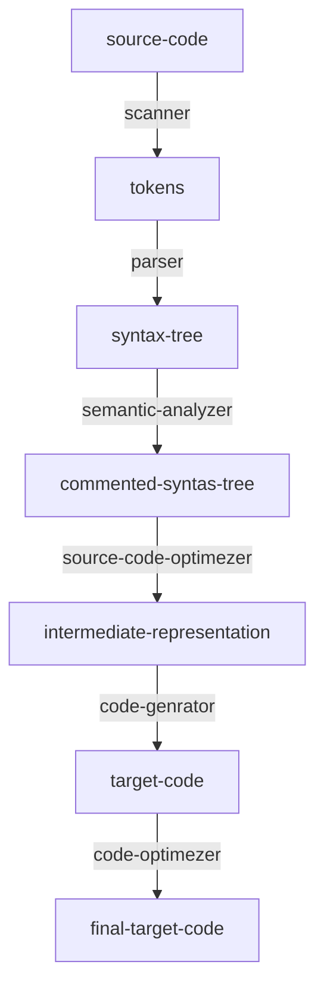

# C编译

GPL : 开源许可

GNU : GNU's Not Unix\!，一个开源的OS系统

gcc : GNU Compiler Collection，GNU编译器套件

> 这里大部分的知识都得跳转到目标文件讲解，而下面的都是：最简单的、大概的讲解

## 编译器

编译器：把人类看得懂的代码\(字母符号\)转换成机器能看得懂且能执行的代码

流程链

预编译：词法预处理器，处理宏，删除注释等，如：\#ifdef \#include \#define，生成token

编译器：语法分析，语义分析，检查错误，生成中间代码/汇编代码

汇编器：优化，转换成二进制机器指令，生成目标文件

链接器：将.o目标文件，再打包一层成为最终可执行文件

GCC\-工具链

一个GCC指令集，解决以上所有过程...

## 详细流程链

## DEMO

gcc \-E a.c 生成.i文件，指令：cpp

接着将文件转换成汇编语言

gcc –S a.i 生成.s 文件，指令：cc

将汇编语言转换成机器码

gcc –c a.s 生成.o文件,指令 ：as

将目标文件转成可执行文件，连接

gcc \-o a.o 指令 :ld

文件编译成可执行文件后，就得执行了，看一下LINUX执行一个文件的过程
