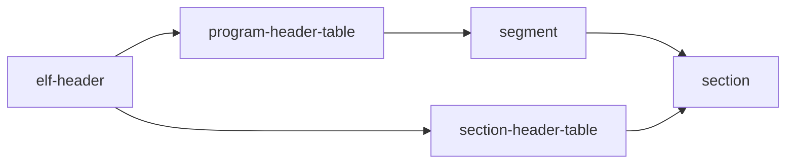

# 概览

目标文件 ELF（executable linkable format）：直译是 可执行 可连接 的一种格式文件。

按照 LINUX OS 的要求，生成一个特定格式的文件，最后交给内核来执行。

而内核执行的过程，像是一个编译器：分析该文件的内容，然后创建进程、初始化内存、加载代码等等，最终让CPU执行。

# 类型

| 类型名 | 描述 | 例子 |
| ---- | ---- | ---- |
| 可重定位文件 | 可连接其它目标文件，合并生成新的目标文件 | .o |
| 可执行文件 | 可给OS 创建进程，映射内存，最终将由CPU执行 | /usr/bin/ls |
| 共享目标文件 | 合并给其它目标文件 | .a .so |
| 核心转储文件 | 调试 or 日志 | core.dump |
|  |  |  |

> 不同类型的目标文件，是告诉 LINUX 如何分析：打包或执行。

.so 动态链接库：也是一个编译后的文件，可执行，是一个库，给目标文件用于连接使用

.a 动态链接库：

指令查看一个文件的类型：

> file a.c a.o

## 结构图

.jpg)

目标文件的结构，分了4个大的段，然后中间是各种\<段\>or\<节\>:

|标识                |描述                                                                                                                                                               |
|--------------------|-------------------------------------------------------------------------------------------------------------------------------------------------------------------|
|elf header          |保存文件的基础信息，及对program sction指向。且固定的大小，内容：文件类型、大小、程序执行入口                                                                       |
|program header table|:描述了系统执行一个程序所需要的段或者其它信息。目标文件的一个段（segment）包含一个或者多个section。只对可执行文件和共享目标文件有意义，对于程序的链接没有任何意义。|
|section1            |节1                                                                                                                                                                |
|......              |....                                                                                                                                                               |
|sectionN            |节N                                                                                                                                                                |
|section hader table |section一些描述信息，可重定向目标文件得有这个选项。                                                                                                                |

4个段的流程关系





elf\-header ：可以搜索到 program\-header\-table 和 section\-header\-table

section\-header\-table指向某一个：secation

program\-header\-table里的每个成员叫segment,每个segment指向若干section

命令查看elf头部

> readelf \-h a.o

```
ELF Header:
  Magic:   7f 45 4c 46 02 01 01 00 00 00 00 00 00 00 00 00 
  Class:                             ELF64
  Data:                              2's complement, little endian
  Version:                           1 (current)
  OS/ABI:                            UNIX - System V
  ABI Version:                       0
  Type:                              REL (Relocatable file)
  Machine:                           Advanced Micro Devices X86-64
  Version:                           0x1
  Entry point address:               0x0
  Start of program headers:          0 (bytes into file)
  Start of section headers:          672 (bytes into file)
  Flags:                             0x0
  Size of this header:               64 (bytes)
  Size of program headers:           0 (bytes)
  Number of program headers:         0
  Size of section headers:           64 (bytes)
  Number of section headers:         13
  Section header string table index: 12
```

> 因为是可连接类型的目标文件 ，program headers为0

分析：

有一些文件的基础描述信息，还有对另外2个table的地址记录

命令查看program header table

> readelf \-l a.o

```
There are no program headers in this file.
```

因为是连接类型目标文件，没有program headers，我们编译一个可执行文件，再执行一下

> gcc a.o
> 
> 
> readelf \-l a.out

```
Elf file type is EXEC (Executable file)
Entry point 0x401060
There are 11 program headers, starting at offset 64

Program Headers:
  Type           Offset             VirtAddr           PhysAddr
                 FileSiz            MemSiz              Flags  Align
  PHDR           0x0000000000000040 0x0000000000400040 0x0000000000400040
                 0x0000000000000268 0x0000000000000268  R      0x8
  INTERP         0x00000000000002a8 0x00000000004002a8 0x00000000004002a8
                 0x000000000000001c 0x000000000000001c  R      0x1
      [Requesting program interpreter: /lib64/ld-linux-x86-64.so.2]
  LOAD           0x0000000000000000 0x0000000000400000 0x0000000000400000
                 0x0000000000000450 0x0000000000000450  R      0x1000
  LOAD           0x0000000000001000 0x0000000000401000 0x0000000000401000
                 0x00000000000001cd 0x00000000000001cd  R E    0x1000
  LOAD           0x0000000000002000 0x0000000000402000 0x0000000000402000
                 0x0000000000000148 0x0000000000000148  R      0x1000
  LOAD           0x0000000000002e18 0x0000000000403e18 0x0000000000403e18
                 0x000000000000021c 0x0000000000000220  RW     0x1000
  DYNAMIC        0x0000000000002e28 0x0000000000403e28 0x0000000000403e28
                 0x00000000000001d0 0x00000000000001d0  RW     0x8
  NOTE           0x00000000000002c4 0x00000000004002c4 0x00000000004002c4
                 0x0000000000000044 0x0000000000000044  R      0x4
  GNU_EH_FRAME   0x0000000000002020 0x0000000000402020 0x0000000000402020
                 0x0000000000000034 0x0000000000000034  R      0x4
  GNU_STACK      0x0000000000000000 0x0000000000000000 0x0000000000000000
                 0x0000000000000000 0x0000000000000000  RW     0x10
  GNU_RELRO      0x0000000000002e18 0x0000000000403e18 0x0000000000403e18
                 0x00000000000001e8 0x00000000000001e8  R      0x1

 Section to Segment mapping:
  Segment Sections...
   00     
   01     .interp 
   02     .interp .note.gnu.build-id .note.ABI-tag .gnu.hash .dynsym .dynstr .gnu.version .gnu.version_r .rela.dyn .rela.plt 
   03     .init .plt .text .fini 
   04     .rodata .eh_frame_hdr .eh_frame 
   05     .init_array .fini_array .dynamic .got .got.plt .data .bss 
   06     .dynamic 
   07     .note.gnu.build-id .note.ABI-tag 
   08     .eh_frame_hdr 
   09     
   10     .init_array .fini_array .dynamic .got
```

看执行结果有11个段，而不是 section

## segment

是一组section，在执行时，CPU 以这个单位来读取/执行。实际上，它是对若干section索引，然后打上TAG，最后方便OS来执行。它的分段规则下面会讲，但主要是：按权限划分。

## segment type

PHDR

INTERP:连接器绝对路径

LOAD :可装载到内存中

DYNAMIC:动态连接想着

NOTE :专有编译器信息

几个关键的segment

1. 代码区 .text
2. 数据区 .data .rodata
3. 链接区

像LOAD类型，就是告知OS要把这个segment里的内容，直接加载到内存中.

## section

分类：.开头的是系统级的，非.开头的是用户自定义的

指令查看section的信息

> readelf \-S a.out
> 
> 
> 结果就不列了，共计28个，太长了，挑几个重点的吧

|标识      |描述                                                      |
|----------|----------------------------------------------------------|
|.interp   |动态链接器的绝对路径\(/lib64/ld\-linux.so.2\)             |
|.text     |CPU可执行的汇编代码                                       |
|.data     |已初始化的全局变量和静态常量                              |
|.bbs      |未初始化数据                                              |
|.rodata   |只读数据段，常量 静态变量                                 |
|.comment  |注释信息段                                                |
|.shstrtab |section名称表                                             |
|.strtab   |代表中使用的字符串，会存到这里。代码中保存是ID            |
|.rel.text |                                                          |
|.rel.data |                                                          |
|.line     |调度时用的行号信息                                        |
|.debug    |调试信息                                                  |
|.symtab   |一个符号表，保存了保存变量名，函数名等                    |
|.init     |保存了程序执行前的初始化代码，这些代码早于main函数被执行。|
|.fini     |                                                          |
|.hash     |                                                          |
|.node     |                                                          |
|.plt      |                                                          |
|.got      |                                                          |
|用户自定义|以上都是以.开头，代表是系统，用户也可以自定义             |

> segment里的每一项就指向这些section，可能包含一个，可能是多个。

section 也有类型，太多，不列了。

sht\_progbits:代码、程序、数据

## 总结2

1. 目标文件的3个表就是索引为list里的详细段内容进行搜索，比如：连接的时候会用到section hader table,执行的时候，需要程序头.
2. section是实际保存代码\+数据的地方
3. section里的内容才是最终告知OS如何加载调度的
4. segment是封装了一层section，做聚合归类，加上权限，最终交由CPU，起到一定优化效果。

## 权限

sh\_flag:来标识一个segment的权限，因为一个segment又包含N个section,实际上是对section打上权限tag

类型

1. 可读 可执行
2. 可读 可写
3. 只读

相同权限的section 合并成一个segment，合并后就由Program Head Table记录索引，不用section header.这也就是解释了：为啥可执行文件section header意义不大，而重写向文件且必须得有section header,链接器就是把 section 合并成segment,文档里说的是这样压缩了空间。

另外，执行时，文件内容是以段为单位，那么，不同段给加上不同的权限，不同段有不同段的用处，OS也就好管理了。比如：代码段可执行可读，常量区不允许修改，数据区可读写。

所以，从这里看，一段代码、数据有什么权限，在编译的时候就已经确定了。

## 连接过程

有点复杂，先写一点点吧

程序中使用的3方库：

1. 直接将原代码引入到项目中，一并编译
2. 指明3方库的位置，不把原代码加到项目中，编译的时候，也一并编译进到执行文件中
3. 指明3方库的位置，不加到项目中，编译的时候，并不编译到执行文件中，运行的时候再动态调用

动态链接：上面第3条 .so

静态链接：上面第2条 .a glic /usr/libs/libc.a

ps:这种连接都是基于目标文件

基本上目标文件相关看了一遍，接下来就LINUX执行这个文件了，其实看目标文件也能看出不少东西，像哪些段是可装载到内存中的，哪些是需要CPU执行的代码，大体上已经就清楚了。像：为什么程序中的常量不允许修改？因为最终编译成可执行文件时，常量的值就已经被编译死进到可执行文件了，是只读的，运行中修改肯定是要报错的。

## linux 执行一个文件

目标文件按照LINUX要求，存储成固定的文件后，就要告知OS要执行些文件了。

用bash命令行，执行一个文件，bash会先建立一个进程，进程再开一个子进程来扫描目标文件，加载执行文件中需要加载的 代码 数据等。

## 加载内存

所有的代码想执行，必须得送往CPU，而CPU读取的代码指令、数据又必须得在内存中，所以，得了解内存加载方式

1. 覆盖式
2. 页映射

覆盖式，比较简单：把内存分块，外层加一个内存管理器，如果需要A模块，就加载A，如果需要B，就加载B，如果这时候用到C了，发现内存不够了，就用C覆盖A或B的内存数据。同时这种方式最终是类似一个树形结构，叶结节之间不允许互相调用。

> 这种方式比较老旧，且需要程序员手动分配

页映射：太复杂了，能写多少算多少吧。

基础原理是：将内存划分成固定大小的N个页，然后打上编号，执行文件里的数据根据大小，也分成若干页。最后，把执行文件里的数据页，映射到内存中，执行过程中，发现页数不够用了，就找一个用不到的页面\(通过算法\)，覆盖了。

MMU：虚拟内存地址映射成物理内存地址。


大体上，一个用户进程的内存空间即是如上图

## 执行

执行文件内存映射好了后，OS告知CPU 指令寄寄存器来.text段取可执行代码，CPU来取时，发现，此内存是空的。触发了OS断页错误，这时OS接管，然后，在物理内存真的给开一段空间。也就是虚拟内存地址与真实物理地址建立关联，然后，控制权交还给进程，进程再通知CPU执行。

CPU关心的也就是是否可执行、可写、可读，那么，执行文件按照这种权限规则，合并一些section即可。

如：.text .init合并，装载的时候，只映射成内存的一个页就够了。

执行（加载内存），会派生出一个进程和多个线程，进程在内存空间中申请的代码区、初始化数据区、未初始化数据区、栈和堆、上下文信息以及挂载的信号等等.

栈\(stack\)：系统栈和用户线。运行时，由OS分配的空间，操作系统维护，存放：函数的参数值，局部变量、返回地址、返回结果等值。一段连续的内存空间，线性结构，大小固定。

堆\(heap\)：一般由程序员分配释放，若程序员不释放，则可能会引起内存泄漏，链表结构

区别：因为堆小且结构为线性读取应该快一些，堆更多的是存一些像 类信息等这些大的，所以用链表更适合~但容易产品内存碎片

因为栈是编译时系统控制，所以编译的时候栈里的数组就是确定的了，而堆是运行时才申请内存

\_start

section:.init .fini

## 共享动态连接库

libaaa.so.1.23:lib开头，接着是库名，然后是SO，接着是版本号（大版本号\+小版本号）

/lib

/usr/lib

/usr/local/lib

## 总结1

看了小3天吧，终于算是对LINUX有一定了解了，以前大部分的理解全是错误的。一个程序能执行需要以下：

1. 编译器进行N次编译，最终将代码组织好，生成 一个目标文件，等待OS执行
2. 启动该执行文件，OS介入，读取目标文件内容，开辟内存空间，进行映射，然后交给CPU运行.
3. 执行期间发生意外，或者需要调度的时候，OS再次介入，调度...

所谓的 堆、栈都是由OS来做分配，最终送往CPU

笔记越往后越乱，也证明书越往后越难，越看不懂，LINUX太复杂的，甚至还有UNIX哲学等等，先只能先记个大概吧。
