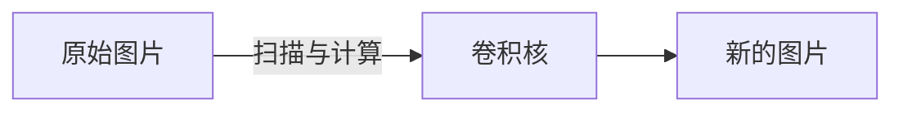

# opencv

## 概览

Open Computer Vision\(Library\) ,开源\-计算机视觉\-类库。

> 注意下：它更倾向的是个类图库，供应用层的开发使用，是非常非常基础的库

1999 年启动，INTEL开发，C/C\+\+编写

> 因为是C/C\+\+编写，可以在 Windows、Linux、Mac 、Android、iOS 上运行，不过还得需要些兼容代码处理

支持API调用语言：JAVA PYTHON Ruby

> 应用层的程序员能直接调用这些库的场景其实不多，基本上中间还有一层引擎帮助处理了。即使是python，它其实也是封装了一层的

##### 核心：计算机 识别/分析 图片\(视频\)

如：

1. 人脸

2. 文字

2. 车辆

3. 医疗

可应用领域

1. 自动驾驶
2. 解锁
3. 打卡
    .......

#### 识别的核心计算是什么？

现实场景 =》 视频 =》 图片 =》 矩阵 =》 像素 =》 RBG

1. 矩阵
2. 像素
3. RBG

> 从这里也能看出 OPENCV 的核心其实也就是 矩阵\+像素，而上面3条是包含关系，也就是日常处理一张图片是：N^2的关系，计算量巨大
> 
> 
> 而视频是由一帧一帧的图片组成，opencv 等于 又可以处理视频了

## 颜色

颜色/光/眼睛是什么？请参考另一篇文章

计算机处理色源顺序：RGB, 这里注意下：OPEN\-CV 默认是BGR顺序，其实就是转换一下，没太大影响

OPEN\-CV使用的色源计量方式：

1. RBG/BGR
2. HSV/HSB/HSL
3. YUV\(视频\)

> 关于颜色空间参考另外一篇文章

## python 环境

pip3 install numpy maplotlib opencv\_python

## 视频操作

打开一个视频：

1. 转成灰度
2. 放慢播放

## 注意

测试OPENCV 函数结果，输出图片时：

matplotlib 是RGB

opencv 是BGR

## 常规操作

1. 读取一张图片
2. 查看图片数据到底是什么？是个3维数组，前两维是X Y 坐标，最后一维是RGB 数组
3. 将图片转换成灰阶图
4. 图片数据的基础操作：
    1. 将某个RBG的通道置0
    2. 取某个区域的数据\(截图\)
    3. 给所有像素做加减法，算是调整一张图片的色调
    4. 合并两张图片，实际就是把两个图片的像素直接相加
    > 图像融合 =》 两张图片相加 =》 得先把长宽同步成一样的，不然 shape 不一样 resize
5. 图片大小重置：放大、缩小

## 图片边界填充

想给图片的边缘做一些填充，它大概有几种类型：

1. 直接用边缘的像素复制
2. 用边缘像素反射\(镜像\)
3. 将边缘一部分像素\(块\)，填充到边缘上
4. 自定义像素值，填充到边缘上

## 阈值处理/二值化

像素值：大于某个定值 ，如：127

1, 二值法，取黑白

平滑处理/滤波

1. 平均值 滤波
2. 高斯 滤波
3. 中值 滤波 =》 降噪效果略好

## 腐蚀/膨胀

去毛刺

腐蚀：用一个矩阵去比对像素，找出那么有差异的像素，然后吃掉。很明显：这个最终的结果毛刺会没，但是自己也会小一圈

膨胀：用一个矩阵去比对像素，找出那么有差异的像素，然后填充。这个最终会胖一圈

先腐蚀去掉毛刺，再膨胀，就是去毛刺的过程

开运算：先腐蚀再膨胀

闭运算：先膨胀再磨蚀

梯度运算：膨胀 \- 磨蚀 = 描边

## 梯度\-算子

sobel 算子，计算：一个像素的梯度，用于描边

它是通过 两个矩阵计算出：一个像素在X轴的梯度值、Y轴的梯度值

\[ \-1 0 \+1 \] \[ \-1 \-2 \+1 \]

\[ \-2 0 \+2 \] \[ 0 0 0 \]

\[ \-1 0 \+1 \] \[ \+1 \+2 \+1 \]

scharr 算子

\[ \-3 0 \+ 3 \] \[ \-3 \-10 \-3 \]

\[ \-10 0 \+10 \] \[ 0 0 0 \]

\[ \-3 0 \+ 3 \] \[ \-3 \-10 \-3 \]

lapkacian 算子

\[ 0 1 0 \]

\[ 1 \-4 1 \]

\[ 0 1 0 \]

sobel算子：用一阶求导原理，计算一个像素上下左右的相邻像素点，得出 一个像素的灰度的亮度变化 ~的间隔的离散情况。先计算垂直，再计算水平，两个结果结合，略麻烦

scharr算子：只能是3X3，跟sobel更像，但是更精确。适合更细的边缘

laplacian算子：一阶求导后，再进行一次一阶求导。实验后：发现，他的结果图 要子以上两个，更精准些，如：细更细，更连贯，字更清晰。但它更容易受到噪音的影响

## canny 边缘检测

1. 高斯滤波，平滑/降噪
2. sobel 计算梯度强度\+方向
3. 非极大值抑制 ,线性插值法\(根据梯度值，删除掉无用的值\)抑制
4. 双阈值检测，是否为真的边缘值
5. 通过抑制 孤立的弱边缘，最终完成边缘检测

> 感觉，就是根据计算好的 梯度值 ，再进行计算，计算出图片里的 边缘的线

边缘检测标准：

1. 低错误率
2. 高定位性
3. 最小影响

## 图像轮廓

find

## 卷积

设定一个小矩阵\(卷积核\)，用该小矩阵去原始图片上扫描与计算\(每个像素先乘，之后再紸累加\)，然后重新生成一个新的图片\(卷积特征\)。

小的矩形：卷积核\(过滤器\)

正常图乘以小矩形得到的一个结果是：卷积特征\(张量\)

步长：小矩形在正常图上的扫描移动步长

卷积操作之后，原始图必然会变小，这个时候就得给图片补像素，叫：padding，即：补多少圈0

函数

cv2.filter2D\(\)

kernel = np.ones\(\(5,5\),np.float32\) / 25

## 降噪

低通滤波

双边滤波

## 轮廓

> 高通滤波，一张图，用人眼如何识别？肯定是由线一点点连接起来，然后，灰暗分隔的地方，算是分隔。

在图像中：一张彩色图，转换成灰度图，那就剩下一维了~然后，颜色在发生变化的地方，其实也就是发生了分隔，就是轮廓
