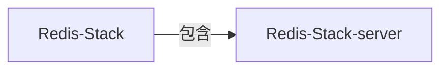

 Redis-Stack 包含：

|                    |         |     |
| :----------------- | :------ | --- |
| Redis Stack Server | 服务端     |     |
| RedisInsight       | 可视化管理UI |     |
| Redis Stack        | 客户端 SDK |     |

 Redis Stack Server 包含了组件： 

|                 |                             |     |
| :-------------- | :-------------------------- | --- |
| Redis           | 就是普通常用 的 redis 实例           |     |
| RediSearch      | 全文搜索、索引                     |     |
| RedisJSON       | 可直接处理JSON格式字符串，object array |     |
| RedisGraph      | 触发器、流处理、分布式函数和完全可编程性,JS编写   |     |
| RedisTimeSeries |                             |     |
| RedisBloom      | 布隆过滤器， 普通类型 + Cuckoo 类型     |     |

#### 安装

docker pull redis/redis-stack-server
476mb

docker pull redis/redis-stack
791mb

docker run -d --name redis-stack -p 6379:6379 -p 8001:8001 redis/redis-stack:latest

>8001 ： RedisInsight

http://8.142.177.235:8001/

docker exec -it redis-stack redis-cli
# 索引

被索引的数据类型：json  hash
>也只有这两种类型，索引才有意义的。它类似关系二维表，对某个字段索引

# 总结 

支持JSON格式操作，但HASH结构也满足JSON
支持全文索引，可以把JSON/HASH 结构的，若干个KEYS的值，中的某些列做索引，也就是可以：跨 KEYS进行搜索。感觉就是：NoSql DB

复杂的场景：直接上 MongoDb 多好。
简单的场景：redis 自己就能解决
折中的场景：不太复杂，数据量也不且，且不想再找第3个插件，直接基于原REDIS上操作

