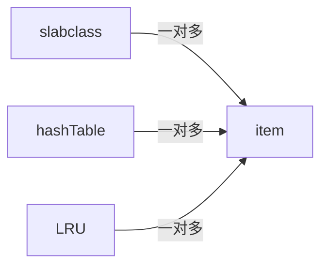

# 概览

# 进组/线程

单线程 + 多线程 = 主线程 + 工作线程组

## 主线程

主要功能：负责 socket 监听 、接收网络的 IO、解析指令、维护 session 、将工作指令分发给 工作线程

1. 初始化 lib event
2. 创建/初始化 工作线程
3. 初始化 pipe ，用于线程间通信
4. 初始化内存
   - 申请物理内核
   - 创建 slab
5. 初始化 hashTable

使用了 libevent 库

大体上它分成两个部分：连接/事件 处理 + 内存管理

# 连接管理

[[memcache-连接.png]]

每个连接的结构体：

```
struct conn_queue_item {
    int               sfd;//accept之后的描述符
    enum conn_states  init_state;//连接的初始状态
    int               event_flags;//libevent标志
    int               read_buffer_size;//读取数据缓冲区大小
    enum network_transport     transport;//内部通信所用的协议
    CQ_ITEM          *next;//用于实现链表的指针
};
```

每个连接最终的容器：

```
struct conn_queue {
    CQ_ITEM *head;//头指针，注意这里是单链表，不是双向链表
    CQ_ITEM *tail;//尾部指针，
    pthread_mutex_t lock;//锁
    pthread_cond_t  cond;//条件变量
};
```


每一个 work 线程，都维护了一个：conn_queue
主线程拿到 新 客户端 的 socket fd ，会创建   conn_queue_item ，把信息写进 conn_queue_item，接着把 conn_queue_item 再push 到 work 线程 的 conn_queue。

最后，发消息告知 work 线程做出相应处理。

之后，work 线程 监听新的 socket fd ，做IO处理

假设此时：有消息过来，drive_machine  函数介入：
主要就是解析指令（conn_parse_cmd ）
执行指令：就是后面的处理了
返回响应数据

# 内存管理

[[memcache-内存.png]]

memcache 采用的是部分预先分配内存，即：在启动时，就把你给它的部分内存空间使用上，进行格式化，等数据的到来，再逐步申请内容
开始是申请大概 64 个 slab 。其中：0 元素为特殊节点，它不会存 item ，它是给后续 63 个提供内存空间

## item

```C
typedef struct _stritem {
	//记录下一个item的地址,主要用于LRU链和freelist链
	struct _stritem *next;
	//记录下一个item的地址,主要用于LRU链和freelist链
	struct _stritem *prev;
	//记录 HashTable 的下一个Item的地址
	struct _stritem *h_next;
	//最近访问的时间，只有set/add/replace等操作才会更新这个字段
	//当执行flush命令的时候，需要用这个时间和执行flush命令的时间相比较，来判断是否失效
	rel_time_t      time;       /* least recent access */
	//缓存的过期时间。设置为0的时候，则永久有效。
	//如果Memcached不能分配新的item的时候，设置为0的item也有可能被LRU淘汰
	rel_time_t      exptime;    /* expire time */
	//value数据大小
	int             nbytes;     /* size of data */
	//引用的次数。通过这个引用的次数，可以判断item是否被其它的线程在操作中。
	//也可以通过refcount来判断当前的item是否可以被删除，只有refcount -1 = 0的时候才能被删除
	unsigned short  refcount;
	uint8_t         nsuffix;    /* length of flags-and-length string */
	//FETCHED：第一次被访问时置位该标志位。
	//ACTIVE：第二次被访问时（即it->it_flags & ITEM_FETCHED为true的情况下）置位该标志位
	//INACTIVE：不活跃状态。(不确定是否有此状态值)
	uint8_t         it_flags;   /* ITEM_* above */
	//此 item 属于哪个 slabclass_t
	uint8_t         slabs_clsid;/* which slab class we're in */
	uint8_t         nkey;       /* key length, w/terminating null and padding */
	/* this odd type prevents type-punning issues when we do
	 * the little shuffle to save space when not using CAS. */
	//数据存储结构
	union {
		uint64_t cas;
		char end;
	} data[];
	/* if it_flags & ITEM_CAS we have 8 bytes CAS */
	/* then null-terminated key */
	/* then " flags length\r\n" (no terminating null) */
	/* then data with terminating \r\n (no terminating null; it's binary!) */
} item;
```

它可以分成两个部分：元数据 + 数据
元数据：连接 slab_class 、LRU 状态、LRU 双向链接地址、失效时间、引用次数、hashTable 的内部链接地址
data：CAS + key + stuffix + value

item 与 item 之间是有连接： hashTable + LRU
item 与 slab_class 也互有联系

## slab_class

slabclass_t 结构体：

```C
typedef struct {
    unsigned int size;      //slab分配器分配的item的大小/当前的slabclass存储最大多大的item
     //每一个slab分配器能分配多少个item/每一个slab上可以存储多少个item.每个slab大小为1M， 可以存储的item个数根据size决定。
    unsigned int perslab;
	//当前slabclass的（空闲item列表）freelist 的链表头部地址
	//freelist的链表是通过item结构中的item->next和item->prev连建立链表结构关系
    void *slots;           //指向空闲 item 链表
    //当前总共剩余多少个空闲的item
    //当sl_curr=0的时候，说明已经没有空闲的item，需要分配一个新的slab（每个1M，可以切割成N多个Item结构）
    unsigned int sl_curr;   //空闲item的个数
    //总共分配多少个slabs
    unsigned int slabs;     //本slabclass_t可用的slab分配器个数

    void **slab_list;       //slab数组，数组的每一个元素就是一个slab分配器，这些分配器都分配相同尺寸的内存
    unsigned int list_size; //slab数组的大小, list_size >= slabs

    size_t requested; //本slabclass_t分配出去的字节数
} slabclass_t;

#define MAX_NUMBER_OF_SLAB_CLASSES (POWER_LARGEST + 1)
//数组元素虽然有MAX_NUMBER_OF_SLAB_CLASSES个，但实际上并不是全部都使用的。
//实际使用的元素个数由power_largest指明
static slabclass_t slabclass[MAX_NUMBER_OF_SLAB_CLASSES];//201
static int power_largest;//slabclass数组中,已经使用了的元素个数.

```

每个 slab 是 大约是 1M(默认，可调)内存空间

> slab 是可变的，对应 chunk 的大小也是可变的随时因子不同，递增。

一个 slab 又被划分成 若干个固定内存大小的 chunk

> chunk 约等于 item

最终所有的 slab 被保存在 slabclass_t 中即，：一个 slab = 一个 slabclass_t

slabclass_t 又被保存于 slab_class 数组中
slab_class 就可以理解为： memcache 中实际管理（分配）物理内存的类。

实际：每个 slabclass_t 大小是固定的， slabclass_t 中的 item 大小不是固定的，memecached 启动/初始化时，好像是以 1.25 倍递增创建 64 个

## hashTable

每个 item 被创建时，它地址会被存于 hashTable，用于检索。

出现 hash 碰撞，它使用的是拉链法 。也就是一个 hash 值 后面对应不是一个 item ，而是一个链表，依次再找~ 但这个链表是 item h_next 值，实际上不存在单独的一个链表。

## LRU

Least Recently Used 近期最少使用算法，用途：

1. 当内存接近饱合时：新进来要存储的数据，会找到不被使用却占用内存的数据
2. 定期清理一些不常用的数据

memcached 启动时，会创建 3 个全局变量：heads[] tails [] size_bytes[]
heads[] tails [] 指向：4 个 LRU list 的 队首/队尾 地址
size_bytes[] 指向 ：每个 slab_class 占用内存的总大小

heads tails 的使用：以 64 为因子，对应的： 0 64 128 192

heads[0+slab_class_id] : HOT
heads[64+slab_class_id]:warm
heads[128+slab_class_id]:COLD
heads[192-slab_class_id]:TEMP

每创建一个 slab_class_t 就会连带着创建 4 个 LRU 链表需要操作，即：heads tails 就得+1

### item LRU 流转

3 个判断依据：

- age = 当前时间 - item.time(最后被访问时间) = 此 item 有多久没有被访问过了
- 内存容量，判定：当前 slabclass 占用内容过多
- it.flag = FETCHED ACTIVE
  > if age > age_limit || size_bytes > limit

1. HOT: 所有 item 创建都会进到这里(temp 除外)，一但到队尾，就开始被处理，活跃扔到 warm 非活跃扔到 cold。不会有移动到队头的操作
2. WARM：访问 2 次及以上的。检测时：如果是活跃状态会重新移到队头，非活跃扔到 cold
3. COLD：内容不够、失效的、长时间未访问过的，扔到这里。大概率被回收，如果又变成了活跃状态，移到 warm
4. TEMP：  该队列中的 item TTL 通常只有几秒，不会被挪动队头

每次 item 被移动后，active 状态会被清除

### 小结

所有的 item 被分成了 3 种类型，其中 cold 里的，是最大概率被回收的，省着遍历所有 item 节点了。算是性能提升吧，标记也更精准点。

4 个数组中的所有 LRU 链表由 一个线程：maintainer，统一管理

## 小结

这 4 个分类基本上就是 memcache 存储的核心，其关系



被操作的节点就是 item ，剩下的都是管理它的组件

可以双向查找：

1. 从 slabclass 可以找到 item
2. 从 hashtable 中找到 item

slabclass 就是纯内存操作，而 hashtable 是从用户操作具体 KEY，这样也算是：内存 绑定 用户数据。用户发送的指令就关心自己的操作。slab 就是管理内存。

## crawler 线程

maintainer crawler 都是高版本加入的，算是一种优化吧。也叫爬虫线程

具说它会扫描 LUR 的链表，把过期的做回收。

## 过期处理

它是懒处理。在 set get flushall 的时候会触发

> 并不像 redis 有个 过期列表

这里不确定的理解：

1. crawler 更倾向于大量的非精确的处理过期 KEY
2. 懒回收是具体到某一个 KEY
3. 1 + 2 是结合的使用

CURD

## 插入

set 命令最终执行的函数 ：do_item_alloc

1. 锁定
2. 添加
   1. 找到最适合(大小)的 slab
   2. 去 LRU 列表尾部找：是否有过期的（会循环找 5 次）
   3. 从 slabclass_t 的 free list 找，是否有空闲
   4. 分配一个新的 slabclass_t
   5. 开启 LRU 淘汰策略，肯定能找到一个
3. 更新 LRU 链表 (item_link_q)
4. 更新 hashTable
5. 更新统计数据
6. 解锁

## 获取

源码函数: do_item_get

1. 锁定
1. 换成 hash 值，是否命中
2. 引用+1
3. it_flag 更新
4. 查看是否失效，失效就直接软删除了
5. 解锁

## 删除

并不是直的删除，而是将此 item 转移到 free list 中

1. 锁定
2. 更新 状态为：空闲
3. 清空引用次数
4. 删除 hashMap 中的 key 值
5. 删除 lru 值（do_item_unlink）
6. 更新 slab_class ，链表，由使用中 改成 空闲中
7. 解锁


# 集群


## hash

就是简单的 hash / 几台服务器 = value，每次用户IO的数据会落到某一台机器上

优点：简单
缺点：

- 没什么太高级的容灾策略，某台挂了也就挂了，上面的数据虽然还在，但也没什么意义了。
- KV的值大小不一，不确定它内部的算法，是否能做到根据每台机器的实际健康情况，再做智能取模
## 一致性哈希

### 原理
假设有 A B C D E 五台机器，KEY：1 2 3 4 5 ， 机器名 key mod 5 = 落到 哪台机器，如果我再新加一台 F，该算法失效。

算法改进：

给每台机器设置一个 整数范围，比较大的

- A：0~100000
- B：0~200000
- C：0~300000
- D：0~400000
- E：0~500000

计算一个 KEY 落到哪台机器的算法：先把 KEY 用 CRC32(hash 函数)，计算出来一个数字值，如果在 500000 以内，挑一个距离 最近 的机器，如果大于 500000，就跟 500000 取个余数

这个时候增加一台机器 F，因为最大值已经设定为 500000，所以取值只能 在 500000 之内，看一下这 5 台机器哪负载比较高，假如 A 比较高，那就给 F 的取值范围为：150000~199999

F：150000~199999

A：100000~149999 改变

新算法：当一个 KEY hash = 150001，原先之前肯定是落 在服务器 A，这个时候加个判断如果<150000 去 A，如果大于则去 F 服务器。

再看一下如果某一台服务器挂机了，假设 E 挂机了

现在有个 KEY 为 450000，按正常来说应该落 到 E 上面，但 E，PING 不通，于是循环，找一个距离它最近的服务器，E 后面没有服务器了，那就循环，A 是最近的。于是落 到 A 上。

### 分析

优点：解决了增加删除某台机器后：模变化，部分缓存数据失效
缺点：数据还是会有倾斜的情况，就是某台机器数据过多


### 虚拟节点 

算是又加了一层索引吧，在上面取到某个模之后，再进行一次计算，保证尽量的：每台机器上的KEY值比较分散

![[一致性哈希.png]]


当前线程数


一、缓存命中率 = get_hits(总命中次数)/cmd_get \* 100%

二、get_misses 的数字加上 get_hits 应该等于 cmd_get

三、total_items == cmd_set == get_misses，当可用最大内存用光时，memcached 就会删掉一些内容，等式就会不成立

memcached/scripts/memcached-tool


