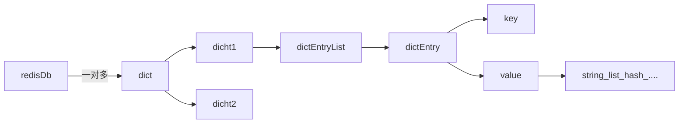

# 概览


[为了拿捏 Redis 数据结构，我画了 40 张图（完整版） - 小林coding - 博客园](https://www.cnblogs.com/xiaolincoding/p/15628854.html)


| 数据类型 | 底层数据结构 |
| :--- | :--- |
| string | sds |
| list | quickList+zipList |
| hash | hashTable+zipList |
| set | hashTable+intSet |
| zset | skipTable+zipList |

# sds

Simple Dynamic String 

#### C 字符串问题

C 语言中是使用 char *chat[] 来存储 string，这里有 3 个问题：

1. 如果计算 string 长度是 O(n)
2. 添加操作，可能会对内存多次重新分配
   > 字符串拼接可能有溢出风险，需要重新分配 。字符串缩减可能有泄露风险，，需要重新分配
3. 二进制安全？
   > C 没有真正的字符串，但有字符串概念，在字符串末尾加上：\\0
   > 数据 + \\0 = 字符串，这里有个问题，一但 数据中包含 \\0，那 len 函数就会错误，也就是数据不安全
   > 字符串常量：数据不可更改。字符串数组：可任意更改
   > 不管是 指针 还是 字符数组，最终都会在末尾加上：\\0
   > 总结：C 语言的字符串并不单独计算长度，且数据与分隔符混用了

所以，redis 又封装了一个新的结构体 sds ，在日常操作字符串就都使用这个结构体，不直接操作 char *

```c
typedef char *sds;
struct sdshdr {
    // buf 已占用长度
    int len;
    // buf 剩余可用长度
    int free;
    // 实际保存字符串数据的地方
    char buf[];
};
```

解决的问题：

1. 加了个索引项，当需要计算长度时，直接读取该项值 O(1)
2. 加了个剩余长度，申请内存的时候，多申请一小块，追加时，避免内存重新分配(动态扩容)
3. 明文了已用未用空间大小，在字符串操作的时候，避免了 溢出
4. 明文了已使用长度，即使数据中包含 \0 依然可以正确使用
5. 真正存数据并不是以字符，而是字节为单位存储。这样就兼容了二进制

未使用：空间的动态分配：
>value < 1mb ，申请 value \* 2
>value > 1mb , 申请 1m

这就是空间换时间，会有一定的内存浪费

3.5 之后 redis 对 sds 继续优化，上面的 sds 结构体，变成了 5 个：
sdshdr5 sdshdr8 sdshdr16 sdshdr32 sdshdr64

```c
struct __attribute__ ((__packed__)) sdshdr64 {
	uint64_t len; //已使用
	uint64_t alloc; // 总共可用的字符空间大小，应该是实际buf的大小减1 (因为c字符串末尾必须是 \0, 不计算在内)。
	unsigned char flags; // 标志位，主要是识别这是sdshdr几，目前只用了3位，还有5位空余
	char buf[];  // 实际存储字符串的地方 其实就是 C 原生字符串+部分空余空间
};
```

大体上：

- 整形单独存，基本上 3~4 个字节妥妥够
- 小字符串，单独存
- 大字符串，也单独存

Sdshdr5: 存储字符串长度区间为[0, 1<<5)之间, 没有 Len 和 Alloc 字段,只有一个 Flags 字段,整个 sdshdr5 占用 1Byte
Sdshdr8: 存储字符串长度区间为[1<<5, 1<<8)之间, Len 和 Alloc 字段都占用 1Byte, 整个 sdshdr8 占用 3Bytes
Sdshdr16:存储字符串长度区间为[1<<8, 1<<16)之间, Len 和 Alloc 字段都占用 2Bytes, 整个 sdshdr16 占用 5Bytes
Sdshdr32:存储字符串长度区间为[1<<16, 1<<32)之间, Len 和 Alloc 字段都占用 4Bytes, 整个 sdshdr32 占用 9Bytes
Sdshdr64:存储字符串长度区间为[1<<32, 1<<64]之间, Len 和 Alloc 字段都占用 8Bytes, 整个 sdshdr64 占用 17Bytes

![[redis-sds.png]]


# ziplist

看名字叫压缩列表，但它是：对内存的优化，虽然外看是链表。但元素内并不存 next prev ，它实际是个 char 类型的数组

ziplist 内部结构：

```
area        |<---- ziplist header ---->|<----------- entries ------------->|<-end->|

size          4 bytes  4 bytes  2 bytes    ?        ?        ?        ?     1 byte
            +---------+--------+-------+--------+--------+--------+--------+-------+
component   | zlbytes | zltail | zllen | entry1 | entry2 |  ...   | entryN | zlend |
            +---------+--------+-------+--------+--------+--------+--------+-------+
                                       ^                          ^        ^
address                                |                          |        |
                                ZIPLIST_ENTRY_HEAD                |   ZIPLIST_ENTRY_END
                                                                  |
                                                         ZIPLIST_ENTRY_TAIL
```

- zlbytes 压缩列表所占用的字节（包括本身占 4 个字节），当重新分配内存的时候使用，不需要遍历整个列表来计算内存大小。
- zltail ：表中最后一项（entry）在 ziplist 中的偏移字节数。可以很方便地找到最后一项（不用遍历整个 ziplist），可以在 ziplist 尾端快速地执行 push 或 pop 操作。
- zllen：压缩列表包含的节点(entry)个数
- entry:表示真正存放数据的数据项，长度不定。一个数据项（entry）也有它自己的内部结构。
- zlend: ziplist 最后 1 个字节，值固定等于 255，其是一个结束标记。

entry 内部结构：

```
area        |<------------------- entry -------------------->|

            +------------------+----------+--------+---------+
component   | pre_entry_length | encoding | length | content |
            +------------------+----------+--------+---------+
```

prevlen：前一项的长度。方便快速找到前一个元素地址，如果当前元素地址是 x，(x-prelen)则是前一个元素的地址
encoding：当前项长度信息的编码结果。比较复杂，稍后介绍
data：当前项的实际存储数据

它的核心就是：把数组改成链表来使用

数组的优点：

1. 连续的内存空间，不会有内存碎片。CPU的缓存也能用上。
2. 带有下标，可以快速检索

数组的缺点：

1. 表头 表尾 可以快速检查，但是表的中部数据检查起来很麻烦
2. 插入/更新，最坏的情况，可能整个链表都要重新进行内存分配(连锁更新)

个人总结：ziplist 可以节省内存，提高一定的检查效率。不适合大数据，一但发现内存重新分配 或 查询中间数据的时候就吃力了。

## quickList

具说 3.2 版本以前是 linkedlist ，比较典型的双向链表，其中内容存储项：value 指向 SDS。缺点就是：遍历慢，next prev 吃内存。

quickList 更像是对 ziplist 的索引（类似：2-3 树/基排序/跳表的感觉）。 其内部的元素都是指向 一个 ziplist 结构

```c
typedef struct quicklist {
    //指向头部(最左边)quicklist节点的指针
    quicklistNode *head;
    //指向尾部(最右边)quicklist节点的指针
    quicklistNode *tail;
    //ziplist中的entry节点计数器
    unsigned long count;        /* total count of all entries in all ziplists */
    //quicklist的quicklistNode节点计数器
    unsigned int len;           /* number of quicklistNodes */
    //保存ziplist的大小，配置文件设定，占16bits
    int fill : 16;              /* fill factor for individual nodes */
    //保存压缩程度值，配置文件设定，占16bits，0表示不压缩
    unsigned int compress : 16; /* depth of end nodes not to compress;0=off */
} quicklist;
```

```c
typedef struct quicklistNode {
    struct quicklistNode *prev;     //前驱节点指针
    struct quicklistNode *next;     //后继节点指针

    //不设置压缩数据参数recompress时指向一个ziplist结构
    //设置压缩数据参数recompress指向quicklistLZF结构
    unsigned char *zl;
    //压缩列表ziplist的总长度
    unsigned int sz;                  /* ziplist size in bytes */
    //ziplist中包的节点数，占16 bits长度
    unsigned int count : 16;          /* count of items in ziplist */
    //表示是否采用了LZF压缩算法压缩quicklist节点，1表示压缩过，2表示没压缩，占2 bits长度
    unsigned int encoding : 2;        /* RAW==1 or LZF==2 */
    //表示一个quicklistNode节点是否采用ziplist结构保存数据，2表示压缩了，1表示没压缩，默认是2，占2bits长度
    unsigned int container : 2;       /* NONE==1 or ZIPLIST==2 */
    //标记quicklist节点的ziplist之前是否被解压缩过，占1bit长度
    //如果recompress为1，则等待被再次压缩
    unsigned int recompress : 1; /* was this node previous compressed? */
    //测试时使用
    unsigned int attempted_compress : 1; /* node can't compress; too small */
    //额外扩展位，占10bits长度
    unsigned int extra : 10; /* more bits to steal for future usage */
} quicklistNode;
```

quicklist -> quicklistNode ->ziplist

![[redis-QuickList.png]]
# hashTable

```c
typedef struct dictht {
    dictEntry **table;             // 哈希表数组，指向  dictEntry
    unsigned long size;            // 哈希表数组的大小
    unsigned long sizemask;        // 用于映射位置的掩码，值永远等于(size-1)
    unsigned long used;            // 哈希表已有节点的数量
} dictht;

```

```c
typedef struct dictEntry {
    void *key;                  // 键
    union {                     // 值
        void *val;
        uint64_t u64;
        int64_t s64;
        double d;
    } v;
    struct dictEntry *next;     // 指向下一个哈希表节点，形成单向链表
} dictEntry;

```

比较简单，就是：数组+链表

数组：通过一个 hash 函数计算出 数组的下标，O(1)，满足 hash 的查询复杂度
链表：key 冲突的时候使用

#### rehash

数组是 dictEntry 的容器，或者叫索引容器。
当数据越来越多的时候 数组的数量肯定是不够用的，于是就提对数组进行扩容
>单个 dictht  数组如果过小且对应的值过多，冲突就会加大
>
>它引入了另外一个结构：

```c
typedef struct dict { 
    dictType *type; 
    void *privdata; 
    dictht ht[2]; 
    int reshaidx; 
} dict; 
```

大体上的思路：
1. 再创建一个新的数组(hash容器)，是旧数组的2倍
2. 按照策划把旧的数组转移到新的数组中

数组迁移策略：
1. 阻塞IO，把旧的一次性迁过去 
2. 逐步迁移
	- 旧的只负责读，如果找不到，就去新的里面找
	- 写操作会在新的里面进行

当 hashTable 过大时，会改成 ziplist 存储：

- 数据长度小于 64
- 列表长度小于 512

# intset

```c
typedef struct intset {
	uint32_t encoding;
	uint32_t length;
	int8_t contents[];
} intset;
```

encoding：INTSET_ENC_INT16  INTSET_ENC_INT32 INTSET_ENC_INT64
contents：保存实际的数据，但它并不是真的 int8  取决   的值
length：保存数据的总个数

很取巧的一个结构，可以保存 int8 int32 int64

# skipTable


![[redis-跳表.png]]

跳表：就是在一个有序的链表基础之上，再建立 N 级索引，以二分法的方式建立。这样搜索更快。
 
找到 level 最高的那个节点，从最高层开始搜索，如果大于就向右，如果小于就向左，如果为 null 则下层寻找


redis 唯一一种：可能使用两种结构存储数据

元素比较多 或 很大的对象 时：skipTable ，否则使用 setint


```c
typedef struct zset{
     //跳跃表
     zskiplist *zsl;
     //字典
     dict *dice;
} zset;
```


为什么不单独使用字典？
字典是无序的，查找快，但是排序不行。

为什么不单独使用跳表？
可以范围查找 ，但是具体 找某个值会很慢

```cpp
typedef struct zskiplist{
     //表头节点和表尾节点
     structz skiplistNode *header, *tail;
     //表中节点的数量
     unsigned long length;
     //表中层数最大的节点的层数
     int level;

}zskiplist;
```

```java
typedef struct zskiplistNode {
     //层
	struct zskiplistLevel{
	    //前进指针
	    struct zskiplistNode *forward;
	    //跨度
		unsigned int span;
	}level[];
		//后退指针
	struct zskiplistNode *backward;
	//分值
	double score;
	//成员对象
	robj *obj;
} zskiplistNode
```


# ListPack

5.0新出的一个结构体，是对 zipList 的优化，6.0 开始部分被替换成了 ListPack


```php
struct listpack<T> {
	int32 total_bytes; // 整个listpack,占用的总字节数
	int16 size; // 整个listpack中元素个数
	T[] entries; // 紧凑排列的元素列表
	int8 end; // listpack的结束符,恒为 0xFF
}
```


```php
struct lpentry {
	int<var> encoding;        //entry中数据的的编码方式,具体在下面介绍
	optional byte[] content;  //存放的具体的内容
	int<var> length;          // 当前lpEntry的长度
}
```


没看出太大的区别，ListPack 比  ZipList 少存了几个值：tail 和 pre_entry_length


# key 的存储结构

redis 中所有的 key 是用的底层 hashTable 结构，如下：



一维数组+链表结构


# 基础数据结构


| 名称         | 分类                                | 底层结构                |                    |
| ---------- | --------------------------------- | ------------------- | ------------------ |
| String     | 最简单的结构类型，可以存在任何数据：字符、数字、二进制       | SDS                 |                    |
| List       | 类似一个队列吧，有顺序的插入元素，元素值可以重复，可以是字符/数字 | quickList           | 做范围查询，首尾元素追加/删除    |
| Set        | 集合，字符/数字都能存，但不允许重复。               | intset hashTable    | 适合随机操作，如某个值的 删除 修改 |
| Sorted Set | 集合，字符/数字都能存，有序的，但不允许重复。           | zipList + skipTable | 做范围查询，有排序规则        |
| Hash       | 就是普通的字典/hashTable                 | zipList + hashTable |                    |

## string

set age 18 ex 10 NX 
设置 年龄=18岁 ，10秒后超时，键值必须不存在

incr age
年龄+1

decr age
年龄-1

get age
18

### 操作字符串

set name zhangsan
APPEND key value ：如果 KEY 是 STRING，在末尾追加


