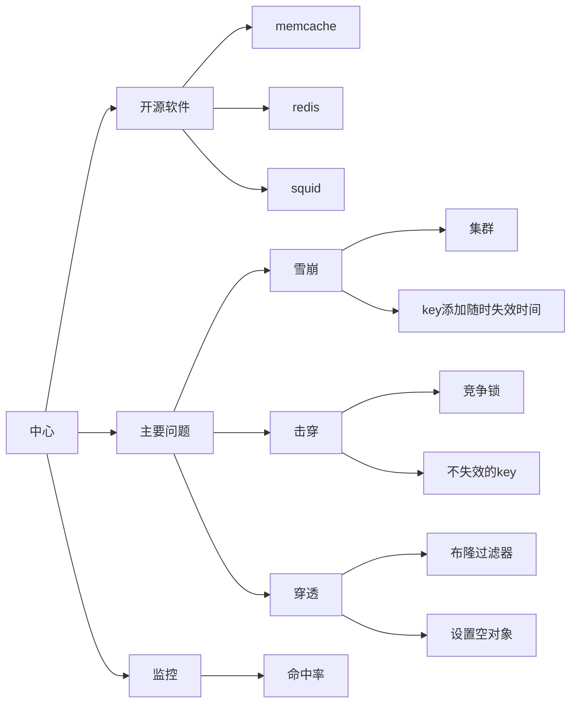

# 概览

缓存解决的核心问题是：原本频繁访问 DB，改成访问缓存。增加构架的稳定性

DB 里存储的全面的/较大的数据，开发者每次访问 DB，DB 需要计算过滤，最终只有几条记录是满足要求的，然后返回给开发者。如果把这几条记录存进缓存中，那么 DB 的压力就会非常非常小。

缺点：

1. 多加了一层(缓存层)，要整体维护这一层
   1. 软件的安装/重启
   2. 配置文件调车与优化
   3. 故障排除等等
   4. 报警
   5. 数据统计
   6. 容灾处理
2. 需要多加服务器或吃掉原服务器一部分性能
3. 请求链路中也多加了一层，
   1. 会增加一次请求的一些时间
   2. 增加了一定的开发复杂度
   3. 开发在：查错/调试略麻烦

# 展示图

# 一些基础问题

## 雪崩

某一时间，缓存挂了，导致请求直接打到数据库上，DB 可能挂了。运维重启 DB，依然有大量请求直接打到 DB 中，DB 继续崩

出现此问题的主要原因：

1. 缓存服务挂了
> 缓存做集群

1. 缓存失效时间过于集中
> 所有 KEY 的失效时间自动加一个随机值

## 击穿

同雪崩类似，只是它是某一个 KEY，或某几个 KEY。像：一些热点 KEY，访问较大的，它瞬间失效还没来得及重新缓存，大量的请求直接到 DB，也可能把 DB 带挂了。

1. 当 key 失效，先去竞争拿个锁，拿到的才有权去直接访问 DB
2. 直接不失效，再有一个程序去维护此 key 值的修改

## 穿透

请求要访问的 DB 数据，本就不存在，先查 缓存为空，缓存再请求 DB 依然为空。此时，如果黑客大量伪造类似请求，也就等于直接跳过了缓存，直接访问 DB 了。
>这种更多是倾向于：访问DB查找也是空的，那么缓存也不好去做缓存，那，每次都要访问DB了

> 注：这里做下与击穿的区别，击穿是本就应该有这样的一个 key，可能当前失效不存在 ，再请求 DB 重写缓存。而穿透是压根就不存在这个 key，再请求 DB 也一样不存在缓存 KEY

1. 布隆过滤器判断 KEY 是否存在
2. 缓存一个特定的'空对象'，用于标识为：空

## 总结

对于记住这 3 个关键词：这里做个小技巧

1. 雪崩，就是有大批的请求同时到来
2. 击穿，重点在于这个 '击' 字，得先打击再穿透
3. 穿透，根本就是无视缓存的存在，直接透过去了\(缓存\)

以上的 3 个问题，其主要都是解决，缓存失效，请求直接打到 DB 上。

# 冷热数据

冷数据：访问次数不高的数据。
热数据：经常访问的数据。

> 二八定律：一个 redis 里缓存的数据，可能 20%访问的频率是最高的，剩余的 80%可能访问率很低

具说 redis 在 2.0 以前有个 VM 机制 ，就是虚拟内存，不常访问的放到磁盘上。不过缺点就是可能会偶尔导致 redis 重启。2.4 之后就放弃了。
自实现 代理层，所有的 IO 均先到代理层这里，如果数据过大,value 就不写 redis ,只做个标记，实际的数据存储到 ssdb 中

总结 ：感觉这东西挺鸡肋的，单从缓存角度看。 redis 最好只放热数据，且不是特别大的。如果冷数据过多，说明程序有问题。冷数据最好放到 db 中。

# 命中率

命中率 = 命中次数 /\( 命中次数 + 不命中次数 )
redis 中两个值： keyspace_hits(命中次数) + keyspace_misses(不命中次数)
缓存的核心指标就是：命中率，这个值不能低于 95%，实际上应该做到 99%。不然，这个缓存系统就是有问题的
