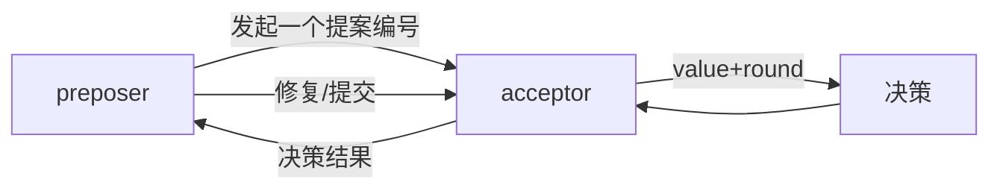
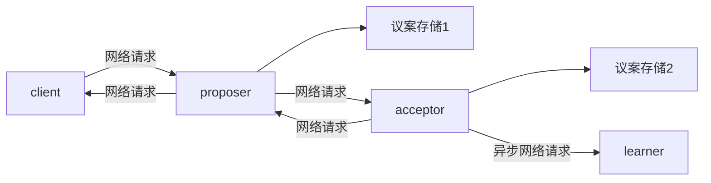
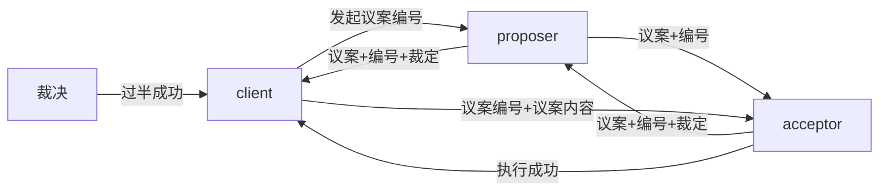

# 概览

定义：基于消息传递的，一致性(共识)算法

> 1990 年提出，后续的所有算法都是基于此，或增加，或删减，算是鼻祖吧。

随着互联网\(微服务\)、大数据、虚拟币\(区块链\) 的兴起后，对分布式的需求更多，应用更多，这哥们的论文就火了
这里先分析一下：2PC 3PC 多数派 算法

#### 注：这里需要先了解分布式算法，文章所有的算法都是解决分布式问题

# 2PC

> 2 phase commit :2 阶段提交

1. 阶段1：准备，广播其它节点：可以执行代码了，并等待所有节点返回执行成功消息
2. 阶段2：提交，广播其它节点：刚刚执行的代码可以提交了，并等待所有节点返回执行成功消息

角色：

1. 协调者 coordinator
2. 参与者 participant

![[分布式-2pc.png]]

优点：

1. 增加一步预执行阶段，一但失败，在第二阶段可以回滚

缺点：

1. 同步阻塞，第一阶段 协调者被阻塞(要等待所有者给定结果)，第二阶段 参与者被阻塞(等待协调者给定提交/回滚) => 可用性不高，一个节点出问题，全体阻塞
2. 协调者，有单点故障的问题
3. 数据锁定范围被加大：执行完的脚本，但不提交，等待协议者发送二次提交消息
4. 阻塞时间过长：执行完的脚本，但不提交，等待协议者发送二次提交消息
5. 数据可能不一致，如：一阶段有失败的应答，二阶段是回滚，某台机器回滚失败(用重试可日志做修复)

# 3PC

> 3 phase commit ：3 阶段提交

canCommit：广播各节点先确认一下是否有时间执行一个事务，并等待所有节点返回消息，且加入定时器
preComiit：广播各节点可以执行代码了，并等待所有节点返回执行成功消息，且加入定时器
doCommit：广播各节点刚刚执行的代码可以提交了，并等待所有节点返回执行成功消息，且加入定时器

![[分布式-3PC.png]]

对比 2 阶段，加了一步：预发布阶段，其实就是：提前确认一下，如果这一步就有问题，后两步就可以省了（减少了资源锁定范围）

加了定时器：之前的阻塞主要是无法确定双方什么时候有响应或对方不响应，加上定时器后，避免了 阻塞

优点：提交做 PING/PONG 处理，不做预执行，减少锁定范围与阻塞时间，一但失败，后面两步均省掉了

缺点：太复杂了

1. 协商效率降低
2. 超时机制导致：数据不一致更严重了

## quorum

![[分布式-quorum.png]]

多数派协议\(法定人数\)：只要保证半数\+1 写入成功，写就不会丢失 ，读也一样，肯定有一个能读成功。

> 感觉跟二阶提交几乎一样，只是在判断的时候：由全成功改为：过半成功

优点：可用性更高，也没那么多网络通信，没有过多阻塞，没有过多数据锁定

缺点：一致性太低

# Paxos 算法

官方讲解地址

> https://zh.wikipedia.org/zh\-mo/Paxos%E7%AE%97%E6%B3%95

Paxos 对比上面 3 种方案其实是：两阶段提交+多数派

> 也算是对上面 3 种方法的优化升级

它又分为 3 种算法：

1. basic Paxos
2. multi Paxos
3. fast Paxos

## 角色

1. client:一个节点 | 一台服务器
2. preposer:提案发起者
3. acceptor\(voter\):提案接收者
4. learner:记录者 ,backup

![[分布式-Paxos-base.png]]

对比传统 2PC 3PC ，它删除了 coordinator 角色，也就是不要单独拿一个节点做仲裁，每个节点都可以做仲裁
## basic Paxos

简要流程:

注意:

1. 分布式严格来说并不是传统的 CS 模式，不存在绝对 S 与绝对 c ,每台机器都可以 C/S
2. client 是包含另外 3 个角色的，或者把 client 看成一台服务器，另外 3 个角色是 3 个服务进程
3. 3 个角色\(进程\)即有一定关系，又没关系，可各自忙各自的

交互流程：
![[分布式-basic Paxos.png]]

多出来一个概念：全局ID
用此ID来标识当前的事务顺序
>如：同一时间有两个 节点发起 事务，要按照顺序来执行

注：此图只是表示了一个节点发起了一次请求，在同一时间内，很可能两个节点同时发起了两次请求。
同一时间，只能有一个成功，另一个失败。
>global_id机制就是干这个的

而失败方，会继续重试此预案。

缺点：

1. 活锁（协商效率）

> client1 说去吃火锅，另外 2 个人都同意了，各端 ID=1，这个时候 client1 准备要发送提议内容了，这个时候 client2 突然说我又想去吃烤肉了，那么另外两个 client 也同意了，那么此时各端的编号 ID=2 了，这会导致 client1 二次发送的提议内容\<N，失败了... ，又比如：并行的两种不同类型的提议，也会相互影响
> 解决办法也挺简单：两边如果发现自己的提议失败了就等一会\(随时时间\)，或者达到 3 次就不再提议了

1. 两次 RPC 过程

> 一次 ID 提议，一次提议的具体内容收发

1. 太过自由，每台机器都可以是任意角色，各自都可以任意发起议案，各次议案、各种角色混合使用，效率很低

# multi Paxos

对 Pbasic Paxos 算法的优化，basic Paxos 的核心是高度自由化，人人都可以发言，只要其中一个人再发起一次提案，那前面未完成的提议均作废

multi Paxos:是把高度自由化改为一定自由化，加了一个新角色：leader

第一步：选择出一个 leader

之后，每个 client 要想发出议案，就直接发给 leader

leader 再分发广播给其它 client，其它 client 把结果给到 leader，leader 仲裁，然后最最终结果转发给 client1

![[分布式-multi Paxos.png]]

对比 poxos:

1. 多了一次选举过程
2. 各节点之间多了一个心跳，保证 leader 正常，如出现意外，还要多一次选举过程
3. 原方案发起者两次请求，改成了一次
4. 发起者不需要仲裁了
5. 参与者的请求\(响应\)，也改为一次了，其实是把两阶段的操作合并成了一次
6. 统一由一个 leader 来进行发起议案处理，能减少活锁的概率

# fast poxos

2005 年诞生

先看一下 poxos 的基础流程：

最少要 4 次网络请求，2 次 IO

而 proposer 其实更像是代理者，帮助 client 完成仲裁过程，它实际上并不是特别关系议案内容，client 更关心仲裁、达成共识

多了一次：proposer 发送 any 消息的过程

any 消息之后的过程被称为：fast round | classic round 过程

各端收到 any 消息：这个编号的提案是 OK 的，后续具体 value 做什么，可以两端自行决定

也就是第一阶段还是 proposer 来处理，第二阶段 proposer 不再处理了，而是发一条 any 消息给两端，让两端直接通信自行决定如何处理

## fast round

简易流程图：

![[分布式-fast-paxos.png]]

参照上图

它是把原本 proposer 的功能做了减法
proposer ：只收编号 ID\(不收议案内容\)和广播 any 消息
二阶段的仲裁\+广播转交 client 了

优点：

1. proposer 更轻
   1. 不再传内容
   2. 网络波动它不会成为阻塞点
   3. 第二阶段的提交过程交给 client acceptor 自己处理
2. client 更自由，直接与 accpetor 通信，如何裁决它自己可以决定

比如：如果并发小，没冲突，就是 fast round，不需要二次仲裁，client 把消息直接发给 acceptor，acceptor 立刻执行提交也不再回消息了

缺点：

1. 多了一步 any 消息处理
2. 编号虽然通过，但并发高的话，value 值可能冲突

感觉 fast round 有点是乐观锁的意思，只要编号投票是正确的，就主观认为二阶段提交也全都能成功

## classic round

当 fast round 的 values 值冲突时，就会退回 到 classic round 模式，执行 puwi
