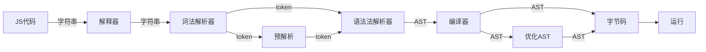

# 概览

google 开发（开源的） ：运行 JavaScript  代码的引擎(C++)。


Parsing -> 词法分析 tokens  -> 语法分析  token  AST


执行栈

Builtin

Dispatch

Ignition 

# 执行过程





```javascript
function o(){
	function i(){
	}
}
```
>对于:不是立即执行的代码，不直接生成AST，而是 lazy parsing.函数 i 可能就是走的    预解析

运行时几个优化策略
函数只声明未被调用，不会被解析生成 AST
函数只被调用一次，字节码会直接被解释执行
函数被调用多次，可能会被标记为热点函数，可能会被编译成机器代码


JS代码 -> scanner 解析器 -> parser生成AST树并优化  -> Lgnition 生成字节码 -> TurboFasn 编译成机器码 运行

## 词法分析 scanner

把上一步的分析结构 结果： tokens ， 拿过来，继续做分析

```javascript
[  
    {  
        "type":"Keyword",  
        "value":"let"  
    },  
    {  
        "type":"Identifier",  
        "value":"name"  
    },  
    {  
        "type":"Punctuator",  
        "value":"="  
    },  
    {  
        "type":"String",  
        "value":"ljc"  
    },  
    {  
        "type":"Punctuator",  
        "value":";"  
    }  
]
```
## 语法分析 scanner 

JS源码字符串，会被解释成，一个大数组(tokens)

var a = 1; 

```javascript
{  
    "type":"Program",  
    "start":0,  
    "end":10,  
    "body":[  
        {  
            "type":"VariableDeclaration",  
            "start":0,  
            "end":10,  
            "declarations":[  
                {  
                    "type":"VariableDeclarator",  
                    "start":4,  
                    "end":9,  
                    "id":{  
                        "type":"Identifier",  
                        "start":4,  
                        "end":5,  
                        "name":"a"  
                    },  
                    "init":{  
                        "type":"Literal",  
                        "start":8,  
                        "end":9,  
                        "value":1,  
                        "raw":"1"  
                    }  
                }  
            ],  
            "kind":"var"  
        }  
    ],  
    "sourceType":"module"  
}
```
![[V8-demo1.jpg]]


function sum (a,b) { return a + b; }

```javascript
{  
    "type":"Program",  
    "start":0,  
    "end":38,  
    "body":[  
        {  
            "type":"FunctionDeclaration",  
            "start":0,  
            "end":38,  
            "id":{  
                "type":"Identifier",  
                "start":9,  
                "end":12,  
                "name":"sum"  
            },  
            "expression":false,  
            "generator":false,  
            "async":false,  
            "params":[  
                {  
                    "type":"Identifier",  
                    "start":14,  
                    "end":15,  
                    "name":"a"  
                },  
                {  
                    "type":"Identifier",  
                    "start":16,  
                    "end":17,  
                    "name":"b"  
                }  
            ],  
            "body":{  
                "type":"BlockStatement",  
                "start":19,  
                "end":38,  
                "body":[  
                    {  
                        "type":"ReturnStatement",  
                        "start":23,  
                        "end":36,  
                        "argument":{  
                            "type":"BinaryExpression",  
                            "start":30,  
                            "end":35,  
                            "left":{  
                                "type":"Identifier",  
                                "start":30,  
                                "end":31,  
                                "name":"a"  
                            },  
                            "operator":"+",  
                            "right":{  
                                "type":"Identifier",  
                                "start":34,  
                                "end":35,  
                                "name":"b"  
                            }  
                        }  
                    }  
                ]  
            }  
        }  
    ],  
    "sourceType":"module"  
}
```
![[V8-demo2.jpg]]


babel 使用了AST 结构，可以把 ES6  转 ES5 
ESLint 使用了AST 结构 :编写规范

- JS 反编译，语法解析
- 代码高亮
- 关键字匹配
- 代码压缩


并不是所有的代码都被解释成AST，如：
- 函数被声明，但却没有被调用
## 字节码

```javascript
function add (x,y)
{
	var a = 2;
	return x + y * a;
}
```


```
StackCheck
LdaSmi [2]
Star r0
Ldar r0
Mul a1,[1]
Add a0,[0]
Return
```


## 简易分析


从几行JS源码(字符串) -> AST -> 字节码 -> 机器码，容量大小逐步变的越来越大，有这个必要么？直接编译执行不好么？

早版的V8具说没有字节码这东西，而是直接编译。但问题是：

- 不好优化（某些多次执行的函数，可以定义成缓存，直接给出结果）
- 如果加上字节码，可以把AST直接删除，而字节码如果不立刻转成机器码，其实占用内容空间更小


# 代码执行过程


一段JS的代码在执行之前，需要先创建<上下文>信息：
- 该函数中所有的变量名
- 该函数被调用的参数信息
- this 指针

<上下文>被保存在一个堆栈（先进后出）的结构体中，便于管理

堆栈的第一个元素：全局上下文，除了基础信息外，还有 windows 对象，也就是V8自带的一些常用API函数。

在执行全局代码的时候，遇到一个函数后，先不会执行函数，而是会要创建一个函数上下文，并压入到堆栈里
>每次调用一个函数，就会创建一个上下文

它跟全局上下文的区别是：它有参数信息，它的 this 是指向调用者，而全局的 this 永远指向自己


