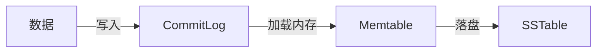

# 基础


#### 对比 DBMS
| dbms         | Cassandra         |
| ------------ | ----------------- |
| Database     | Keyspace          |
| Table        | CF(column family) |
| Primary Key  | Primary Key       |
| Column Name  | Key / Column Name |
| Column Value | Column Value      |


类似于 java 的 map 结构：
```java
Map<RowKey, SortedMap<ColumnKey, ColumnValue>>
```

#### 字段类型-数值：

|          |                                                    |     |
| :------- | :------------------------------------------------- | --- |
| int      | 32位有符号整型，和Java中的int类似；                             |     |
| bigint   | 64位长整型，和Java中的long类似；                              |     |
| smallint | 16位有符号整型，和Java中的short类似，Apache Cassandra 2.2开始引入；  |     |
| tinyint  | 8位有符号整型，和Java中的tinyint类似，Apache Cassandra 2.2开始引入； |     |
| varint   | 可变精度有符号整数，和Java中的java.math.BigInteger类似；           |     |
| float    | 32位IEEE-754浮点型，和Java中的float类似；                     |     |
| double   | 64位IEEE-754浮点型，和Java中的double类似；                    |     |
| decimal  | 可变精度的decimal，和Java中的java.math.BigDecimal类似。        |     |
|          |                                                    |     |

#### 字段类型-文本：

| 数据类型 | 含义 | 描述 |
| ---- | ---- | ---- |
| ascii | 文本 | 表示ASCII字符串 |
| text | 文本 | 表示UTF8编码的字符串 |
| varchar | 文本 | 表示uTF8编码的字符串 |
|  |  |  |
#### 字段类型-时间

| 数据类型 | 含义 | 描述 |
| ---- | ---- | ---- |
| timestamp | 时间 | 包含了日期和时间，使用64位有符号的整数表示 |
| date | 日期 |  |
| time | 时间 |  |

#### 字段类型-标识符

|类型|含义|描述|
|---|---|---|
|uuid|128位数据类型|通用唯一识别码  <br>CQL 中的 uuid 实现是 Type 4 UUID，其实现完全是基于随机数的|
|timeuuid||Type 1 UUID|

#### 段类型-其它

|类型|含义|描述|
|---|---|---|
|boolean|布尔类型|值只能为 true/false|
|blob|二进制大对象|存储媒体或者其他二进制数据类型时很有用|
|inet|IPv4 或 IPv6 网络地址|cqlsh 接受用于定义 IPv4 地址的任何合法格式，包括包含十进制，八进制或十六进制值的点或非点式表示  <br>CQL 会输出为 0.0.0.0 这种 地址形式。|
|counter|计数器类型|值不能直接设置，而只能递增或递减  <br>不能用作主键的一部分；如果使用计数器，则除primary key 列之外的所有列都必须是计数器|

#### 集合类型

|  |  |  |
|:---|:---|:---|
| set | 无序集合 | cql返回的数据是有序的 |
| lis | 有序集合(插入顺序) |  |
| map | hashMap |  |  

  


#### 3种key：

|  |  |  |  |
| :--- | :--- | :--- | ---- |
|  Primary Key | 主键 | 每张表必须有一个 | 此值用来分区 |
| Composite Key | 多列主键 |  |  |
| Clustering Key | 字段排序 | 非必填 | 数据最终按照这个顺序存储 |


# 分区/一致性HASH

整个集群会组成一个环(一致性hash)，当一个条记录写入，根据 Primary Key 的值，落在哪个节点上


# LSM

Log Structured Merge Tree，是一种分层，有序，面向磁盘的数据结构.
核心思想：充分了利用了磁盘批量的顺序写要远比随机写性能高出很多。
LSM模型：LevelDB，HBase，Google BigTable，Cassandra，InfluxDB 


# 写入流程

|           |                                         |     |     |
| :-------- | :-------------------------------------- | :-- | --- |
| CommitLog | 写入数据时，先写到这里                             |     |     |
| Memtable  | CommitLog 写入成功后，会加载到 Memtable 中         |     |     |
| SSTable   | Memtable 到达一定阀值后，会落盘。同时，删除 CommitLog 记录 |     |     |

![[cassandra-写流程.jpg]]




# CommitLog

DBMS 的 CommitLog 是 redo undo ，用于事务和宕机后恢复
cassandra 是用 unixstamp ，不做删除，可能有重复数据，但只用最新的，所以它没有 undo 只有 redo

# Memtable

CommitLog 写入成功后，会写入到内存中
>缓存写回机制(Write-back Cache)

内存中，kv 形式，顺序写入

触发 flush :
- 达到 memtable 的 flush阈值时
- 系统关机时
- 执行 nodetool flush或nodetool drain命令时。
- commit log已满时

# SSTable

Sorted Strings Table，每一个 column family 都会对应：至少一个SSTable文件。

Data.db：存储数据，按照 key 排序后存储key/value键值字符串。
index.db：索引文件，保存的是每个key在数据文件中的偏移位置
Filter.db：Bloom Filter 映射文件。SSTable一旦完成写入，就不可变更，即为immutable。

一但落盘成 SSTable 文件，就不会再改变了 ，因为其使用 unixstamp 方式存储

#### Compaction / 压实  

随着数据不断写入，缓存不断刷入磁盘生成SSTable的时候，我们会拥有很多SSTable。下面这个场景：

用户先写入[1, 3, 8, 2]，刷入磁盘生成 SSTable0:[1, 2, 3, 8]
用户再写入[0, 3, 7, 6]，刷入磁盘生成 SSTable1:[0, 3, 6, 7]
用户再写入[0, 4, 5, 9]，刷入磁盘生成 SSTable2:[0, 4, 5, 9]

用户查询3：虽然 SSTable2 没有3，但是因为这个0~9 这个范围包含了3
你需要搜索这个文件，确定有没有你要的数据（这种落空的情况可以通过Bloom filter优化）。
如果SSTable文件很多，查询效率就会显著下降。那么解决这个问题，就是做Compaction。合并 ：SSTable0、SSTable1、SSTable2 

>Compaction过程中还有一个重要任务是清理过期或者被删除的数据。


压实进程会在后台将多个SSTable进行合并。
>一个 table  可能有多个 SSTable 文件

读取路径涉及到越多的 SSTable 文件，读取的时延就会越久。
理想情况下，一个数据库被合理调优后，一条查询语句不会涉及超过2~3个SSTable

压实策略：
- STCS (Size Tiered Compaction Strategy)：适用于读写混合的工作负载。
- LCS (Leveled compaction strategy)：适用于大量读取的使用场景，因为这个策略减少了数据分布在多个SSTable的情况。
- TWCS (Time window compaction strategy)：适用于时间序列类型或任何有TTL（存活时间）限制的数据库表


最终物理文件存储格式，以（区）为单位 ：
- partitionHeader：Partition Key、Partition Key len 等
- row：具体的数据在这里
- endpartition：一个字节，标识分区结束


row 的格式太长，不写了，大概包括 ：
- flag ：标识当着  row 的状态
- Row Marked For Delete At： 当前列的删除时间
- Row Body Size：当前列的长度
- cell：每一列的具体数据 ，若干个
- Columns Bitmap：字段值 bitmap ，实际存储中并不存列名，通过 bitmap 标记映射，
>列名-保存在：SSTable 的 md-X-big-Statistics.db 中。row Bitmap 中标记哪些列存在，哪些列不存在

cell 排序：默认就是按照字母顺序
>这个排序是通过 BTree 实现的
>

# 只有 写和读

cassandra 中：只有 写和读 操作， 没有 update delete
- UPDATE：命令会变成一条INSERT语句 + unixstamp
- DELETE：命令会变成一条INSERT语句，并打上删除标识 tombstones ，在 SSTable 合并时再删除

查询时：会有重复数据出现，但是按照 SSTable 最新的文件开始查找，肯定是先查到最新(Timestamps)的数据


# 墓碑的垃圾收集

# 布隆过滤器

 每一个 SSTable 文件有一个 BloomFilter 。
 BloomFilter 会在内存中
 当查找一个KEY是否在某个文件中，使用 BloomFilter  加速，避免查找多个 SSTable 文件


CQL (Cassandra Query Language)


# 安装


|  |  |
|:---|:---|
| 7199 | JMX |
| 7000 | 节点间通信（如果启用了TLS，则不使用） |
| 7001 | TLS节点间通信（使用TLS时使用） |
| 9160 |  Thrift客户端API |
| 9042 | CQL本地传输端口 |  


下包：
```
https://dlcdn.apache.org/cassandra/4.0.12/apache-cassandra-4.0.12-bin.tar.gz
https://download.oracle.com/java/17/latest/jdk-17_linux-x64_bin.tar.gz
https://www.oracle.com/cn/java/technologies/javase/javase8-archive-downloads.html
```

安装JDK
安装PY3


创建目录

```
mkdir hints
mkdir commitlog
mkdir data
mkdir cdc_raw
mkdir saved_caches
```

```yaml
cluster_name: 'Smith Cluster'

hints_directory: /var/data/cassandra/hints

data_file_directories:
     - /var/data/cassandra/data

commitlog_directory: /var/data/cassandra/commitlog

cdc_raw_directory: /var/data/cassandra/cdc_raw

saved_caches_directory: /var/data/cassandra/saved_caches

```
修改配置文件

启动:
>./cassandra -R

查看是否启动成功：
```
ps -ef | grep cassandra
./nodetool status
```


连接服务器：
./cqlsh 192.168.202.156 9042

```
create keyspace mydb WITH replication = {'class': 'SimpleStrategy', 'replication_factor': 1};
```

创建一个张：

>create table student (Student_id int primary key, Sname text, Sbirth timestamp, Snum text, Sphone text )

插入一条记录：
>insert into student(Student_id ,Sname , Sbirth ,Snum ,Sphone) values(12,'aaa',1713098539 ,'bbb','cccc');


desc keyspace;