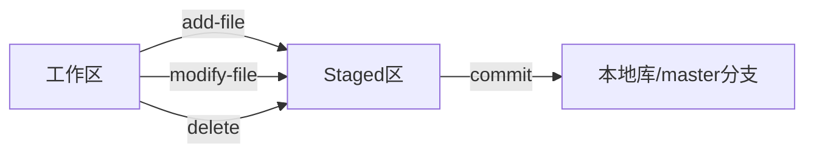
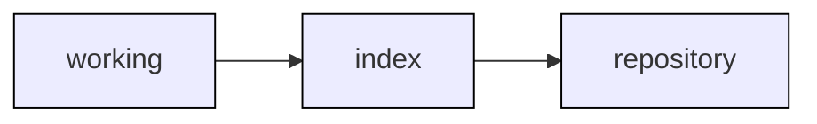
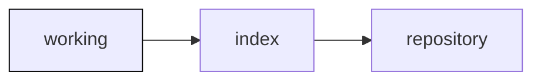
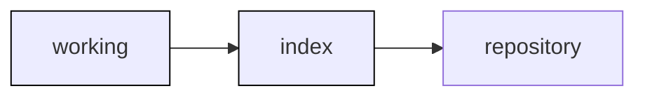
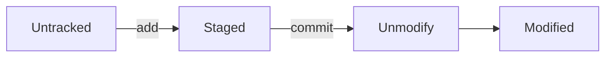

# git

版本控制器

默认端口号：9418

这次认真看了，从头看

# GIT实现原理

每个项目下会有个:.git 文件夹，里面的各种数据就是GIT做版本控制的核心了。

什么时候会有这个.git文件夹子？

> 当CLONE或者INIT一个文件夹后，文件夹下面会有一个新文件夹：.git


#### 工作区

Working Directory：项目文件代码实际存放的地方，就是项目的根目录，里面都是正常的普通的文件

#### 版本库区

Repository：.git 文件夹。存放着最终的版本代码(文件)，分支管理等


所以，我们日常的操作就是跟 Repository 区打交道


#### 暂存区（ staged ）


目录新添加文件不会进这里，但：git add 会进到这里，还有已经提交过版本库的文件，做了修改、删除操作会进到这里

> 本地仓库：即 当前分支，暂存区的最终会传到这里

交互流程：


版本控制的实现就是：3个区的数据流转

3个区的状态

当我们建好仓库，并加完文件并提交后，3个区的内容都是一样的：


当工作区加了一个文件后，那么：working tree 与 index 和 repository\(HEAD\) 就不同




当我们修改/index添加了一个文件后，working tree 和 index repository 就不同



## git文件状态

区的流转讲完后，就得详细到每文件了，其状态如下：

> Untracked:未被跟踪，如在工作区新建了一个文件，就是此状态。
> 
> Unmodify:文件已经入库, 未修改
> 
> Staged:git add后，即是此状态
> 
> Modified:文件已修改





## 创建项目

有两种方式：

1. git clone
2. git init

git init:

1. 先是创建一个文件夹，然后 git init，初始化
2. 随便添加点东西，然后提交，不然没有 master 分支

这种方式基本上不太用了，因为：创建一个新的项目，都统一由管理员在gitlab上操作了。

git clone:

1. 随便挑个位置，直接git clone

这种是主流，因为简单：而且还帮你把remote设置好了，直接开发就行了，不用管git了

## 跟随

对一个文件更改后，未提交，这时切换另一个分支，会连带着把你刚才的修改与新分支合并...

优点：你的所有修改不会被丢掉，同时还能看到可能出现的冲突

缺点：经常切分支，容易弄混了，污染了其它分支，产生冲突等等

## 冲突

产生冲突的操作：合并，如：pull、本地修改未提交切换分支

解决方法

1. 直接放弃本地修改
    1. 本地的每个冲突文件 git checkout 文件名
    2. git reset \-\-merge
2. 选择性修改
    1. 修改每个文件
        git add . \(这一步好像用不到呢\)
        然后git commit \-a

> 当AB 均提交了本地修改，A合并B后，产生冲突b.php,git commit b.php 会有如下错误：
> 
> 
> fatal: cannot do a partial commit during a merge.
> 
> 
> 但是，git commit \-a \- m 'dd' ，这样就能提交，挺有意思.
> 
> 
> git status 提示：All conflicts fixed but you are still merging.
> 
> 
> 也就是说，合并未完成，虽然你修改了冲突文件b.php，但得整体提交才行，即：先把合并动作完成了。

## stash

缓存当前未提交的修改内容

使用场景：

1. 当临时有事要立刻切换到某个分支时，有未提交的文件，先存了，避免带到另外一个分支中。
2. 合并分支时，先把自己修改的暂了，然后，再下载新的分支

直接暂存

> git stash

提示

> Saved working directory and index state WIP on ffff: 8ebd49e Merge branch 'ffff'

直接暂存，并设置一个消息号，便于查找

> git stash save 'imaaaa'

git stash list

git stash show

git stash pop

git stash drop

git stash clear

## 回滚/恢复

先确定一个关键点： A版本回滚到D版本，中间还有B和C，BC的版本怎么处理？

由此问题引发出的2种解决方案及2种问题

1. 全忽略，不管BC版本的修改了，这种比较直观，既然回滚了，那中间就不要了，但是引起另外一个情况：既然回滚，肯定是加了新的代码，那这些代码丢了，等于把程序员的工作量给删除了。
2. 不忽略，代码都得保留，不能删了程序员的工作量，而且，后续找问题也得用到这些代码。问题是：那你就得合并代码，这期间肯定得有冲突，就算没有冲突，多出来的那总分代码是不是正确的？如果能快速定位问题，还好，不能快速定位，反而把事情搞的复杂了。

看来用\<是非\>这种直接的方式解决，都有问题。

1. 全忽略，但是BC版本的修改放入暂存区，不参加版本提交。这样master很快恢复到无错误的版本，保证线上出错的版本瞬间回退。而错误版本，在本机存着，拉着程序员一起恢复 ，一起调试找问题。

## revert

撤消某一个版本，然后，合并（将撤消版本代码删除，余下的版本做合并）。如果成功，自动提前一次git，如果失败（发生冲突，撤消的版本改了A。而当前版本也改了A），就会暂停，需要你处理冲突后，手动再提交一次，如果不想解决冲突就取消此次revert ,git revert \-\-abort

咋说呢，看似这种方式更稳妥，因为所有日志都留着，最后还再加一次新的合并的提交日志。可它并不是恢复，而是删除了一个版本，重做了一个新版本，这期间，出现冲突的概率挺大。实则感觉把简单的问题给复杂化了呢...

应用场景：假设有A B C D 4个版本，D的版本在线上跑着，这个时候突然发现B的版本有问题，但是C D版本必须还得留着，所以只需要把B版本删除了就行。

## reset

退回到某个版本，对于中间的B C 版本，可以选择保留、暂存、删除，具说是直接操作head指针。

把当前head指向恢复版本的head：

3个参数：

1. \-\-hard:最简单的，,把缓存区的数据清空，工作区的新加的文件也删除。
2. \-\-soft：仅移动head，不修改工作区和缓存区
3. \-\-mixed：改变暂存区内容，但不会改变工作区

感觉3个参数挺鸡肋的，真是要回滚，缓存区肯定不存在任何内容啊，工作区内也不可能新加文件...

区别：

revert 是把删除后的版本与当前版本合并，之后，再提交一次。 head是向前走，他更强调的撤消某个版本，且还要处理之后的版本。

reset 是直接跳到指定版本，是向后走，不做提交。reset更强度的是真的立刻跳转到某个版本

我比较倾向reset这种方式，因为要回滚大概率是线上出问题了，需要快速响应，核心初衷就是快速回滚到某个版本，是真的恢复到某个版本，而不是重做，也没时间重做，也没必要重做，因为既然是错的版本就应该删除掉。

## .gitignore

按说一个项目下所有的代码都应该进到版本库，但肯定有些文件不想进，如：

.idea:编辑器的文件

go.sum:类库管理文件

只需要新建一个.gitignore，把想忽略掉不进版本库的文件写到里面就行了

## 远程仓库

之前的讲解都是基于本地的，GIT区别于SVN最大的特点就是，它即有本地仓库，又有远程仓库，并且二者可以联合使用。

查看远程关联地址：

> git remote \-v

origin:翻译是起源，个人的理解这就是个标签，或者对远程连接起的一个名称，而origin是第一次添加的远程源。

> 在执行clone的时候：git会默认的设定远程源，就是origin

远程的源不一定是一个，可以有多个。

设置远程关联地址：

> git remote add http://xxxx.com

设定了这个源，就算是跟远程绑定了关系，这个远程并不是传统意义上的单台服务器，而可能是多台服务器。可能是公司特定的一个服务器，也可能是某个程序员的服务器，总之：概念得区分开。

但在实际项目中，基本上就是一个源，即：公司的代码仓库。

下载远程代码

> git fetch

这个下载代码，得明白：是基于分支的，某个分支的head版本的代码，当然你也可以指定分支，指定版本号

下载远程代码并合并

> git pull

这个是日常用的比较多的指令，主要是合并了两个动作：下载\+合并，当出现冲突的时候，需要手动解决下

推送本地版本到远程

> git push

一样，也有版本\+分支区别

## 查看历史日志

git log

```
commit 8f8131ee79d66d0227bacf8a4229b305772d93f1 (HEAD -> master)
Author: mqzhifu <mqzhifu@sina.com>
Date:   Wed Jul 14 15:28:00 2021 +0800

    reset commit

```

有版本号、提交人、提交时间、操作类型

它有很多参数可以配置做筛选:

\-\-oneline:简化显示，只用一行

\-p \-n :显示最后几行

\-\-after和\-\-before:指定时间范围

> 其实也可以直接配置grep使用

文件恢复原版本

> git checkout 文件名

查看分支

> git branch \-a

创建分支

> git branch 分支名

且换分支

> git checkout 分支名

新文件送往缓冲区

> git add 文件名

文件修改提前

> git commit \-a \-m '描述信息'

初次提交，得设置一下用户名和邮箱

全局设定：

> git config \-\-global user.email "mqzhifu@sina.com"

单项目设定

> git config user.email "mqzhifu@sina.com"

以上两种方法我基本是不用，我是直接修改配置文件 ：

> vim .git/config

添加如下：

```
[user]
    name=mqzhifu
    email=mqzhifu@sina.com
```

简易合并

> git merge XXX
