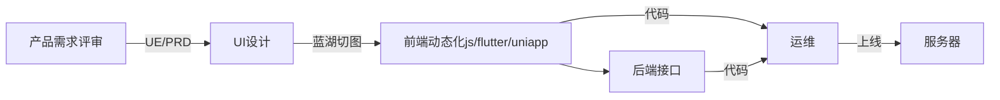

# 微服务

## 概述

简单粗暴理解：一个公司的产品（项目代码），传统模式下都是放在一个仓库\(git\)里存储，统一管理（编写|修改|提交|上线），然后，将该产品（项目代码）按照一定规则进行拆分，最后：变成一个个小的微型产品（服务），各自管理。

> 注：微服务并不是一个新的技术，也不存在颠覆了：什么技术|行业。它只是把原有的一些杂7杂8的技术点/软件工程学 做了一个整合，更像是：一种概念、一个框架而以。
> 
> 
> 另外，也不存在什么完美的微服务构架体系，每个公司的微服务体系都不一样，用的技术和开源软件也各不大相同。

## 传统模式进化史\(web\)

从3个阶段做分析：

早期:混沌时代

这个时代：UI是没有蓝湖的，得有专门的前端程序员把UI图转化成HTML\(css\+div\)代码，再交给后端，后端实现动态化\(js\+php\)，最后把项目代码给到运维上线。其实严格来说：没有前端，只有美工，

中期：前端后分离

这个时代：UI有了蓝湖后，切图的功能可以省略80%，上面时代的切图的前端程序员基本上没啥活了，但是原本后端写的JS，现在交给前端来写。

> 这里看出：前端的明显变化，由之前的只会切换变成了写JS代码了\(动态化\)，同时后端的工作变简单了。

同时产品需要关注：PC H5 安卓 IOS 等，多端模式

现在：大前端

这个时代：才算是比较干净的将前后端完全分离，因为前端完全可以自己独立部署自己的代码了，与后端的关系只是通过HTTP调用而以，并且前端还需要关心多端的兼容情况，如：andriod ios pc h5等

分析看这3个阶段，整体变化最大的是前端：原来后端做的一些事情现在都由前端开始负责了，那么后端变化其实不太大，那，后端就有点拖后退，于是，先分析一下后端哪里可以优化：

1. 后端因为代码整体是运行在公司自己的服务器上，用户是通过网络协议\(http/tcp\)调取的，那么就不存在前端的问题：多端兼容，所以优化方向不在这里
2. 后端是否可以做的更加灵活？稳定性更好？扩展更好呢？分析一下，可行性及问题：项目代码都在一个仓库
    1. 即使仅仅是修改：某一小段代码，但也要把整个项目代码一起上线：上线很麻烦，编译就很慢
    2. 即使仅仅是修改：某一小段代码，但也要把整个项目代码一起上线：一但出现些问题，影响整个项目，耦合高，程序员维护也是麻烦
    3. 程序员过多时，提交代码，各种冲突
    4. 不好扩展：如当支付功能流量过大，无法单独为它自己增加服务器做负载
        .......

其实还能写很多条，但总结下来我觉得就一条：不够灵活，如：

站在产品的角度看，如果是小型项目或创业型项目，要求快速迭代快速试错，这种模式基本不靠谱，如：代码上线一次就得用个一天....那都大家都可以被辞退了...

## 微服务时代

将传统模式的：一套的项目代码，进行拆分，拆分的规则：

1. 项目
2. 功能
3. 人群
    ......

> 如何划分？这个没有具体的方法，或者说：没有绝对的划分准则，不同公司的业务不同，方式也不同

这里拿电商系统举例吧：

先按照项目进行划分，任何公司做大后，人数必然也会跟着增加，连带着会划成若干项目组，比如：用户组、订单组、支付组等，又或者：to c 组、to b 组等等吧。

那么：每个组都有一套相关的代码，组内自己的人维护自己的代码仓库\(git\)，也不太需要关注其它组的产品代码，自己组可任意上线项目，这样基本上能有个敏捷开发雏形吧。

但这里可能有个问题：每个组可能都要重复开发的代码，如：用户中心、消息中心、支付中心等，如果说：A组有支付功能、B组也有支付功能，两个组都各自写一套，这就有点浪费了

所以：单纯的把一个大项目拆分成若干的几个项目，也没解决太多问题，反而增加了开发量，于是，这里引入了另一个拆分的维护：按照基础功能再进行拆分

召集：公司现有的每个小项目组员，开会，商定哪些基础的功能都有用到，就不要重复开发了，统一来开发。

现在就变成了如下的开发模式：

这么分析完后，看后端的具体分类：

1. 项目组，每个项目只需要有2~3后端就够了，主要精力集中在自己组里的业务做开发，复杂功能或基础类的功能找另外一个组
2. 平台构架组，基础的微服务开发，且不关心具体业务，只需要给每个业务做一些标识，保证所有业务请求都可用即可。

## 优点：

1. 业务组不用招太厉害的后端，基本上会增删改查即可，复杂的东西交给平台构架组即可
2. 自己组的后端程序员专注于自己组的业务逻辑
3. 其它业务组出现故障，自己组大概率不太会受影响
4. 随时上线，不太受其它业务影响，可快速迭代、敏捷开发
5. 当用户量过大时，可任何扩容
6. 不受开发语言限制，各个组用JAVA GO PHP 都无所谓

## 缺点

技术层面：

1. 原本一个项目的代码，现在要经过几次请求，有网络消耗
2. 如果微服务之间也允许互相调用，会有死循环
3. 某一个服务出现问题，不好查错
4. 某一个服务出现问题，不好回滚
5. 某一个功能即可划到A服务，也可以划到B服务，互相推诿
6. 联调麻烦
7. 测试麻烦
8. 部署/上线麻烦
9. 代码复杂度增高
10. 需要单独有平台构架组，并且要有构架师级别的人参与

产品层面：

1. 因为服务过于分散化，想实现一个需求，可能要找很多组的人一起开会
2. 出了问题，不确定该找谁解决
3. 做需求评审时，增加了微服务这个维度，得有概念

## 总结

没有完全的解决方案，更不可能有完全的构架，微服务的缺点也很明显：需要投入大量的人，且都得是水平较高的人，且维护成本也很高。

产品层面也会增加一定复杂度。有个段子：任何稳定的微服务构架组，都得建立在至少搞垮两家公司的基础之上的。那为什么大公司都喜欢用这套体系？因为：大公司人太多，沟通成本太高，能切到最小粒度，保证快速迭代上线。

另外，本篇文档更倾向给产品解释，真正要做微服务这只是个开始，最复杂最难的是微服务的治理\(配套设施与中间件等\)，如：日志体系 分布式 队列 K8S 链路追踪 网格治理 网关 服务发现/治理 等等。
