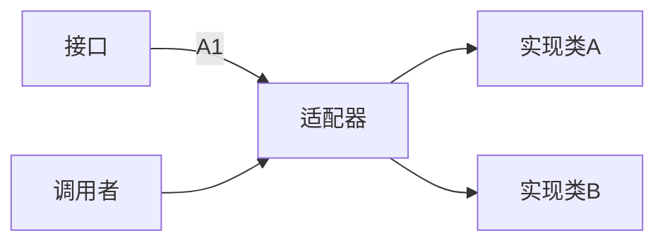
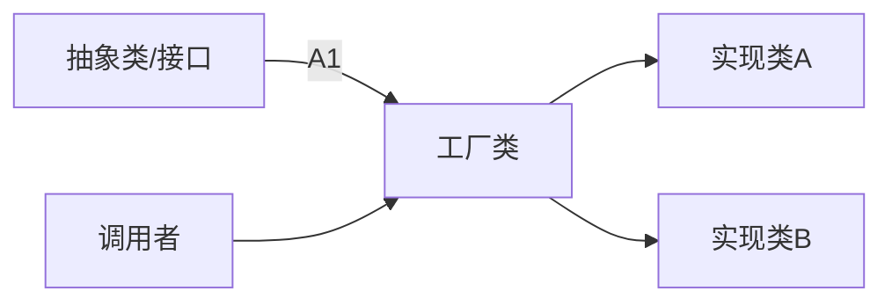
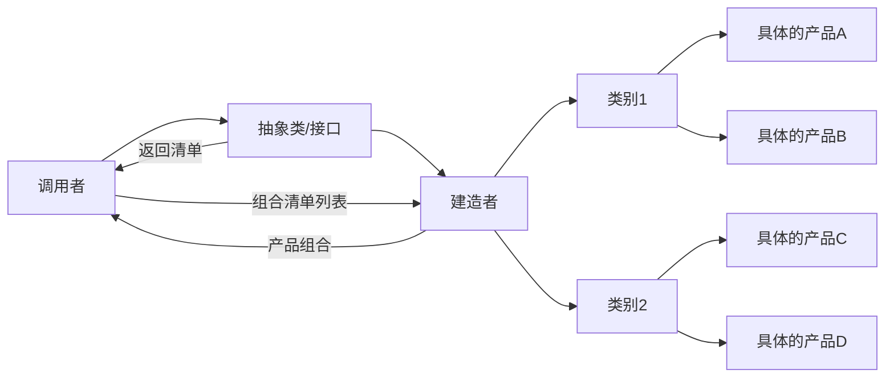
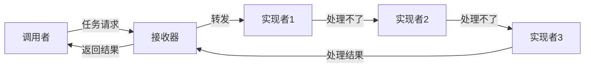
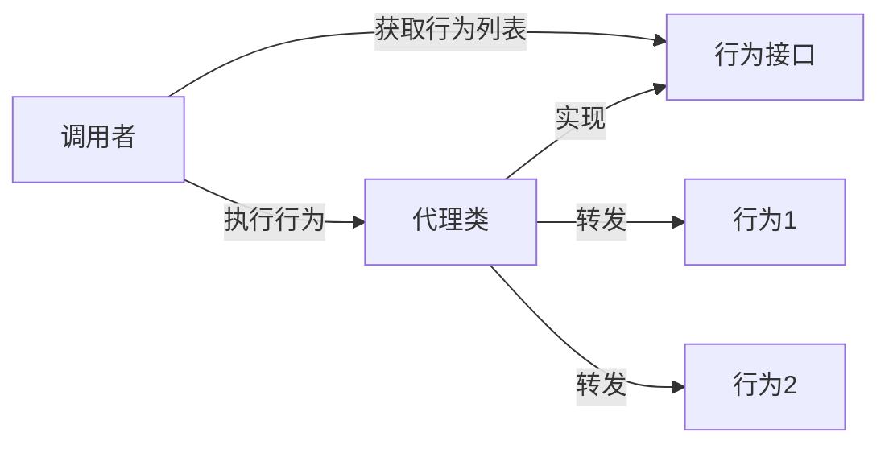
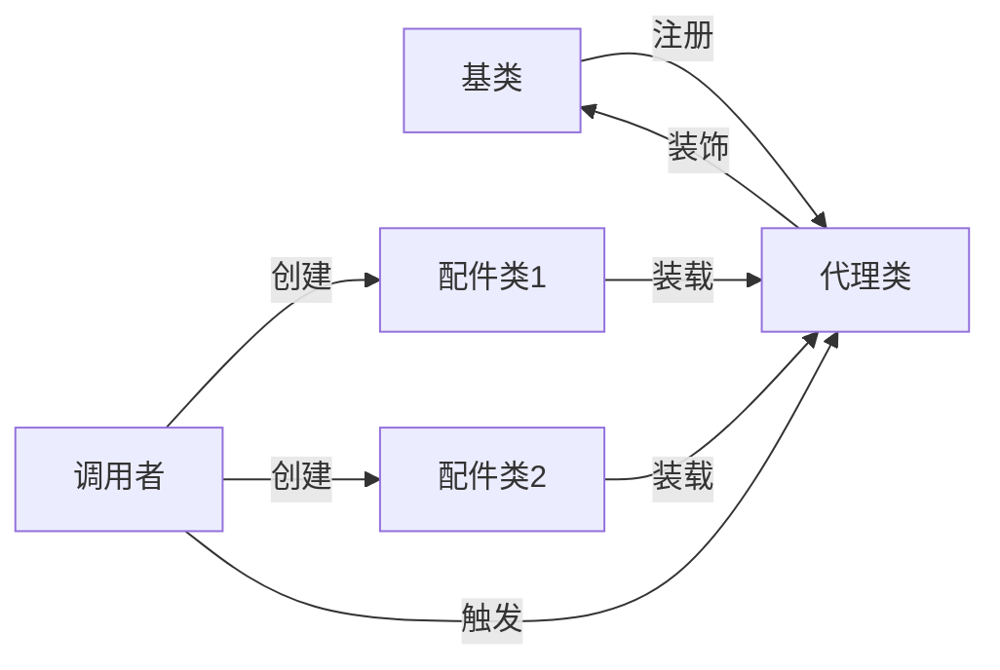
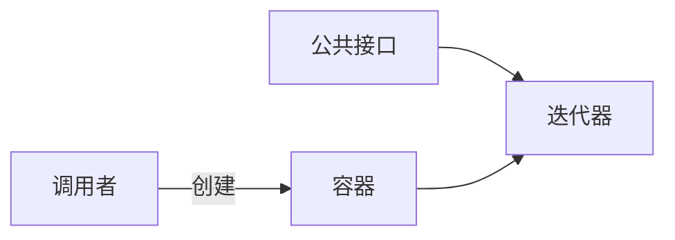
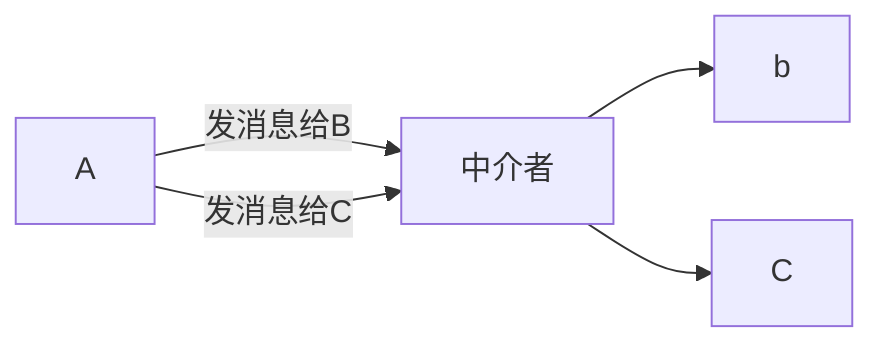
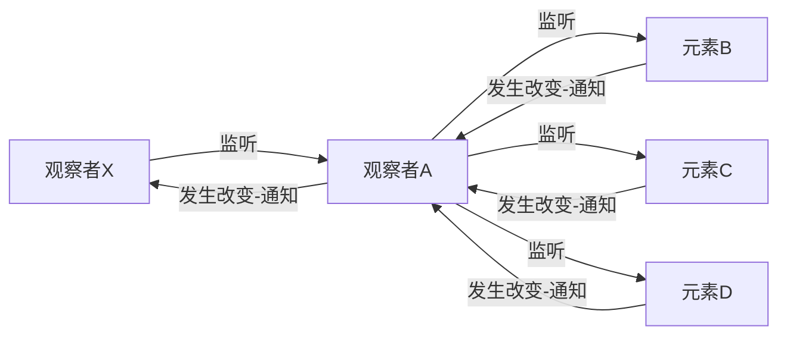
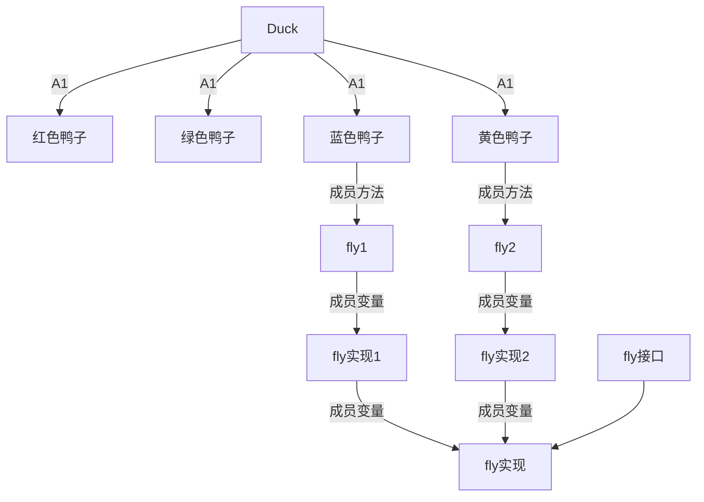

# 概览
设计模式并不是某一种算法\(如：单例\)，它也可以整合/合并多种模式而生成一种新的模式。
所以它是：一种思维，一种解决软件工程各种问题的思维。更像是软件工程学，从更高的角度去审视一个项目，并不急于动手，而是思考用什么样的方法组织代码的结构。

# 一个软件项目的设计

最终都是以代码为结果，而代码只是方方面面设计后的结果，过程中会有方方面的考良，如下：

- 学习成本
- 使用成本
- 维护成本
- 团队协作
- 开发效率

并不是模式越多就越好，有些模式之间是互斥的，有些模式并不适用于特定的项目，所以这些都要考虑进去。还要考虑使用成本，一个小的项目，过多的使用模式，只会使开发者降低各种效率，加大学习成本，像:spring将模式用到了极致，但真的是臃肿，导致开发者各种不爽，严重的会造成人员离职...\(一点不夸张\)

## 结论

小型的项目，或者外包型的项目，非产品类的且不需要过多维护升级的，不适合重度使用设计模式。
例如：PHP在互联网WEB领域能干掉JSP，核心思想就是PHP非常简单，只用了几个核心的模式，复杂的一律不使用。

不要过度迷恋设计模式，可以根据自身项目情况，部分使用设计模式，一定把握好~度\!

# 一个模式的定义

- 名称：给新的模式起个名字
- 问题：遇到了什么样的问题？
- 解决方案：基于问题思考，通过什么样的组织方式及算法，出解决方案
- 效果：对比使用新模式后与旧模式的区分。

# MVC
model view controller

| 名称                      | 中文  | 分类  | 使用频率   | 场景      |
| ----------------------- | --- | --- | ------ | ------- |
| factory                 | 工厂  | 创建  | 常用     | 支付、DB驱动 |
| sigleton                | 单例  | 创建  | 常用     | 全局对象    |
| builder                 | 创建者 | 创建  |        |         |
| prototype               | 原型  | 创建  |        |         |
| composite               | 组合  | 结构  |        |         |
| decorator               | 装饰者 | 结构  |        |         |
| adaper                  | 适配器 | 结构  | 常用     | 支付、DB驱动 |
| proxy                   | 代理  | 结构  | 常用     | 网关      |
| facade                  | 门面  | 结构  | 常用     | 各种组件    |
| brige                   | 桥接  | 结构  |        |         |
| flyweight               | 享元  | 结构  | 单例、连接池 |         |
| interpreter             | 解释器 | 行为  |        | 场景      |
| iterator                | 迭代器 | 行为  | 常用     | 所有      |
| mediator                | 中介  | 行为  |        |         |
| memento                 | 备忘录 | 行为  |        |         |
| observer                | 观察者 | 行为  | 常用     | 服务发现    |
| state                   | 状态  | 行为  |        |         |
| strategry               | 策略  | 行为  | 常用     | 系统调用组件  |
| template                | 模板  | 行为  | 常用     | MVC     |
| visitor                 | 访问者 | 行为  |        |         |
| chain of responsibility | 责任链 | 行为  |        | OA审批流   |
| command                 | 命令  | 行为  |        |         |

# adaper 适配器模式

问题：两个略相似的类，完成的功能也不全一样，也有相同功能的函数，可是函数名不一样，调用方却想统一两个类的函数名。比如：显示器有A接口类型的，也有B接口类型的，但是笔记本只有一种TYPE\-C接口，加个转换头就行了，转换头就是这个设计模式。

解决办法：

1. 调用者不直接调用这两个类，而是调用另外一个类，而另外一个类封装这两个类。
2. 既然两个类的方法名不相同，直接改了这个类里的方法名不就得了，多省事儿....
3. 调用者加个if判断一下，不就得了

分析解决方案：

1. 第2条，你得有权限能改这个实现类。另外，能加不改的原则，改坏了咋办？改坏了别人的东西要背祸的...
2. 第3条，调用者要在自己的程序里加判断，如果再加一个实现类，且函数名也对不上，那程序里就得有一堆IF
3. 结论：这里我们肯定选择方法1，不然还讲个毛...

> 从这里的第2和3条也看出来，小项目直接改个函数名就行了，或者加个IF，没必要搞的这么复杂上设计模式。

**具体实现**

角色

1. 实现类A 实现类B
2. 一个接口
3. 适配器

流程

1. 我们先定义一个接口，里面包含的是几个公共函数名~
2. 告知调用者，以后调用看这个接口就行了
3. 定义一个适配器的类，实现刚刚定义接口里的所有函数



总结下就是：你想用实现类A，就接上A，想用B就接B，但是只能接一个。因为多了一个接口，调用者也不用关心实现者，实现者也不关心调用者，麻烦的是：维护这个适配器的人....

优点：

1. 项目耦合度低
2. 复用高
3. 扩展性强

缺点：

1. 复杂度增加
2. 不易阅读，原本一步调用，改了2步
3. 维护加大，得有个人专门维护这个适配器

# factory 工厂模式

问题：有阿里支付，有微信支付，类名也都不一样，调用者需要记住每个类名~

解决办法：

角色

1. 抽象出公共的方法，创建一个新的抽象类/接口
2. 使用者
3. 工厂类

优点：

1. 项目耦合度低
2. 复用高
3. 扩展性强
    缺点：
    1. 复杂度增加
    2. 不易阅读，原本一步调用，改了2步
    3. 维护加大，得有个人专门维护这个适配器

使用场景：

- 支付，统计定义3方支付的几个公共接口，每加一种就直接加个实现类，调用方通过动态参数，基本不用改代码。
- 日志，日志的持久化有很多种，像本地文件，网络传输等等
- 数据库，应用程序使用数据库，也可以快速切换，如MYSQL切换到SQL\-SERVER

感觉跟适配器模式挺像，区分就是：适配器是直接调用函数，而工厂是帮new 一个对象返回，供调用者使用

# 工厂 适配  区别 

工厂 更强调加工 也就是 创建对象：new object 
适配模式：更强调 预告定义好接口
# sigleton 单例模式

烂大街的模式，不详细讲了，直接说优缺点

优点：

1. 节省内存开支，因为只有一个实例
2. 开发者可以统一只调用一个地方，使用同一个实例，减少程序员多写代码
    缺点：
3. 如果A变更属性值未告知B，B使用的实例可能就出错。
4. 如果AB多线程操作单实例，会有冲突

# builder 建造者模式

问题：实例化一个对象时，该对象里可能又包含一堆的其它对象，即：该对象是一个复杂的结合体。那么，调用者每次可能在构造的时候传一堆参数。

如：去KFC买吃套餐A：主食（鸡腿堡、鳕鱼堡）、喝的（可乐、果汗）、小食（薯条、鸡块）。客户可以做出选择，如何搭配（前提是不能脱离主框架：主食、喝的、小食）

解决办法

1. 将这个大的对象里的各种个子对象抽离出来。
2. 创建一个新的类：建造者，用于接收调用者的构造函数
3. 将抽离出来的子类，做成一个清单，并暴露给调用者
4. 调用者根据清单，自己组合，并请求 建造者 ，由它帮忙实例化




优点：

1. 插拔简单，不影响任何一方
2. 使用灵活，可以做任意组合
    缺点：
3. 场景固定，只能适用于一些比较好抽离且是一级一级选择的场景

# chain of responsibility 责任链

员工申请费用：500是直系领导，1000是总监，10000是CEO。
对于员工，并不知道多少金额由谁来审批，但是他知道填写好单子给直系领导，如果直系领导能够处理就直接处理了，如果处理不好，就直接甩给下一个人。
关键点：请求者不知道谁来处理，而每一个接收者也不确定自己能不能处理。
在多点未知的情况下，往后甩了就行了。

技术点：

1. 统一入口，接收者
2. 每个实现者之间的前后顺序关系


它是一个环形链的结构，跟链表结构有点像，只是这个链表串起来的是一堆的类。

纯责任：一个请求，只能被其它一个实现者接收并处理，一但处理完成后直接返回结果，不向后传递。
非纯责任：一个请求，可以被每一个实现者接收，如：日志
半纯责任：一个请求，可以被某一个实现者接收，该实现可以处理，并继续向后分发，也可以在某一个节点停止。如：OA审批流

优点：

1. 接收者可以有多个，
2. 插拔方便，减少耦合，扩展好
    缺点：
3. 因为双方均不知道最终谁能成功接收，可能会有遗漏情况

# command 命令行模式

订单：可以正常下单购买，也可以打折时候购买
将这两种执行动作封装成两个类：正常购买行为，打折购买行为
写一个代理类，用来接收指令

购买者 调用 代理类 发出指令，代理类执行具体的行为



一个请求动作，可能由若干个子动作协同完成，把这些子动作统一封装成一个动作，然后注册到代理类上~然后，曝光给调用者，调用者依此接口，请求代理器，发出指令执行。

# decorator 装饰者模式

我们要对一个已有的对象添加新功能，又不想修改它原来的结构

如：蛋糕是一个主体，可以往上再加各种配件，如：水果、巧克力、咖啡等等

1. 建一个代理类，并继承\<蛋糕\>类，这样就满足了：不改变主类的要求
2. 创建一个配件容器，并注册到代理类上
3. 创建2个具体的装饰者
4. 实例化其中一个装饰者类，并注册到代理类的配件容器中，这样 主类\+配件类就形成了一个新的类
5. 代理类再创建一个方法：触发配件类修改主类行为
6. 调用者解这个 配件类修改主类行为



算是一种取巧吧，通过生成一个新的类，将基类和要改动行为的类统一加载到这个新类中，实现了：在不发动基类的前提下，扩展了新的功能。

# Facade 外观/门面模式

假设有一个类，该类有点大，实现了好多的功能，最终大到像一个子系统了。那么，当你使用这个类要完成一个行为的时候，可能要调用此类的若干个方法，略有点复杂，如果说把该类就当成一个子系统来看待，调用者只需要知道具体的行为，而不需要去关心细节（如：调用N个方法才能完成一个行为），就会非常好。

1. 大类将各种行为定义好，给到调用者
2. 调用者，根据给出的接口，直接使用此类调用即可

感觉跟\<命令行模式\>有点像呢，都是把一些方法打包成一个行为。
另外，这不就是单入口模式么，所有的请求都只有一个类，可以进行日志追踪

laravel里大量使用了Facade模式

# flyweight 享元模式

共享对象

1. 单例模式
2. 连接池/线程池

都算是对象的共享，只是单例模式更像是全局变量，而池的概念则是跨进程线程的
有一个容器/池，来统一管理这些共享对象
内部状态：如IP PORT 连接时间 等，这些在创建的时候即不可变，有点私有成员变量的意思，或者静态变量、常量，这种状态下是可以被多进程共享的。
外部状态：A创建一个对象，年龄18 性别为女，B同样创建了一个对象，年龄60，性别为男。虽然类一样，但是成员变量值不一样，是不能被共享的。

优点：

1. 减少内存使用
2. 全局作用域，可供任何代码使用，修改后全局生效
    缺点：
3. 线程安全
4. 对象间修改的安全
5. 池的方式使用，那就得有一张表来维护，加大了复杂度

# iterator 迭代器模式

就是遍历一个容器:数组 map 链表

优点

1. 帮助程序员快速遍历一个容器，不用自己算了
    缺点
2. 但凡加一层，肯定就得加开销

这东西现在大部分语言都内置了，没必要自己写...

  



# mediator 中介模式

解决类与类之间的通信耦合度高的问题

如：A要给B发消息，A又给C发消息，简单的方式A直接调用B和C，这时候创建一个中介者类，统一处理



就是简单的加一个代理统一管理，也算是一种设计模式...

# memento 备忘录

在不改变/侵入一个 实例化类的前提下，备份该实例的内部属性值。

简单理解：备份一个对象....以便恢复

原理：

1. 做一个代理类
2. 类中有一个容器，存储保存的类内容
3. 有个策略，保存多少条，多久失效

这也能算个模式，真是醉了.....

# observer 观察者

它算是一种内部通信机制，某个元素注册，监听/观察其它若干个元素，但这些元素发生变化后回调通知观察者。



看图里，A监听了3个元素，一但发生改变3个元素会回调通过A。有趣的是：观察者也可能是被观察者，因为X又在观察A

优点：

1. 观察者 可以随时知道被监听元素的变化
    缺点：
2. 简单的几个观察者机制还好，一但多了，肯定会慢，尤其嵌入式的监听，页面会慢死

# prototype 原型

就是克隆一个对象.... 这也是个模式，无语了....

浅copy:把一个对象直接赋值给另外一个变量，这种方式可以将对象的成员变量、静态变量复制过去，但是内部的地址引用类型是无法复制的，比如像：hashMap，这属于一个地址类型的容器，你就算复制过去，新的对象如果修改里面的值，旧的对象里的值跟着连动。

深copy:同上，只是像复杂类型，如：引用一并都能复制过去。

实现原理

1. 还是创建一个代理器
2. 所有的对象创建都由此代理器收集
3. 复制的时候，统一调用这个代理器。
4. 每个类里得定义一个clone方法，在复制时，用于确定哪些复杂类型一并得复制

# proxy 代理模式

即访问一个类的时候，不直接访问此类，而是创建一个代理器，访问这个代理类，再由代理类去访问实际的类

负载、分流、防火墙、鉴权、日志、远程调用等等吧，有点小网关的意思，也可以理解成单入口

# state 状态模式

一个对象如果状态变了，连带着要执行一个额外的行为

如：调用者改变了玩家的当前状态为下线，那么连带着要更新一下玩家下线时间

# strategry 策略模式

有点复杂

假设我现在要实现一个功能：操作鸭子

1. 先抽离出 公共函数，定义基数
2. 确定非公共的函数，定义成接口

```
class Duck {
    func calling(){}
    func swimming(){}
    abstract func display{}
}

class RedDuck extens Duck(){
    func display{
        print "im red duck"
    }
}
```

一切正常，此时候，需求变更，要加一个功能：蓝色的鸭子会飞，其余的均不会，开始分析：

1. 在父类里加，那么其它鸭子就会调用这个方法，不合规则
2. 定义一个接口，让蓝色的鸭子单独实现此接口，并在实现类增加这个实现函数，但是：如果此时黄色的鸭子也想会飞呢？依然实现这个接口，同时实现类里重新写一遍实现代码？复用性降低
3. 多重继承，套来套去，复杂度更高
4. 用策略模式，基于第2种方法优化
    1. 接口依然定义，只是实现此接口的不是\<实现类\>，而新建立一个类，这样就是一份代码了。
    2. 接着就是把这个新类加到原类体系中
    3. 在黄色蓝色鸭子的实现类中各自加1个成员变量，类型为：新类
    4. 实例时，会飞的鸭子就创建这个新类，不会飞的就不加了
    5. 在黄色蓝色鸭子的实现类中各自加1个fly 方法



这个DEMO不是特别清楚，其核心思想是：一个实现类，要把行为跟算法分开，行为就是正常继承的模式，而具体的差异化的算法，要再新建立一个类，特殊处理。

# template 模板模式

开始看有点复杂，看明白了发现也没啥...

1. 先定义一个执行流程
    1. 初始化
    2. 前置设置
    3. 开始执行\(如：选择衣服颜色\)
    4. 结束
2. 流程定义好后，就是具体的实现方式了，每个步骤都可以有不同的实现类，如：南方人穿说衣服比较亮，那第3步，实现就设置衣服颜色为：红，北方人比较土，实现因就设置为灰色。
3. 接着就是正常开始执行了。

DEMO可能不太有说服力，拿页面举例子

1. 公共头部
2. 公共左侧菜单
3. 中间自定义内容
4. 公共尾部

公共的地方是可以反复利用，保存3个文件即可，而中间的部分是动态的，那就有N个脚本生成。

# visitor 访问者

假设：当前有个容器，里面的元素呢，大体上相同，比如：兔子、猫、狗 都是动物 ，但是跑的方式不一样

这个时候呢，用迭代器遍历，然后执行 \<跑\>这个方法，按说大家统一叫一个函数名，直接调用就得了，或者定义一个接口，全都实现了，但问题就出在可能有些类里的函数名它不一样，那外部调用就得是一堆 IF，且再多一个类，IF就继续会变大。现在单独定义一个叫做访问者的类，同时该类里加一个该当 ，外部如果想访问就先访问这个类。

很无聊的一个模式，真是蛋疼

# brige

# composite 组合模式

将一个类的关系，以树形展现出来，比如：根类，里面依赖了 A B C D 类，展示出来
实在是没看懂，这个鬼东西到底有什么用？

# interpreter 解释器模式

调用者给出一段字符，如：表达式运算，设置好间隔符，然后统一分析间隔符前后，调用不同类的不同方法。

其实就是解析一段字符

23种模式，看了20种，总结下来，在写PHP框架的过程，有一半都用过，只是不知道是什么模式，并且有些是组合使用，有些是用了一半的模式。太多的东西都是挺无聊的，而且，模式这鬼东西，感觉就是一层封装一层，没啥太新鲜的东西...

AOP:Aspect Oriented Programming，面向切面，对OOP的补充。正常的OOP是纵向定义关系，如果跨\<纵向\>，像日志类，遍布整个过程，这样的需求时，AOP更适合，所以AOP是面向横向编程。如：权限认证、日志等、拦截、通知 。简而言之：就是各种类在调用之前，先调用AOP代理，代理再去调用具体的业务实现类。

IOC：Inversion of Control，即“控制反转”，把要 实例化的类，不由程序中new创建，而是交由代理，代理去加载类到容器中，程序再调用容器。

实际上，容器在加载类的时候，还会判断该类是否还有其它依赖类，如果有，会一并加载注入到容器中。

DI

注解
