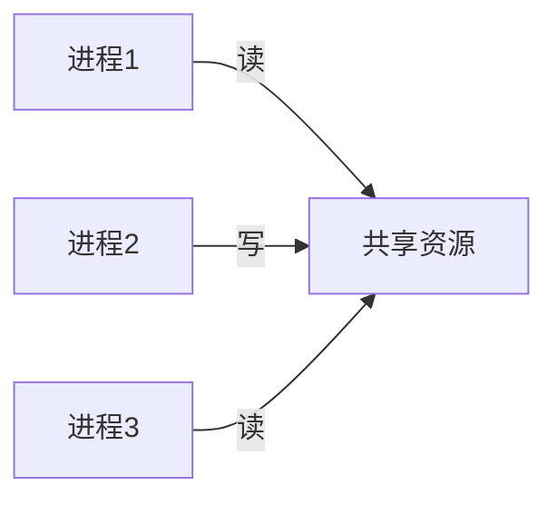

# 概览

# 并发 访问/更改 -> 共享资源(数据库、文件、全局变量)

# 问题

数据就只有一份，操作是3次。不加顺序控制，那就是纯随机了，如下几种情况：

>这里以单核CPU为例 ，多核 CPU有L1/L2/L3 及总线控制机制，另外linux内核也有控制，这里不做讨论

1. 两个读操作优先，写操作最后，那么这里有个二义性，是不是读的数据是滞后的？
2. 如果一次读优先，之后是写，最后再读，那第二次读出来的数据跟第一次就不一样了？
3. 如果让写操作优先，之后再两次读操作，这里有个二义性，读取的数据太新了？我其实是想要未更新之后的数据？

所以，从以上看，并发操作同一数据 ，怎么看都没有完美的可能性，只有开发者给其定义顺序才有意义，如下：

1. 写优先，阻塞其它读写操作
1. 写优先，阻塞其它写操作，读操作依然可以
2. 读优先，阻塞其它读写操作
2. 读优先，阻塞其它写操作

其实，就是对读写的优先级做排序。

如何进行排序？就是给这个共享资源加上一个标识：当前资源我(进程1)正在处理，后续想要操作该数据的人要么等一下，要么按照一定规则一起处理该数据。这个标识就是锁

锁：就是给并发请求按照一定规则进行串化

# 锁的应用场景

1. 库存超卖。同时两个请求进来，同时先读取库存，如果此时stock=1，那么就会超卖
2. 金钱多付。同时两个请求进来，同时先读取用户的余额，假设商品是20元，如果此时balance=20，就等于赔了20块

所有的锁都是基于并发/高并发的前提下，如果并发不高，或者没有并发，那可以不用锁了

反射思考：这里有个可笑的问题，既然应用层的代码处理不过来那么多的请求(高请求才会有高并发)，那直接在更上层直接拒绝这些请求不是更好？

这就得从产品角度出发了，如果用户打开一个页面直接黑屏或直接提示几个字：拒绝访问，那用户肯定得跑了，而如果最上层接收到这些请求，给用户一个页面，提示：请等待，前面还有XXX人需要服务，马上回来，这个效果就好多了，无奈，苦逼了后面的技术人员。

如果说最前置机或中间件(队列系统)把这些大量请求进行缓存并做顺序处理，那是不是可以不用锁了？

如果是单进程/单服务貌似可以，但问题是前置机有处理，应用层的服务同可以加机器来做集群，最终还是会有一群机器共同从队列中取出请求并做处理，还是得加锁，就算服务层不是集群，那DBMS也是个系统，除了用户的请求外，还能还有后台的业务，总之数据就是一份，怎么搞，都可能有并发的情况，并发的问题无处不在，锁必要得有。前置机只能是减轻加锁的强度而以

# 锁机制

## 自旋锁

一个进程，尝试获取锁，如果获取不到，就一直尝试获取锁这个过程，死循环，也可以设置一个定时器，超时退出死循环。

自旋锁是实现了互斥锁，不同点是：自旋锁就是一直死循环，而互斥锁会放弃当前进程执行权。

优点：

1. 排它性，保证数据的绝对安全，只要有人拿到，且解锁，其它任何进程就只能等待
2. 时间性较为及时。只要有人释放锁，能第一时间处理该资源

缺点：

1. 很吃CPU资源
2. 还可能出现死锁

分析场景：

如果一个锁短时间内无法获取到，其实也大概率该锁处理的就是慢，你如何自旋也得不锁，有点脑残的意思。

而如果该资源不管被谁加锁，都能很快处理完，这种锁倒还挺适合

## 互斥锁

一个进程，尝试获取锁，如果获取不到，那就不获取了，进程进入睡眠状态，让其它人先计算着，自己则等待一段时间后，被内核唤醒尝试再获取锁

优点：

1. 排它性，保证数据的绝对安全，只要有人拿到，且解锁，其它任何进程就只能等待
2. 与自旋锁对比，它更节省资源，并不是常时间占用CPU

缺点

1. 与自旋锁对比，它的实时性不高，并不能第一时间获取锁
2. 还可能出现死锁

## 读写锁

想要对共享资源进行操作时，先加锁，有两种：

1. 加读锁，如果当前进程获取到读锁，其它进程如果：
1. 继续加读锁，会成功
2. 继续加写 锁，会阻塞
1. 加写锁，其它进程加读锁或写锁都会阻塞

有些软件对其进一步优化，比如：

1. 当前资源被加了写锁，这个时候有其它进程要加读锁，进入阻塞，而之后，又有一个进程过来要加写锁。再之后，当前进程释放了锁，按说应该是先给加读锁，但是调度器会认为写锁优先集更高，最后一个进程会加锁成功
2. 当前资源被加了写锁，这个时候有其它进程要加读锁，依然可以成功，但是加写锁肯定是失败的

感觉算是对 自旋锁 互斥锁的优化吧，至少在并发读的时候，也没有竞争关系，有写的时候，就跟自旋锁 互斥锁差不多吧。

对读操作大并发的情况有一定的优化

# 锁的广义分类

## 悲观锁

悲观情绪，拿锁之前，认为别人一定会修改这个数据，所以，就把锁加上。

问题1：其它人如果此时有读写操作，如何处理？

这里得分两种情况：

1. 排他锁/独占锁：其它进程不允许读不允许写
2. 共享锁：我加个共享锁，其它进程可以读也可以不读，但肯定不允许写

问题2：一但拿锁失败，是直接进入阻塞睡眠，还是自旋？

没定论，看自己的业务场景吧

那么，悲观锁更像是一种理论，一种概念没有绝对的定论，比如：互斥锁 自旋锁 就满足 悲观锁的<排他锁/独占锁>，而共享锁则满足于<读写锁>，个人感觉它更是对一些锁机制的宏观总结。

## 乐观锁

拿锁之前，认为别人不能修改这个数据，所以，就正常操作，只是加一个监听，也只有在最后提交事务的时候，才会检查该值是否被修改过，如果修改过，整个事务全回滚，否则正常。

缺点：ABA问题。如果A加了watching ，开始自己的操作。此时B，先获取了 锁里的值，然后各种执行，期间该值被A给修改过了，因为B并没有加锁，如果再次获取锁里的值，就会出现幻读。

优点：多个线程可同时给某个值锁，承载并发更高些，如果读多，写少，可以用乐观锁

# 从架构看锁的分类

1. 各种语言自带的锁

>像java go c# C C++ 都有自己的锁机制，你只要调语言自带的API函数即可。而，不管是什么机制，其核心就是：帮助你完成正常业务逻辑，或者再准确些就是内存临界值的控制

2. 开源软件自带的锁机制

>像mysql-db，它自己内部就有各种锁，但是默认状态下它只会用最保守的锁机制，而如果我们想给DB中的一些数据加特定的锁，跟上面差不多，调用MYSQL自带的API函数即可

3. 分布式锁

>语言自带的锁，更倾向本机使用，如果跨服务器/跨网络就不太好用(也可以自己实现或用中间件)

>开源软件自带的锁机制 更倾向软件自己保护自己的资源，自由度还不如语言自带的锁更高，也无法拿到代码中做公共使用

>如果应用代码被部署在多台机器，又同时接收请求并同时服务，这个时候就得跨服务器间加锁了。

3种锁，看似好像分布式的更强，但其实各有优缺，但互相并不排斥，可以混着用。

还是那句话：具体场景具体使用

# 加锁带来的问题

不管你选择什么锁机制，都会降低性能。

1. 并发处理变低
2. 处理时间变长
3. 开发难度加大

因为任何锁都会有竞争关系，感觉读写就像是个天敌，程序员就是做适当平衡而以。所以，没有完美的锁机制，只有适用的场景。