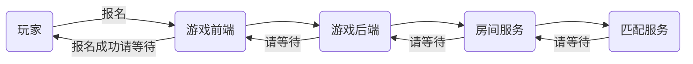
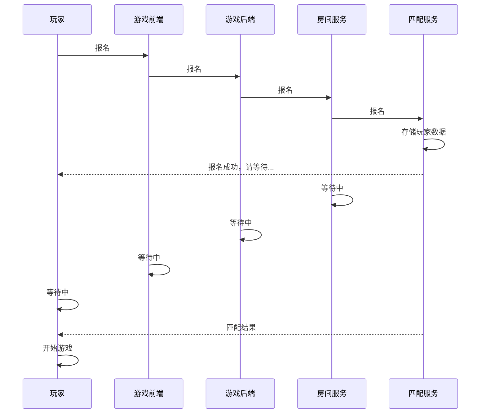

# 概述

玩家想要玩对战类的游戏，报名后，系统给匹配出对手
从公司角度看：控制玩家的对手，即可以拉高月活(异性匹配)，又可以控制胜率等等吧
此服务参照了：之前做小游戏的匹配机制 + 腾讯的匹配服务

# 角色定义

| 序号 | key           | 描述     |
| ---- | ------------- | -------- |
| 1    | player        | 玩家     |
| 2    | game client   | 游戏前端 |
| 3    | game server   | 游戏后端 |
| 4    | room service  | 房间服务 |
| 5    | match service | 匹配服务 |

# 流程图




# 时序图



# 权重

## 玩家权重计算

一个玩家的权重：根据 请求方 附带的 玩家属性值，代入到公式中，先计算聚合函数，最后 计算表达式的值

## 公式定义

1. 公式 ,avg \(age\) \+ gold \* level \- 20
2. 权重值匹配范围 ,1 ~ 3
3. 是否接受调配，如在指定的范围内匹配不到对手，是否可放大搜索范围
4. 聚合函数:sum max min average

# 匹配规则-基础配置

1. 成团人数
2. 报名超时时间
3. 匹配成功后超时时间
4. 权重
5. 请求方附加字段，匹配成功后如实返回
6. 模式
   1. N 人组团，如：吃鸡
   2. N VS N 组队互相 PK，如：王者荣耀

# 匹配计算方法

1. 全检索/模糊搜索
2. 块检索
3. 递增检索
4. 自定义检索

## 全检索/模糊搜索

每次匹配计算时，都会优先触发此种检索方法。
该方法：直接统计总人数、总小组数，如果人数太少，后面 3 种检索就没必要了。如果总人数\<2 倍\(满足人数条件\)，也会跳过后面 3 种。

## 块检索

0~1
1\-2
...
8\-9
9\-10

它是把总分分成 10 个块，依次去处理每个块的玩家

## 递增检索

0\-1
0\-2
...
0\-7
0\-8
0\-9
0\-10

它是依次递增的方式，处理每个块的玩家

## 自定义检索

0\-1
0\-2
1\-3
2\-4
3\-5
4\-6
...

他是即包含了上一次块的一部分数据再加下一个块的一部分数据，属于偏折中的方式检索

## N VS N 匹配公平性

比如，5 人组队，优先匹配其它的 5 人组队，保证公平性

# 匹配结果推送机制(重试)

当匹配成功 或 匹配失败，结果需要推送给调用方时，需要推送操作， 目前是重试 3 次，如果对方均无法正常接收，不会保存该数据，直接删除

# 协程组

## 主协程：

1. 信号处理
2. main
3. http
4. Metrics

## rule 协程组：每个 rule 会有如下 3 个守护协程

1. 匹配成功超时检测
2. 匹配计算
3. 推送

## log 协程组：每实例化一个 log 会有一个协程负载接收消息，并负责写入磁盘

1. main
2. http
3. 每个 rule 都会 4 个 log
   1. 匹配成功超时检测
   2. 匹配计算
   3. 推送
   4. 报名

总协程数计算：4\(主协程\)\+2\(log\)\+rule 数量 \* \[3\(守护协程\)\+4\(log\)\] = 6 \+ rule 数 \* 7 = 6 \+ N \* 7

这里假设 N=5 ， 6 \+ 5\*7 = 41

## 不支持/待解决功能

假设现在有 A\(北京\) B\(上海\) C\(上海\) D\(北京\)
rule 配置规则不变，想把：上海跟上海的匹配到一块，北京的跟北京的匹配到一块

# 负载均衡

假设 A 公司，有 100 个 rule 配置条目，脚本布置在机器 1 上，之后，发现机器 1 的负载较高，想做横向分拆。

1. 先确定是哪些条目访问量比较大，比较吃服务器资源
2. 确定好 ruleIds 后，停止旧进程，在新机器开 1 个进程，参数配置里：指定监听的 ruleId 即可。同时旧进程在旧服务器重新开启，一样：指定监听的 ruleId 即可。

> 一个 rule 配置条目会对应一个队列，所以横向随便拆分，放在 N 台机器上

负载过高的多个 rule 在一台机器上，被拆分到多条机器后，即解决了单进程处理多个 rule 的情况，那如果，单 rule 负载又非常高呢？
入口加一个负载器，多台机器还是正常启动匹配进程，注：redis 要拆分，或者 redis


redis 流转图：
[[游戏匹配-redis.png]]

# 日志

1. 程序异常
2. 主日志
3. http IO
4. 报名
5. 取消报名
6. 报名异常
7. 匹配成功
8. 报名超时
9. 匹配成功超时
10. 推送
11. 报名
    1. 报名成功
    2. 报名失败
    3. 报名超时
    4. 取消报名
12. 异常数据
13. 推送数据 2. 匹配成功超时 3. 推送失败丢弃 4. 重试日志

# 数据持久化

1. 玩家基础：状态、playerId、超时时间
2. 玩家权重
3. 小组
4. 匹配成功结果集
5. 推送

# 测试数据

1. HTTP 接口
   1. 报名
   2. 取消报名
2. 自动化测试
   1. 报名
      1. 基础参数测试
      2. 组队模式
         2。 吃鸡模式
3. rule 测试
   1. 基础参数测试

HTTP\-报名\-用例 1：走一下最基本的流程.正常用工具请求，

```
{
  "addition": "diiiiii",
  "group_id": 1111,
  "player_list": [
    {
      "uid": 10,
      "weight_attr": {
        "level": 10,
        "age": 18
      }
    },
    {
      "uid": 11,
      "weight_attr": {
        "level": 10,
        "age": 18
      }
    }
  ],
  "rule_id": 1
}
```

1. 报名后，检查 redis 数据：
   1. PlayerManager_rid_player
   2. sign_rid_group_person_1
   3. sign_rid_group_player
   4. sign_rid_group_weight
   5. sign_rid_group_element_gid
   6. sign_rid_timeout
2. 等待 10 秒，让报名超时，看一下超时：
   上面 6 个队列的值均应该被删除
   超时后，PUSH 会运作，查看 redis 数据：
   1. push_ruleId_pushId
   2. push_ruleId_status
   3. push_ruleId_inc_id
3. push 的重试机制，N 秒后，重度 N 次后，上面的 push_ruleId_pushId 、push_ruleId_status 会被删除

HTTP\-报名\-用例 1：测试一下权重公式\(修改 rule formula 字段: \<age\> \* 20 \+ \<level\> \* 50 \)

HTTP\-报名\-用例 1：请求两次，看一下匹配成功后的一些流程

```
{
  "addition": "diiiiii",
  "group_id": 2222,
  "player_list": [
    {
      "uid": 20,
      "weight_attr": {
        "level": 11,
        "age": 16
      }
    },
    {
      "uid": 20,
      "weight_attr": {
        "level": 11,
        "age": 16
      }
    }
  ],
  "rule_id": 1
}
```
