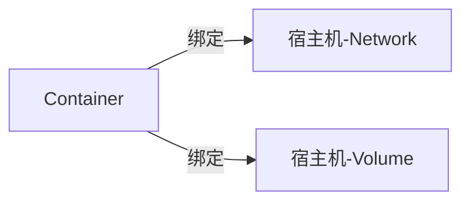

# 安装

官网

> https://docs.docker.com/engine/install/centos/

先删除掉系统里旧的

```
yum remove docker \
                  docker-client \
                  docker-client-latest \
                  docker-common \
                  docker-latest \
                  docker-latest-logrotate \
                  docker-logrotate \
                  docker-engine
```

> yum install \-y yum\-utils

> yum\-config\-manager \-\-add\-repo https://download.docker.com/linux/centos/docker\-ce.repo

yum install docker\-ce docker\-ce\-cli containerd.io

启动

> systemctl start docker

御载

> yum remove docker\-ce docker\-ce\-cli containerd.io

## portainer

浏览器，可视化管理UI

docker pull lihaixin/portainer

docker run \-itd \-p 7777:9000 \-v "/var/run/docker.sock:/var/run/docker.sock" lihaixin/portainer

admin

mqzhifu123

# 概览

docker：虚拟化，跟 VM 有点像，只是相比 VM 更轻更小更灵活

VM:是在宿主机上再安装一个OS系统hypervisor

docker:是在宿主机上安装一个软件而以，具体你想用什么软件，自行搭配

实际对比着看：

VM：就是一个真正的 OS，你要启动起来就很慢，另外，一个宿主机再虚拟出来一个OS，这样最多就是两个OS

docker：因为只是一个软件，一个进程，你想开什么自己装载即可，启动快，且要多少个OS就开多少个OS

Docker 的实现，主要归结于LINUX三大技术：命名空间 \( Namespaces \) 、控制组 \( Control Groups \) 和联合文件系统 \( Union File System \)

Namespaces

|namespace         |引入的相关内核版本                  |被隔离的全局系统资源                                          |在容器语境下的隔离效果|
|------------------|------------------------------------|--------------------------------------------------------------|----------------------|
|Mount namespaces  |Linux 2.4.19                        |文件系统挂接点                                                |                      |
|UTS namespaces    |Linux 2.4.19                        |nodename 和 domainname                                        |                      |
|IPC namespaces    |Linux 2.4.19                        |特定的进程间通信资源，包括System V IPC 和 POSIX message queues|                      |
|PID namespaces    |Linux 2.6.24                        |进程 ID 数字空间 （process ID number space）                  |                      |
|Network namespaces|始于Linux 2.6.24 完成于 Linux 2.6.29|网络相关的系统资源                                            |                      |
|User namespaces   |始于 Linux 2.6.23 完成于 Linux 3.8\)|用户和组 ID 空间                                              |                      |

> 个人理解：一个操作系统的大部分基础功能及基础资源，都打上一个label\(namespace\)，互相看不见对方，都各自以为是'全世界'，而实际上都是一个个的真实的\<进程\>，OS虚拟出来namespace这一层概念。

能把功能及资源划分\(虚拟\)，但依然是普通的进程，依然可能某个进程吃满CPU的情况，需要对这些进程\(虚拟\)进行限制，于是就得引用 Control Groups

Resource limitation: 限制资源使用，比如内存使用上限以及文件系统的缓存限制。

Prioritization: 优先级控制，比如：CPU利用和磁盘IO吞吐。

Accounting: 一些审计或一些统计，主要目的是为了计费。

Control: 挂起进程，恢复执行进程。

四大组成：镜像 \( Image \)、容器 \( Container \)、网络 \( Network \)、数据卷 \( Volume \)。

  


  



## image 镜像

image:一个软件代码包,如：NGINX、PHP5、PHP7、MYSQL5、MYSQL8，甚至可以是centos7。

> 更像是运行一个项目所需要的环境软件

repository:镜像仓库，跟git有点像，用于存储image,这里分为~本地和远程

搜索一个镜像

> docker search imageName

下载一个镜像

> docker pull imageName

查看本地已有镜像

> docker images

删除一个镜像

> docker rmi imageName

**制作镜像，有3种方法：**

1. docker commit
2. dockerfile
3. docker import

需求：当我们运行了一个容器：NGINX，默认是index.html的内容，如果我们不想用默认的index.html，然后进入该容器，修改了该index.html的内容，退出，再访问就成了新的内容，但是，如果把该镜像删了，重新再启动镜像，刚刚修改的东西就没有了。

**docker commit模式**

当我们启动一个容器后，进入该容器，然后修改里面的文件，之后执行docker commit即可。

查看对镜像的修改

> docker diff imageName

```
docker commit \
    --author "Tao Wang <twang2218@gmail.com>" \
    --message "修改了默认网页" \
    webserver \
    nginx:v2
```

**dockerfile模式**

```
mkdir mynginx
cd mynginx
touch Dockerfile
vim Dockerfile
```

```
FROM nginx
RUN echo '<h1>Hello, Docker!</h1>' > /usr/share/nginx/html/index.html
```

构建镜像

> docker build \-t nginx:v3 .

这个：. 指的是上下文目录，真正的构建流程是，将当前需要构建的项目中的所有文件打包发送给docker server进行构建，而server构建的时候，得知道一个项目路径，即是这个点

而如：run copy a.json /app/a.json

这个a.json源文件就是 docker build 时定义的路径，而不是项目的根目录，所以有时候，新手构建的时候，发现找不到源文件，就把这个.写成了 根 / ，导致构建的时候非常慢....

**import模式**

docker import centos\-7.5 mydiycentos:test

3种模式对比：

commit:比较局限，有那么点：保存一下当前已修改的镜像，没其它作用

import:更像是 想做一个开源镜像，用一个干净的OS，放上点自己的东西，给所有人用，感觉也不常用

dockerfile:比commit更灵活，可以跨机器部署，又比import方式轻，更重要的，它可以用来做CICD

## container 容器

创建/启动一个容器:开启进程，将镜像里的内容打到一个容器中运行

> docker run \-it imageName /bin/bash

|         |                                                                            |
|---------|----------------------------------------------------------------------------|
|\-d      |守护模式运行容器，并返回容器ID                                              |
|\-i      |交互式操作,打开一个标准的输入接口                                           |
|\-t      |终端 ,创建一个伪 tty 终端                                                   |
|imageName|镜像,nginx mysql php kafaka 等                                              |
|/bin/bash|容器启动后要执行的命令，这里我们希望有个交互式 Shell，因此用的是 /bin/bash。|

> 这个/bin/bash一直不太理解，之前一直以为如果想外部再登陆容器必须得写，试了下，原来它只是容器在启动过程中，要执行一条指令而以，而且他跟\-d 是冲突的....去掉了\-d 它才有效果...

查看当前已开启的容器列表

> docker ps \-a

容器的几个核心状态:Created、Running、Paused、Stopped、Deleted

与容器进行交互，就是进入容器里

> docker exec \-it 容器ID bash

停止一个容器

> docker 容器ID stop

重新启动一个容器

> docker 容器ID start

删除一个容器

> docker rm 容器ID

```
-f, --force 强制删除一个正在运行的容器（使用 SIGKILL）
-l, --link 删除指定的连接
-v, --volumes 删除与容器关联的卷
```

## dockerfile

|指令   |描述                                    |
|-------|----------------------------------------|
|copy   |将需要打包的文件复制到image里           |
|add    |跟上面差不多，更健壮，支持：URL 解包功能|
|env    |设置容器内部的环境变量                  |
|cmd    |一般用于 启动一个服务的shell指令        |
|workdir|指定当前工作目录                        |
|label  |添加一些元数据                          |

从这些指令中，完全可以做CICD了。挺强大了，感觉dockerfile才算是docker灵魂啊~

假设 /data/myproject1 下是项目代码，现在要启动

> touch dockerfile.one
> vim dockerfile.one

```
FROM golang:1.16.0
WORKDIR  /data/myproject1

copy * .

RUN go mod tidy \
go build -o app_exec

CMD ["./app_exec"]
```

构建

> docker build \-t go/myproject1:1 \-f Dockerfile.one .

还有一种方法是，将这个过程分成两部分，再用一个公共的shell文件整合一下，如下：

1. 编译过程 有一个文件中
2. 启动 app\_exec 在一个文件中

cicd.sh:

执行1，生成 app\_exec

再开一个docker 把app\_exec 复制进来

最后执行 app\_exec

还有一种方法，支持多段构建，就是把上面1 2 合并成一个dockerfile

```
FROM golang:1.16.0
doing something
....

FROM node:alpine
doing something
....

启动

```

## Volumes 数据卷

将容器内的目录映射到宿主机的目录上，有点mount的意思

1. 在宿主机可直接看到容器内部变化
2. 宿主机做出修改，容器内部立刻生效

\-\-mount source=my\-vol,target=/usr/share/nginx/html

查看

> docker volume ls

这种方式最好只用到log，如果其它的像：动态修改nginx配置文件之类的，最好还是用dockerfile来实现

还有像：DB会产生出数据存储，统一管理，那用卷挂载到宿主机硬盘，方便备份，这种就是有状态的服务了，不建议用容器

## 网络

容器端口8080 \-\> 映射到宿主机80

> \-p 80:8080

不指定映射，直接把容器里的所有监听端口，全部到宿主机（随机）

> \-P

容器互联

1. 通过宿主机IP\+暴露的端口号
2. \-\-link

## docker\-composer 安装

下载可执行包

> wget https://github.com/docker/compose/releases/download/v2.2.2/docker\-compose\-linux\-x86\_64

设置可执行权限

> chmod \+x /usr/local/bin/docker\-compose

转移到系统指令中\(也可以ln\)，同时改名

> mv docker\-compose\-linux\-x86\_64 /usr/local/bin/docker\-compose

查看版本

> docker\-compose \-\-version

## 实践

需求：两个容器，1 nginx 2 php ,实现 http 请求 a.php 能正常显示

> docker search nginx
> docker pull nginx
> docker images

启动/创建 nginx

> docker run \-it nginx /bin/bash

发现，直接进入了容器，并没有返回宿主机，退出，查看下：

> ps docker

发现没有启动

> ps docker \-a

发现容器状态为：

> Exited \(127\) 51 seconds ago

两种方式，第一种是重新启动该容器\(自动变成了守护模式\)

> docker start 容器ID

第二种方式，重新再创建一个，以守护模式开启，同时映射宿主端口

> docker run \-it \-d \-p8080:80 nginx:latest /bin/bash

然后就蒙了，死活请求不通的，结果就是：容器启动成功，还得再到里面，再启动一下nginx，可之后又好了...

> docker run \-it \-d \-p 8080:80 nginx:latest

启动成功，现在开启日志文件挂载

mkdir \-p /data/docker/nginx/logs

mkdir /data/docker/nginx/conf

mkdir /data/docker/nginx/www

docker run \-it \-d \-p 8080:80 \-v /data/docker/nginx/logs:/var/log/nginx nginx:latest

测试下，是否成功：

curl http://127.0.0.1:8080

tailf /data/docker/nginx/logs/access.log

挂载web目录

docker run \-it \-d \-p 8080:80 \-v /data/docker/nginx/logs:/var/log/nginx \-v /data/docker/nginx/www:/usr/share/nginx/html nginx:latest

为什么不挂载配置文件？如果挂载，nginx启动，会在宿主机找nginx.conf，它就不会自动创建了，所以，默认启动失败，可以启动后，在容器里目录内容全CP到宿主机再启动，另外，这种方式也不太好，应该改成dockerfile

> \-v /data/docker/nginx/conf:/etc/nginx
> 
> 
> \-v /data/docker/nginx/conf/nginx.conf:/etc/nginx/ nginx.conf
> 
> 
> \-v /data/docker/nginx/conf/conf.d/default.conf:/etc/nginx/conf.d/default.conf

touch /data/docker/nginx/www/index.html

echo "im test dockers" \> /data/docker/nginx/www/index.html

curl http://127.0.0.1:8080

## docker\-composer

dockerfile 是构建一个项目或服务，但是多个容器一起部署，就有点麻烦

如：一个项目用PHP编写，你还得再开3个容器：nginx mysql reids

## docker解决了什么问题？

1. 解决各软件版本不同、依赖不同版本
2. 想快速配置一个环境，而不用make编译
3. 可以对应用进行隔离，避免某一个应用过高，带挂了整个机器
4. 可用于CICD

## docker问题

1. 性能，多加了一层docker肯定得有一定性能开销
2. 封闭，所有的软件都运行在docker里面，想查个错，看看日志，不太方便
3. 同上，封闭后，监控、报警、日志的统一处理
4. 增加运维、开发者成本

## docker使用场景

并不是所有项目都适合docker,如：

1. 中小型公司且项目数较少
2. 应用程序都差不多，对版本也没太多要求，如：PHP 固定的就是nginx mysql redis
3. 有状态的服务，如：DBMS产生的存储数据，如果误删了容器，这些DB数据也丢了。

适合的场景：

1. 项目较多或项目使用的语言比较复杂\(php java go\)，需要针对不同项目部署各种开源软件
2. 项目中的代码对版本依赖度较高，需要对不同项目的代码的使用不同的软件环境
3. 学习一个软件，需要快速搭建一个环境
4. 测试一个项目的代码，不同版本的兼容性
5. 无状态的应用程序或服务
