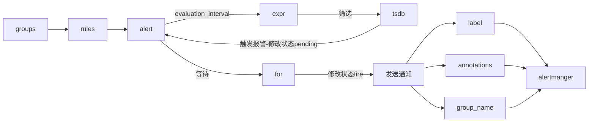
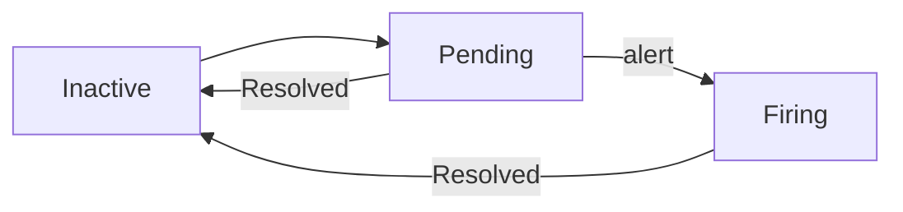
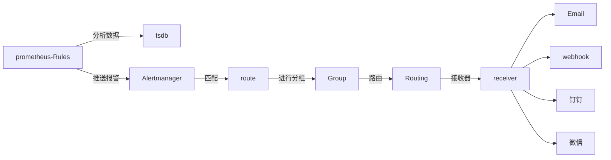

# prometheus&alert&push

## TSDB

> prometheus的核心就是TSDB，所以得先了解下

**TSDB：Time series database，以时间为维度的数据库**

> 其特征主要包含如下：

|关键字   |描述                             |
|---------|---------------------------------|
|timestamp|数据发生的时间                   |
|metric   |该数据的标识                     |
|value    |该数据所具体值，也可能是多个value|
|tag      |附属属性                         |

特点：

1. 结构相对简单，基本就是基于列操作，没有太复杂的像：联表操作、范式、事务等
2. 针对\<列\>的操作比较多，各种统计
3. 以时间为核心点进行计算（索引建立在时间维度上）
4. 需要存储的数据量非常大
5. 写多于读、顺序写、不更新、不删除
6. 分布式

开源软件：

|关键字                   |语言  |时间|
|-------------------------|------|----|
|Influxdb                 |golang|2013|
|OpenTSDB                 |java  |    |
|Druid                    |java  |    |
|Round Robin Database Tool|C     |2015|

横向对比：它即不算NOSQL 也不算RDB

感觉主要是用于统计学的，随着智能设备的崛起，像：智能手环监听心跳、生产车间监听机器状态、服务器状态监听等，TSDB使用场景挺多。

## prometheus

核心是一个时序数据库，围绕着数据库，又包含了：API UI 收集数据 插件（如：报警）等，这样一个系统。


> 这是网上的一张图结构图

**metrics**

一组metric，基于promehtues也叫一个job，基于某一个功能的一组统计数据。如：apache php mysql 这种都是一个metrics

**metric**

一个统计数据，在metrics里。如：

1. 支付成功数
2. 支付失败数
3. 温度数
4. 心跳数
5. 请求记录
    ......

这个值才是真正的值，并最后参与计算统计的。

> metric的值可以是一个简单标量\(数字、字符串\)，也可能是一组数据（code=200,uri=/baidu）

prometheus如何获取到客户端的metrics数据?

> 在若干时间周期向配置文件中的jobs的IP:PORT,请求拉取一次metrics数据集合，并存于到本地TSDB中。

metric数据\(时序\)的逻辑分类\(存储上还是TSDB格式\)，如下：

|关键词   |类型|说明                                                                    |
|---------|----|------------------------------------------------------------------------|
|Counter  |    |计数器，一定是递增的 一般：\_total作为后缀。累加指标                    |
|Gauge    |瞬时|，如温度，可任意加减。其为瞬时的，与时间没有关系的，可以任意变化的数据。|
|Histogram|    |一定时间段内的，彩样取平均值，以分位数存储                              |
|Summary  |    |一定时间段内的，彩样取平均值，以区间存储                                |

> 这里是逻辑分类，而实际上数据在DB中没这层逻辑，都是你发啥我就存啥。

客户端创建好metrics数据，给出HTTP回调地址，然后告知promethues，promethues在配置中设定好回调地址，整个流程也就通了。

如果一台服务器只有一个服务还好，如果有N个呢？那promethues在配置中就有N个jobs\_names，可不可以每台机器只有一个进程，所有服务向该进程推送消息，而promethues只从这台机的这个进程上拉数据即可呢？

push gataway|statsd\_exporter

> 给使用者自定义的收集器，自研的软件项目，肯定是很多自定义特殊的数据，exporter肯定是满足不了，才有了这个东西。

自己的服务可以清楚的知道如何创建/变更metric项，但是如果开源软件呢？实际也有开源的收集器，如下：

|名称               |描述    |
|-------------------|--------|
|node\_exporter     |服务器  |
|blackbox\_exporter |        |
|graphite\_exporter |        |
|consul\_exporter   |consul  |
|haproxy\_exporter  |haproxy |
|memcached\_exporter|memcache|
|mysqld\_exporter   |mysql   |

> exporter:开源软件N多，估计官方也没那精力全都给出，像：redis php kafka 等等吧，但这些可以在github上找到。

.png)

上图即是最终的使用形态了，图中也能看出来prometheus 是个粘合体~调度各种资源，其它的只是配合它来做。

而prometheus的运转流程，或者说操作流程就两个文件：prometheus.yml alertmanager.yml

这两个文件中的核心是：jobs rule

## label

给metric数据项加标识\(Metadata label\)，作用：

1. 一个metric加上一个标签，就等于多了一个维度，所以 value\+label 就实现了多维度搜索
2. 拉取的metrics可能来自很多个节点，多节点就得做区分，所以就有了label

> 注：label是由prometheus端添加，而不是client

label也分为两类

1. 使用者自定义
2. prometheus默认定义

配置一个job时，其中的target项就自动被转换成了instance标签

> prometheus给每个target默认添加的标签，如下：

**address**：当前Target实例的访问地址\<host\>:\<port\>

**scheme**：采集目标服务访问地址的HTTP Scheme，HTTP或者HTTPS

**metrics\_path**：采集目标服务访问地址的访问路径

> 注：这些标签属于内部使用，USER是无法使用的，并且这些标签并不进入DB中

## 安装

下载包：

> https://prometheus.io/download/

解压

> tar \-zxvf
> 
> 
> mv /soft

查看版本

./prometheus \-\-version

> vim prometheus.yml
> 
> 
> 加一个监控值：

```
global:
  scrape_interval   15s  #采集3方数据周期,默认1m
  evaluation_interval    #计算rule expr 周期,更新告警状态,默认1m
  #scrape_timeout: <duration> | default = 10s #采集3方数据 超时时间
  #external_labels: #与3方交互时，添加的默认标签
    #env: test
    
- job_name: 'prometheus'	#这个是默认即带，监控prometheus自己
    static_configs:
    - targets: ['localhost:9090']
- job_name: 'php-fpm'           #监控(8182)机器上的php-fpm
    static_configs:
    - targets: ['localhost:8182']
    
- job_name: '235_node'

    static_configs:
    - targets: ['127.0.0.1:9100']#监控服务器自己

- job_name: '235_pushgetway'   #从pushgateway摘取数据

  static_configs:
  - targets: ['127.0.0.1:9091']
  
```

启动：

> ./prometheus \-\-config.file=prometheus.yml \-\-web.enable\-lifecycle

```
--config.file -- 指明prometheus的配置文件路径
--web.enable-lifecycle -- 指明prometheus配置更改后可以进行热加载
--storage.tsdb.path -- 指明监控数据存储路径
--storage.tsdb.retention --指明数据保留时间
```

启动后，用浏览器试一下，查看启动是否成功

> 38.142.177.235:9090

优雅关闭

> kill \-TERM 27350

http ui 也可以操作：

> curl \-XPOST http://localhost:9090/\-/quit
> 
> 
> curl \-XPOST http://localhost:9090/\-/reload

服务端的事情OK，现在准备，在被监控的机器上安装client

## prometheus.yml

1. global:全局配置
    1. 数据收集周期时间
2. alerting:
    1. 使用哪种告警插件
    2. 插件的访问地址
3. rule\_grou\_files:告警规则的配置文件列表
4. scrape\_configs:采集配置
    1. job\_name
    2. static\_configs:targets

主要就是这4大块，其中核心的就是jobs

## 报警机制

先看一下，rule\_group.yml demo

```
groups:
- name: node_up #group name
  rules:
  - alert: node_down #规则名称  
       expr:expr: up{env="operations"} != 1 #触发报警的表达式
       for: 1m #报警状态为 Pending 后等待 1m 变成 Firing 状态
       labels: #标签
         severity: warning 
       annotations: #描述
         description: "Environment: {{ $labels.env }} Instance: {{ $labels.instance }} is Down ! ! !"
         value: '{{ $value }}'
         summary:  "The host node was down 20 minutes ago"
       
```

接着看一下，基础的流转：



再看一下流程图：

.jpg)

最后看一下状态流转：

一条rule的\-UI界面 会有3种状态：

1. Inactive 正常状态，未激活警报
2. Pending 已触发报警条件，但在一定时间内后才发送，有点延迟的意思，如： for 1m 子句中定义的持续时间
3. Firing 满足条件，且超过了 for 子句中的的指定持续时间 1m



核心关键点

1. expr : 也就是 触发报警表达式，这个也是最难。。。我看了看DEMO，好复杂....

> expr: up{job="share\_linux\_os\_node"} == 0

1. for : 持续时长，上面触发后，等待多久才真的发送报警
2. evaluation\_interval : 计算expr周期

分析：

evaluation\_interval:这个值不要太小，也别太大，不然频繁触发计算exp，会很生成多条告警大量发送的情况

for:这个值不要太小，可以略大一点，因为，网络波动很正常，值太小一样会有很多告警发出来

最终发送一告警的时间为：evaluation\_interval \+ for

查看报警配置信息

> http://59.110.167.206:9090/alerts

## PromQL

> 类似sql query 的一门小语言吧。
> 
> 
> 报警阀值配置的时候，需要写公式

**聚合函数**

|关键字       |描述                 |
|-------------|---------------------|
|sum          |累加                 |
|min          |最小                 |
|max          |最大                 |
|avg          |平均                 |
|topk         |前N条                |
|count        |统计条数             |
|count\_values|对 value 进行计数    |
|stddev       |标准差               |
|stdvar       |标准差异             |
|bottomk      |样本值最小的 k 个元素|
|quantile     |分布统计             |

> 后4个基本上不咋用，是统计学的东西

内置函数

floor round ceil

rate: 配和 \[1m\] 参数一起使用，所有记录的value , 1分钟/60 = 每秒平均值

> ps:这个值好像是配合counter类型数据，对增量进行求每秒平均值

表达式

\+，\-，\*，/，%，^ ==，\!=，\>，\<，\>=，\<= and，or，unless

> unless：非， 等于 \!

**查询结果分类**

1. 瞬时数据 \(Instant vector\): 包含一组时序，每个时序只有一个点，例如：http\_requests\_total
2. 区间数据 \(Range vector\): 包含一组时序，每个时序有多个点，例如：http\_requests\_total\[5m\]
3. 纯量数据 \(Scalar\): 纯量只有一个数字，没有时序，例如：count\(http\_requests\_total\)

> metricaName{field=xxx,label~=xxx}\[5m\]

metricaName:一个metric名称，可以类比MSYQL一个表名

field:当传输的值为一组，且包含若干字段时，字段名，可以类比MSYQL一个字段名

label:标签名

5m:过去5分钟的数据

一个简单的DEMO：

> http\_Request\_total{code=200 , method='POST',jobs="node\_206"}\[5m\]

查看metric=http\_Request\_total,字段 code=200 method=post, 标签 jobs=node\_206,最近5分钟的数据

再结合 内置 函数与 聚合函数，及表达式，即是一条完整的query

floor\(avg\(http\_requests\_total{code="200"}\)\)

## node\_exporter

> https://github.com/prometheus/node\_exporter/releases/download/v1.0.1/node\_exporter\-1.0.1.linux\-amd64.tar.gz

解压，启动

> ./node\_exporter \-\-web.listen\-address="0.0.0.0:9100" \> /data/logs/exporter/node\_exporter.log &

查看启动是否成功

> lsof \-i:9100
> 
> 
> 注：记得打开阿里云端口限制

都OK了后，prometheus ui http 端 ，查看

> http://39.107.127.244:9090/targets
> 
> 
> 搜索：up，即可看见状态值 了

vim prometheus.yml

加一个监控值：

```
  - job_name: 'node'   ### 新增加job
    static_configs:
    - targets: ['127.0.0.1:9100']
```

到搜索框里输入：up ，execute 就看见图形了

## push getway

应用场景：

1. 当一台机器上跑着多个服务，如直接在prometheus中配置job略麻烦，于是在本机启动一个进程，接收多个服务的metric数据，最后在promethus中只配置这个进程，只摘取该进程的配置信息即可。

缺点：

1. 多服务同时推送一个进程，数据量大，会把该服务搞挂，造成单点故障。

> 当前机器上所有服务也被标记成挂了

1. pushgateway保存所有数据，而用户的自有服务即使重启，之前的metric数据依然存在于push\_gateway中。

> 重启push getway，之前的metric数据会消失。也可以通过接口手动删除

1. 因为ushgateway聚合了一台机器上所有的用户服务，并且有旧数据，那么当某个服务挂了，pushgataway依然还会把该服务的旧数据推送到prometheus中，且prometheus依然认为该服务是正常的。

下载安装包/解压

启动：

> ./pushgateway \-\-web.listen\-address="0.0.0.0:9091" \-\-web.telemetry\-path="/metrics" \-\-persistence.interval=1m

\-\-persistence.file="persistence\-data"

查看下效果

> http://8.142.177.235:9091

自己的一些信息

> http://8.142.177.235:9091/metrics

## 监控nginx:

nginx 添加配置文件：

```
    location ~ ^/(status|ping)$ {
            fastcgi_pass 127.0.0.1:9000;
            fastcgi_param SCRIPT_FILENAME $document_root$fastcgi_script_name;
            include fastcgi_params;
    }
```

php修改配置文件：

pm.status\_path = /status

重启，

http://114.55.2.201/Nginxstatus

http://114.55.2.201/status

监控 php\-fpm

https://github.com/bakins/php\-fpm\-exporter/releases

被监控的机器安装php\-fpm\-exporter

//\-\-addr:监听本机端口，供远方的prometheus 调用

//endpoint :要监控的php\-fpm

/soft/php\-fpm\-exporter \-\-addr 0.0.0.0:8000 \-\-endpoint http://127.0.0.1/status

- job\_name: 'php\-fpm'
    static\_configs:
    - targets: \['114.55.2.201:8182'\]

=======================================================

## 报警/预警策略

监控实体分类

|类型          |监控指标                            |备注                 |
|--------------|------------------------------------|---------------------|
|服务器        |CPU/内存/网络/硬盘负载高、服务器宕机|centos               |
|自研服务      |进程意外退出、负载高、运行时异常    |golang php java      |
|开源软件\-自建|进程意外退出、负载高、运行时异常    |nginx apache rabbitmq|
|开源软件\-3方 |进程意外退出、负载高、运行时异常    |lbs mysql redis      |

触发类型

|类型|监控指标                                   |获取方式        |方式|
|----|-------------------------------------------|----------------|----|
|被动|进程意外退出、负载高、运行时异常           |从日志DB中分析  |pull|
|主动|程序中执行中 发生了错误，程序员能直接捕获到|通过HTTP直接推送|push|

分析

> 主动：需要提供一个HTTP SERVER API接口
> 
> 
> 被动：需要有TSDB主动去收集数据并存储，再加上分析，最终推送给报警器

核心

1. 日志DB，可存储监控实体的日常数据
2. 分析日志，有报警策略
3. web service接收报警
4. 报警推送通知，微信 邮件 SMS webhook
5. UI

> 日志DB及日志分析，prometheus可处理，剩下就是有个service：报警接收器，alertmanager即可。

## alertmanager

安装报警插件

> https://github.com/prometheus/alertmanager/releases/download/v0.21.0/alertmanager\-0.21.0.linux\-amd64.tar.gz

prometheus \<\- Rules \-\> Alertmanager \-\>Group \-\> Routing \-\>receiver


  



|描述    |key           |说明                                                                                                  |
|--------|--------------|------------------------------------------------------------------------------------------------------|
|全局配置|global        |用于定义一些全局的公共参数，如全局的SMTP配置，Slack配置等内容                                         |
|模板    |templates     |用于定义告警通知时的模板，如HTML模板，邮件模板等；                                                    |
|告警路由|route         |根据标签匹配，确定当前告警应该如何处理；                                                              |
|接收人  |receivers     |接收人是一个抽象的概念，它可以是一个邮箱也可以是微信，Slack或者Webhook等，接收人一般配合告警路由使用；|
|抑制规则|inhibit\_rules|合理设置抑制规则可以减少垃圾告警的产生                                                                |

vim alertmanager.yml

```
global:
  resolve_timeout: 5m #该参数定义了当Alertmanager持续多长时间未接收到告警后标记告警状态为resolved（已解决）
  smtp_smarthost: 'smtp.qq.com:25'
  smtp_from: '78878296@qq.com'
  smtp_auth_username: '78878296@qq.com'
  smtp_auth_password: 'zhifu123'

route:
  group_by: ['alertname'] #根据alertname进行分组
  group_wait: 1s #被分组后的警告，等待多久，真实发送警告一个周期内收集若干警告，统一发送一条就够了
  group_interval: 10s   #之前已发送了一次警告后，再等待多久后，再发警告
  repeat_interval: 5s
  receiver: 'web.hook'
receivers:
- name: 'web.hook'
  webhook_configs:
  - url: 'http://127.0.0.1:8088/alert.php'
#inhibit_rules:
#  - source_match:
#      severity: 'critical'
#    target_match:
#      severity: 'warning'
#    equal: ['alertname', 'dev', 'instance']
```

检查一下配置文件

> ./amtool check\-config alertmanager.yml

启动

> ./alertmanager \-\-config.file=alertmanager.yml

验证是否成功，查看UI

> http://59.110.167.206:9093/

vim prometheus.yml

添加如下

```
alerting:
  alertmanagers:  # 配置alertmanager
  - static_configs:
    - targets:
      - 127.0.0.1:9093  #alertmanager服务器ip端口
rule_files:
  - "first_rules.yml"

```

touch first\_rules.yml

```
groups:
- name: nodeup
  rules:
  - alert: nodeup
    expr: up{job="share_linux_os_node"} == 0
    for: 5s
    labels:
      severity: test
      #team: node
    annotations:
      summary: "{{ $labels.instance }} 已停止运行超过 15s！"
```

./promtool check rules rules/node.yml

./amtool check\-config alertmanager.yml

重启prometheus

配置完成 后，prometheus UI 查看 下 alert 的status

> unkown：刚启动，初始化状态
> 
> 
> nactive：这里什么都没有发生
> 
> 
> Pending：已触发阈值，但未满足告警持续时间（即rule中的for字段）
> 
> 
> Firing：已触发阈值且满足告警持续时间。警报发送到Notification \> Pipeline，经过处理，发送给接受者这样目的是多次判断失败才发告警，减少邮件。

再去alertmanager 看看是否收到报警

## 主动上报alertmanager

## 总结

不知道是不是被JAVA系洗脑了，还是说prometheus太好了，它不仅仅是收集数据UI化，还能报警，也就是干了监控的事儿，像之前的 nagios zaabix 基本可以放弃了。

另外，再配合grafana确实用的挺爽。
