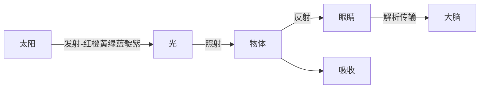

# 光/颜色/眼睛/像素

## 颜色基础

颜色的构成关系是：光源、物体、观察者\(眼睛\)

颜色：物体\(人\)本身不具备颜色，或没有固定的颜色，取决于物体对光的吸收、透传、反射程度。光大概有7种颜色，而物体对哪种颜色反射更好，那此物体就偏向此颜色。

> 物体是不是绝对没有颜色，这个好像不敢100%确定

人类眼睛看到的颜色：实际不一定是真的，光源照身在物体上，物体可能会透视、可能吸收，也可能会反射\(取决物体\)，观察者接收的颜色也就会随之产生变化。

> 如果一个物体不反射光，那人类就看不见了。具说地球没有，宇宙有一个：黑洞。（黑色也反光，只是略低）

> 颜色不固定，如：同一样物体早上跟榜晚看到的是不同颜色，如太阳就是，下午就是夕阳红

什么是光?

它是电磁辐射，即有波的性质，又有粒子的性质，于是它是：电磁波的一种

> 光即是能量，光即是颜色，光即是温度

什么是光波？

它跟海浪/波浪类似

什么是波长?

光波的的上下幅动大小\(一次光波粒子长短的周期\)

> 红色的波长：最长
> 绿色的波长：最短

什么是频率?

> 波浪多久重复一次

什么是光谱?

> 波长\+频率

什么是电磁波？

光、无线电、红外线、紫外线等均是，大部分人类都看不见，我们肉眼能看见的叫：可见光....

|    |波长\(THz\)|频率\(nm\)|
|----|-----------|----------|
|红色|668~789    |380~450   |
|绿色|526~606    |495~570   |
|蓝  |631~668    |450~475   |

> 光波长介于0.39\-0.77微米之间，频率在380~750THz，的电磁波是人眼可见的范围，这个范围称为可见光谱

可见光为什么是都是白色？

颜色光并不是颜色分明，而是一层层颜色合并而来，由红到紫，也叫：混合光束

光的传输？

可见光是由多种颜色混合而成的光（7种过度色，也叫光带），7种颜色的光合在一起变成了白色。

日常情况下，光在空气中传播，不管颜色的波长什么样，速度都是相同的

假设一束光传输过程中遇到了一个物体（三棱镜），因为是玻璃，有吸光作用，光进入镜子里依然还会继续向下传输，但是光在穿越玻璃的时候遇到了一定的阻力，光的传输也变慢，波长短的传输就会变快，波长过长的就会变慢，最后，混合的可见白色光，被提取出7种色带

既然，混合的白光，能够被撮出来，如果能测量出波长跟频率，就能计算出该光波的能量，那就能分辨出该颜色值ID

眼睛工作原理：

cornea\(角膜\):接收光，这里时不时还会有水出来，估计是防脏吧

iris\(虹膜\):调整瞳孔大小\(放大缩小\)决定光的进入多少

pupil\(瞳孔\):位于虹膜，可调整大小

lens\(晶状体\):位于瞳孔后测，可变大变小，主要实现聚集光线

retina\(视网膜\):位于眼球最后方，接收光信号脉冲

> 只有可见光的频率进入到眼睛里，视网膜才起作用，而实际上，非可见光在未进入到视网膜之前即被隔绝了

视网膜：

视杆细胞：感应亮度（在视锥细胞前面,不连接细胞）

视锥细胞：感应三元色\(直接连接细胞\)

现在结合光原理\+眼睛原理 分析出：核心是视网膜

视网膜：分析出光源的波长\+频率=光谱，视网膜更像是一个光线的捕捉器\+颜色映射器

> 其实视网膜也没有颜色的概念，它也只是分析出一个数学值\(光谱\)，然后传输给大脑，大脑接收数字信号，再做映射与构图，所以从这里分析看：到底颜色是真的存在，还是大脑构建的幻想or假象？

三基色原理：自然界中所有的颜色都可以用红、绿、蓝\(RGB\)这三种颜色波长的不同强度组合而得。三种颜色叠加，也叫次混色，这又引出互补色了，不做分析了。

> 三基色=三原色

## 存储/显示光

#### 分析与识别光

从上面分析得出：只要做一个类似视网膜的元器件，可以识别出：可见光的颜色（RBG）,计算机就能识别出颜色，并保存下来。能保存就能显示出颜色了

计算机处理颜色功能：

1. 光颜色的存储核心：能有一种电子元器件，可以识别光，分析出光的颜色/亮度等

> 相机

1. 光颜色的显示核心：有一种人造光，可以照亮3元色，可控制亮度

> 电视、显示器

#### 存储光\(像素\)

人眼是有一个画幅/画面的，同理，相机也有画幅，那么存储光就是一个二维平面图。图是有点构成的，光就是散落在这二维平面上的点，这些点就是像素了

> 人眼最多是180度，也就是只能识别出一个面，而靠两只，就能识别出3D效果的，鹰眼是270度的，鹰眼就有点超越面的效果了。
> 
> 
> 相机，可以并两块合成一块就是360度了

将识别出来的光点，再映射进一个画布上，即可存储光了

#### 显示光\(像素\)

> 既然能存储光，显示其实就不太难了，至少：能显示出个基本效果，要显示的非常细致且饱和度自然，那就是科学家\+各大厂家努力的了

1. OS取出硬盘中存储的文件：一个矩阵内包含N多像素块，每个像素包含3个值:R B G
2. 有一个投光的元器件，可以打出三种光：R B G，能调整亮度
3. 一块面板\(显示器\)内，嵌入到N多个上面这种灯，根据文件的数据，最终把画面映射到面板上

液晶显示器的最小单位是像素，而一个像素其实还有3个子像素，每个子像素是一个颜色，R B G

## 像素

二维平面是由若干点组成，给每个点加上颜色，就能显示出一幅彩色画面，这个点就是：像素

> 像素更深层次的理解是：对现实世界的影像进行收集/存储/展示

日常开发虽然提到这个词较多，但实际《像素》实际是给硬件使用的：采集器/显示器

我们软件行业理解的像素更像是一个正方块，对这个正方块的显示与处理

比如：显示器最终显示一个像素，是把一个正方块内等分成3份，每份后面有一个灯，如果该像素是纯红黑，这个像素块只有1/3是亮的

## 颜色空间

#### HSV/HSB/HSL\(彩色三要素\)

HSV:所有色域值，整合成一个圆柱立方体，如果要确定一种颜色就得有3个值

1. Hue:色调，外层圆圈的值\(圆圈的度数\)。颜色明暗的程度，是光作用于人眼时引起的明亮程度的感觉。
2. Saturation:饱和度，圈内的一个值。颜色的类别，例如红色、蓝色、绿色指的就是色调。

> 以上两个值就能定位到一个平面上的一个点

1. Value/Lightness/:圆柱体的高度。颜色的深浅程度，也称彩度。例如深绿、浅绿指的就是绿色这个色调的饱和度，饱和度越高，颜色越深。

HSL是用的HTML5\-CSS中

RGB是人眼能看见的眼色，HSV才是真正对颜色的定义，HSV 更像是画家调色

#### RBG\(A\),三基色

自然界中大部分彩色都可以由三种基色按不同比例混合得到

每种颜色的亮度范围是0~255，那RGB就是 255 \* 255 \* 255 = 16581375种颜色。

简写：有些程序里颜色值如：\#FF FF FF ，实际上就是255拆成两个16进制数表示

从最大值255来看，这是 一个8位数，2 ^ = 256，也可以变相的叫法：8位真彩色

R:reg，通常范围从0.0（没有红色）到1.0（全部的红色）。

G:green，通常范围从0.0（没有绿色）到1.0（全部的绿色）。

B:blue，通常范围从0.0（没有蓝色）到1.0（全部的蓝色）。

A:alpha（不透明度）成分，通常范围从0.0（完全透明）到1.0（不透明）。

L:light，通常范围从0.0（黑暗）到1.0（全白）。最终这个成分会被分散到RGB每个中完成最终的图像效果。

> 个人觉得，这个算是RGB的一次加强处理，即：RGB混合出一个颜色后，可能亮度不够，再补充一次
> X:这个是被系统忽略的成分。
> 
> 对于RGBL通道来说，默认的情况下设置为0。而Alpha通道却不同，在默认的情况下被设定为1，代表不透明。

存储格式：

RGB565:使用 16b\(bit\)表示一个像素，5b 用于 R，6b 用于 G，5b 用于 B

> 这种好像略节省空间，可能有一些颜色值不经常用，影响也不会特别大，就是显示的效果一般

RGB888:使用 24 位来表示一个像素，每个分量都用 8 位表示

> 这就是正常3个 255 255 255 字节

ARGB8888：使用 32 位来表示一个像素，R、G、B 都用 8 位表示，另外 A\(Alpha\)表示透明度，也用 8 位表示

> 这个就多一种色域：透明度，空间变大，显示效果略好些

#### CMYK

Y:黄色

M:品色，magenta，品红/洋红/玫红， 介于： 紫色 红色 粉色之间的一个色

C:青色，cyan

K:黑色

彩色打印机墨盒：Y M C K

rgb是显示与存储，更多是吸引光

而像印刷这种，我们是有光/颜色，如何能反向映射到纸上，于是就有了:CMYK

> 至于为何不直接用rgb，不清楚

#### YUV

PAL、NTSC、SCEAM:三大视频标准使用的颜色空间

> YUV 属于PAL

主要是应用于视频领域

Y:表示明亮度

> 如果只有Y没有UV，也可以理解为黑白影像

U和V:表示的则是色调和饱和度

> Cb Cr只是两个色差信号而已

对比RBG

> 它需要3个颜色的值，混在一起，才能体现一个值，而YUV只需要一个值，貌似就能显示出黑白效果

采样：

1. YUV4:4:4采样，每一个Y对应一组UV分量。
2. YUV4:2:2采样，每两个Y共用一组UV分量。
3. YUV4:2:0采样，每四个Y共用一组UV分量。

> 平常使用的基本都是：YUV422

存储：

YUV存储可以分为两种：packed（打包）和planar（平面）：

1. packed：Y、U、V分量穿插着排列，三个分量存在一个Byte型数组里；
2. planar：Y、U、V分量分别存在三个Byte型数组中；

> 这里结合采样/存储来看，也有一点H.264的 重建帧 的影子，通过一定算法优化存储大小，提高传输

优点：

1. 人眼对亮度敏感更高，而色差略低一些，那么就可以：小量压缩或不压缩 Y 值，而大量压缩UV值即可。这样存储数据变小，传输变快
2. 黑白电视也能接收彩色信号源，只是不处理UV色值

缺点：

1. 好像是在计算机领域，只能处理 RGB 数据格式 。
    一张图片的采集依然还是RGB，然后再转换成YUV，压缩，再转回RGB

## HDR

High dynamic range

正常人眼识别的三元色RGB：上限就是255 255 255 ，人眼对亮度的敏感度更高，如果只是在这3元色上不停的加色深意义不在，得把亮度提上了才行

于是显示器厂家就提出了:HDR技术，提高多少多少尼特

苹果的：retina 显示技术，就类似于 HDR 技术

RGBA\+X，这个X通道就是类似HDR技术

## 像素格式

像素格式描述了像素数据存储所用的格式。定义了像素在内存中的编码方式。

> 计算机OS，如何读取像素格式，加以处理，并显示\(OpenGl\)
